## Assignments实验报告

### 实验内容：

已知如下图地图，黑色表示障碍物无法通行，要求实现避障算法寻找从红色起点出发到达绿色终点的最优路径。


要求：

（1） 对图中的地图进行建模，抽象成类，对数据进行封装；

（2） 思考寻路算法的实现，对问题进行拆解，对算法实现也要求抽象接口类；

（3） 使用给定的C++工程模板，按照模板编写CMakeLists.txt，以及Google Test单元测试，DoxyGen注释的使用。


### 数据结构设计

> 拿到题目最开始的想法就是想静态的实现对地图的绘制，然后对Astar算法进行复习，通过思考过后，觉得map形状，起始点，终点以及障碍，都是可以由用户通过交互的方式来完成的，进而选择将一些必要的数据聚合在类里面封装起来，本次实验一共设计了两个类，分别为Point（用于存储点的信息），Map（用于存储地图的相关信息，同时前端界面的拓展）

#### 1、点的坐标抽象成一个结构体

Xy结构体存储的是点的位置坐标，x表示横坐标，y表示纵坐标，初始值都设置为0。

```
struct Xy
{
    int x = 0;
    int y = 0;
};
```


#### 2、地图上的每一个点抽象成一个Point类

* Point类中含有的私有成员

|   成员名   |               具体含义                |
| :--------: | :-----------------------------------: |
|   Xy _xy   |    Xy结构体，存储当前Point的坐标信    |
| int _value | 状态码，用于标记当前的坐标的Point状态 |

* Point类中含有的公有成员

|                  成员名                   |              具体含义              |
| :---------------------------------------: | :--------------------------------: |
|                  int _f                   |               总代价               |
|                  int _g                   |           当前走过的代价           |
|                  int _h                   |            到终点的代价            |
|              Point* _parent;              | 存储上一个经过的Point保存路径信息  |
|                 Point();                  |            默认构造函数            |
|   Point(int m_x, int m_y, int m_value);   |            重载构造函数            |
|                 ~Point();                 |              析构函数              |
|             void insertAbs();             |       将当前Point设置为障碍        |
|            void insertFirst();            |      将当前Point设置为起始点       |
|            void insertFinal();            |       将当前Point设置为终点        |
|            void insertNoAbs();            |      将当前Point设置成非障碍       |
|          void insertPriority();           |    将当前Point设置为优先队列内     |
|              int getValue();              |           获取当前状态码           |
|              void updateF();              |              更新_f值              |
|                Xy getXy();                |            得到坐标信息            |
|         void setParent(Point& p);         |             设置父节点             |
| bool operator<(const Point& point1)const; | 重载比较函数作为优先队列第三个参数 |

* Point类的友元函数

|                            成员名                            |          具体含义           |
| :----------------------------------------------------------: | :-------------------------: |
| friend std::ostream& operator<<(std::ostream& os, Point& m_point); | 重载输出运算符打印Point信息 |

#### 3、将地图抽象程一个Map类

* Map类中含有的私有成员

|                   成员名                   |         具体含义          |
| :----------------------------------------: | :-----------------------: |
|                int _length;                |        地图的长度         |
|                int _weight;                |        地图的宽度         |
|                 Xy _first;                 |     起始点的坐标信息      |
|                 Xy _final;                 |      终点的坐标信息       |
| std::vector< std::vector< Point  > > _map; | 整个地图由二维的Point组成 |
| std::priority_queue< Point > _point_open;  |  存放当前优先队列中的点   |
|          std::vector< Xy > _path;          |  寻路完毕过后的路径信息   |
|             bool _haveway = 1;             |  表示当前地图是否有通路   |

* Map类中含有的公有成员

|                   成员名                    |                  具体含义                  |
| :-----------------------------------------: | :----------------------------------------: |
|                   Map();                    |                默认构造函数                |
|      Map(int m_length, int m_weight);       | 重载构造函数，通过地图的宽和高来初始化地图 |
|        void insertAbs(int x, int y);        |             将当前点设置为障碍             |
|       void insertFirst(int x, int y);       |            将当前点设置为起始点            |
|       void insertFinal(int x, int y);       |             将当前点设置为终点             |
|        void deleteAbs(int x, int y);        |               删除当前障碍点               |
|           bool isOnBoard(Xy xy);            |             判断当前点是否越界             |
| int twoPointDistance(Xy point1, Xy point2); |           计算两点之间的斜线距离           |
|       int gAdd(Xy point1, Xy point2);       |            计算代价_g的增量距离            |
|                void aStar();                |               实现AStar算法                |
|               void getPath();               |          存储起点到终点的最短路径          |
|               void reStart();               |           刷新状态码和初始化操作           |

* Map类的友元函数

|                            成员名                            |                           具体含义                           |
| :----------------------------------------------------------: | :----------------------------------------------------------: |
| friend std::ostream& operator<<(std::ostream& os, Map& m_map); | 重载输出运算符，用于整个地图的输出，输出的数据为各个坐标位置的状态码 |

* 拓展，用于前端的成员

|                            成员名                            |         具体含义          |
| :----------------------------------------------------------: | :-----------------------: |
|        void paintEvent(QPaintEvent* event) override;         |     重写绘图画笔事件      |
|          void mousePressEvent(QMouseEvent* event);           |     重写鼠标监听事件      |
|                      int start_x = 10;                       |          基坐标x          |
|                      int start_y = 10;                       |          基坐标y          |
|                       int gsize = 50;                        |         网格大小          |
| bool start_button = 0;<br/>bool final_button = 0;<br/>bool abs_button = 0;<br/>bool a_star_button = 0;<br/>bool clear_button = 1;<br/>bool restart_button = 0; |    鼠标资源的控制符号     |
|                       int last_x = 0;                        | 记录上一次鼠标点击的坐标x |
|                       int last_y = 0;                        | 记录上一次鼠标点击的坐标y |


### 算法思想

> 核心算法用到的是A-Star算法，这是一个启发式算法，属于贪心算法和bfs的结合，使用的贪心选择策略为当前预计的最小代价，通过代价函数来确定其下一步应该走的路径，每一次都记录上一次路过的结点，最终到达终点以后即可获得走过的路径。	

```
算法描述
1、建一个优先队列，优先队列按照代价从低到高进行排序。
2、计算起始点的代价，将起始点push到优先队列中。
3、不断从优先队列中取出top的元素，并将其周围的点push到优先队列中，周围的点满足的条件，不是障碍，且不在当前的openlist中，若在其中则比较代价大小，代价小则更新。并将父节点的记录保存下来。
4、如果已经到了终点，则按照父节点寻找路径。
5、若优先队列为空以后，则说明起点到终点没有路径。
```


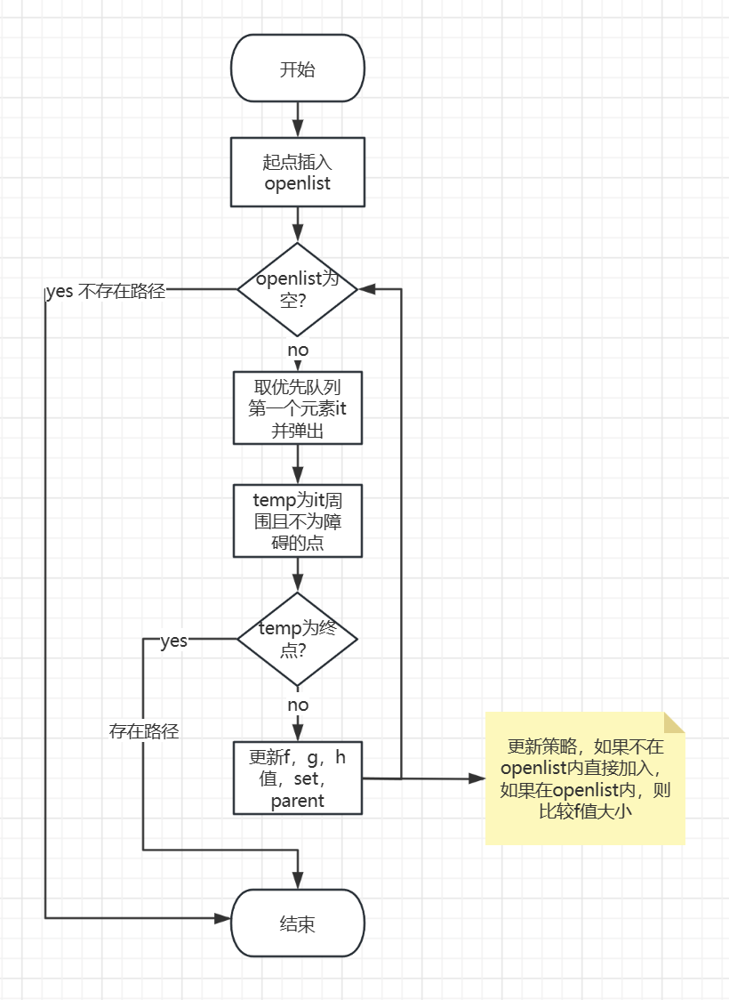


### 输入描述

* 地图的长和宽

  用户手动输入地图的长和宽，得到长和宽以后，会自动初始化地图大小

* 输入起始点

  选择地图上的某一空白处作为起始点

* 输入终点

  选择地图上的某一空白处作为终点

* 输入障碍

  选择地图上的空白处可以设置为障碍

* 清除障碍

  点击clear_abs可以将障碍清除

* 寻路

  点击a-star进行从起点到终点的寻路

#### 输入测试：

> 在本次实验中，一共设置了6个可以提供选择的按钮，当按钮处于灰色状态时，代表按钮处于未被激活状态，即该按钮不可点击，当按钮处于蓝色则说明按钮可点击。
>
> ADD_FIRST		设置起点
>
> ADD_FINAL		设置终点
>
> A_STAR				使用Astar开始寻路
>
> ADD_ABS			设置障碍
>
> CLEAR_ABS			清除障碍
>
> RESTART				重新开始，将一些状态清除

* 测试一、5行10列

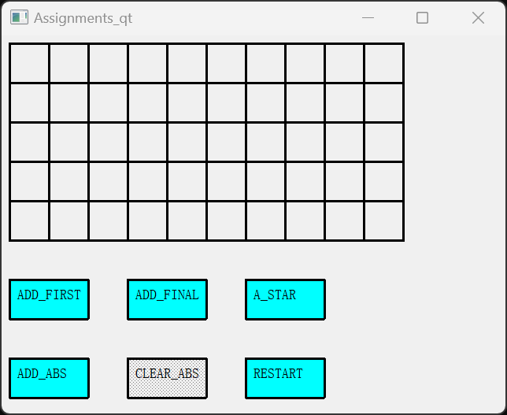

* 测试二、3行5列

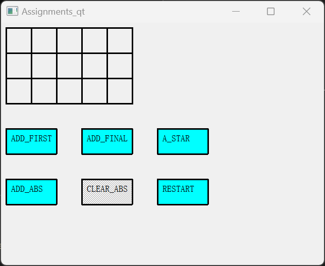

#### 结果测试

> 结果说明：
>
> 绿色的网格代表设置的起点
>
> 红色的网格代表设置的终点
>
> 黑色的网格代表设置的障碍
>
> 白色的网格代表可以通路
>
> 灰色的网格代表寻路算法经过的搜索空间

* 测试一、无障碍情况

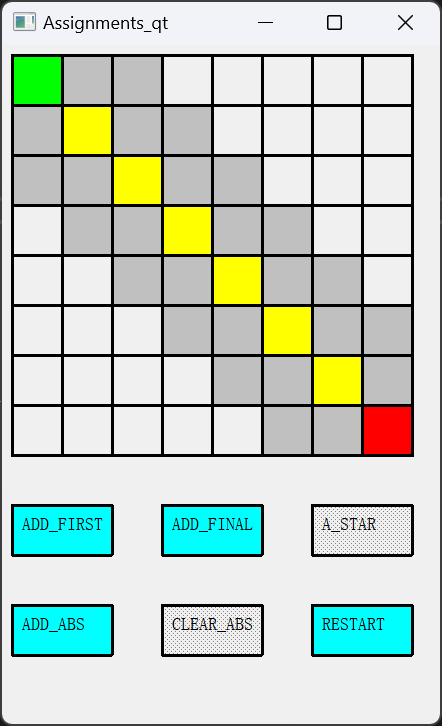

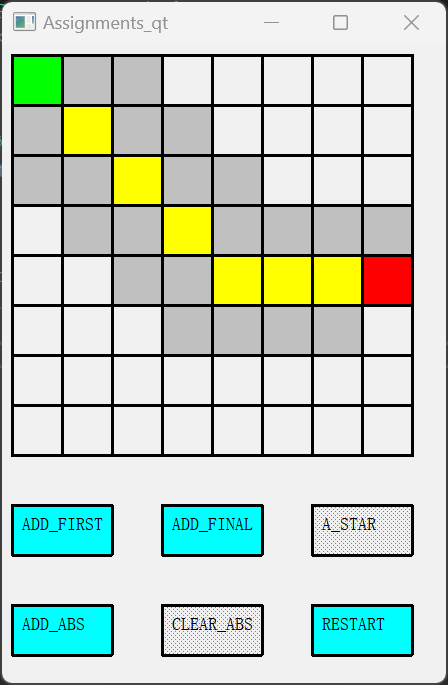


* 测试二、随机障碍情况

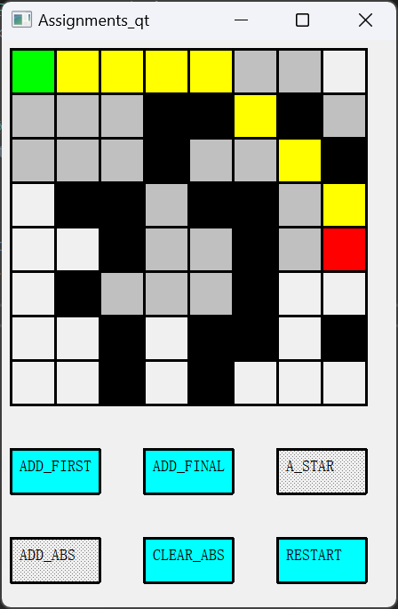

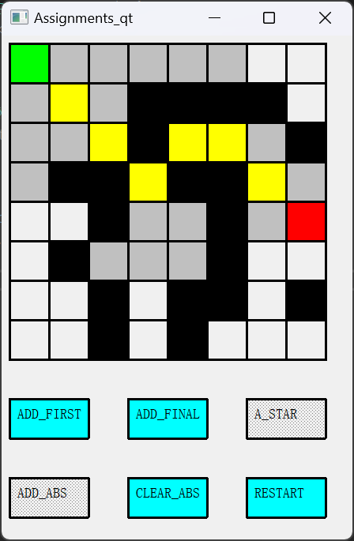

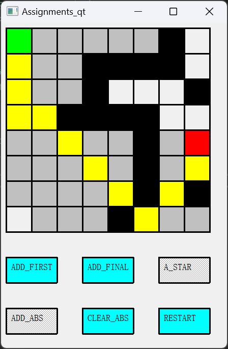

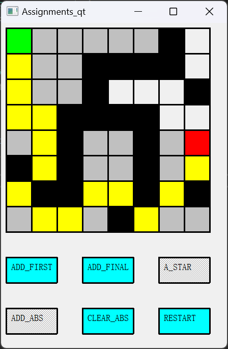

* 测试三、无通路情况

  > 没有通路，则不会寻路，状态码为5的表示搜索到了的位置，从打印出的状态码中可以看出，搜索在障碍的边界处便中断了。

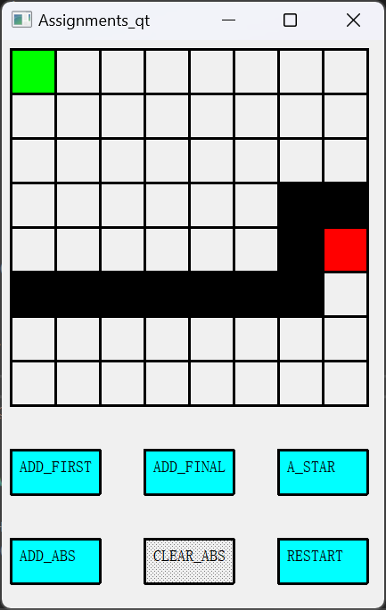


### 实验总结

#### 遇到的一些问题

* **优先队列中比较函数的使用**

  最开始使用的是代价f值作为比较函数中的参数，这样会导致一种情况，如果有两个代价一样的结点插入优先队列的时候，在下一次弹出优先队列的过程中，代价一样的结点会按照进入队列的先后顺序来进行弹出，也就是说在代价相同的结点中是按照广度优先的方式来进行的。但是如果我们在f值相同的情况下，再对h值进行比较，每次优先选择h值最小即最接近终点的结点出队列，这样就会将解空间缩小很多，具体案例如下所示。

  * 使用两个参数的比较函数

  ```
  bool Point::operator<(const Point& point1)const {
      if (_f == point1._f) return _h > point1._h;
      return _f > point1._f;
  }
  ```

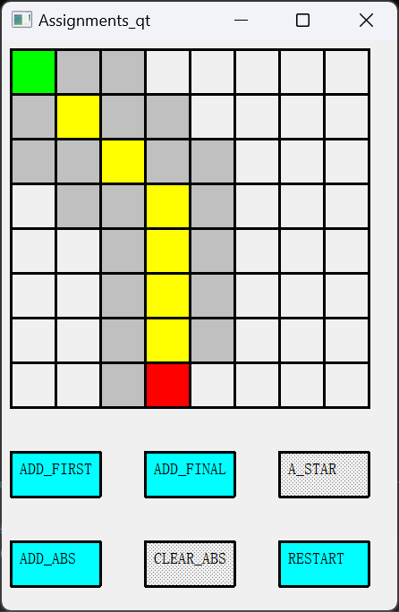

* * 使用一个参数的比较函数

  ```
  bool Point::operator<(const Point& point1)const {
      // if (_f == point1._f) return _h > point1._h;
      return _f > point1._f;
  }
  ```

  

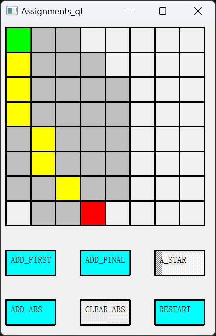

* **关于插入优先队列以后是否需要更新f值的问题**

  在起初的版本中，通过简单的分析认为不需要更新f值，因为最开始认为如果能够在之前就到达的位置，再后面再到达了，说明会绕一些弯路，所以这样的f值肯定会大于或等于最开始进入openlist的结点。但在运行过程中出现了下面的问题，问题就是因为没有更新f值造成的，因为在最优路径中第一次遍历的最优路径上的点，不一定是通过最优路径中的点遍历的，所以会存在有f更小的现象。


* **在优先队列中查找元素的问题**

  优先队列是一个堆的结构，很适用于取出最大值或者最小值，但如果是想要从优先队列中找到某一个元素，就较为难办了，在实验中出现的场景便是，需要确认当前遍历的结点是否在优先队列中，如果在优先队列中，则需要进行比较，不在的话则插入。

  采用的方式是在Point类中加入了一个value参数，用于表示当前结点的状态码，当value为0时表示属于通路，1表示障碍，2表示起点，3表示终点，5表示在优先队列中，通过这样的方式便可以极大便利的获取当前结点的状态值，并达到随机访问结点状态的现象，如果某一个结点在优先队列中，只需要查看该节点的状态码即可。设置状态码还有一个好处，如果需要重新开始的话，只需要将该节点的状态码改为0即可。

* **一个超级无脑的小bug**

  在调试过程中，发现无法进行多次寻路，找了将近一天，最后发现Point中使用指针存储的parent结点用于寻路，下意识的在析构函数中使用delete删除parent，因为没有给parent分配内存，是使用等号复制地址的。所以在使用界面交互进行多次寻路的过程中，出现内存被回收的问题，窗口强制退出。

* **前端遇到的一些问题**

  前端需要解决的最主要的问题并不是绘图，而是资源状态的获取问题，获取鼠标事件，以及如何控制不同的点击执行不同的操作，最后使用一些bool值来进行组合完成。

#### 总结

个人认为这一次实验收获还是挺大的，AStar算法的实现本身也不是一个比较难的问题，所以思路还是比较清晰，在开始进行没多久以后便完成了核心的一些代码内容，在最开始也是想设计一些前端界面的交互内容，所以障碍，起始点，结束点都对外提供了交互的接口。最主要的是，在代码调试的过程中遇到的一些需要钻研的问题让我有很大的收获，包括对一些场景的拓展实现等等，最终明白了一个道理：如果不去解决问题，就永远也不会发现问题。实际上，当完成核心代码以后，便可以实现实验想要达到的预期功能，但是因为想要在功能上做一些拓展，实现一些优化，于是便产生了各种各样的问题，所以在解决问题的过程，也是发现新问题的过程，但往往这一些新问题才能够具有更大的收获，比如：在解决优先队列中查找元素问题的过程中，慢慢的竟逼近了priority_queue的底层原理，也许这些东西可能以前也了解一些，但是真正深入还是在把他应用到实际问题的过程中才能够明白的。

在这一次实验中，也是看到了自己很多比较薄弱的地方， 比如cmake语法使用不是很熟练，对一些模板深度也不是很能够达到，包括自己debug的方式也是效率很低，以后还是希望能够在这些方面更多学习。

同样，通过这次实验，也是感受到了互相交流的重要性，在和郭帆共同完成的过程中，我觉得我们之间交流的氛围还挺好的，遇到一些问题大家互相商量，解决不了的问题互相帮忙，也是从他身上学到了很多东西，他会想办法做一些很新颖的东西，比如会给障碍加一些权重，会使用一些学到的c++新特性，他身上有一种好胜心，会让自己脱颖而出，遇到问题就想一直钻研到底，我都要被他卷死了hhhh，后面还是希望能够更多的互帮互助，互相多学一些新知识！


### 使用到的C++新特性

* 列表初始化
* auto自动类型推导
* 使用nullptr
* 使用override重写函数 
* 使用noexcept

