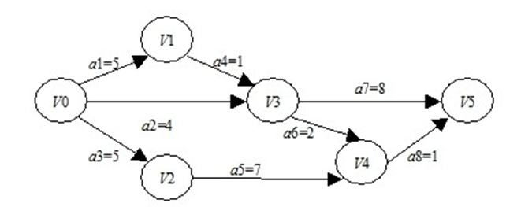
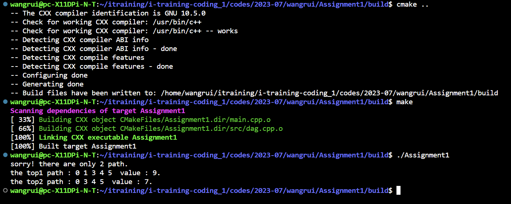

# Assignment 1

## 1 题目

​		在一个有向无环图（DAG）中，有节点Vertices，连接两个节点的叫做边 Edges，每条边都有权重Weight，指定一个起点，一个终点和X个中间点，用C++编写程序，找出经过所有这些指定点的权重之和的前TopN条路径。需要自己设计图的数据结构，构造相应单元测试用例（可以用Google Test），用例要覆盖X为1个或者多个，N为1条或者多条，并能运行通过测试用例。



## 2 建立类

以下均为类中的私有成员

- Edge：记录边的起始点、终止点与边的权重
  - int _start: 起始点
  - int _end: 终止点
  - int _weight: 边权重

- Path：记录路径，包括必经的vertex与遍历过程中的路径
  - int _vertices_num: 记录路径上vertices的数量
  - int *_Path: 一维数组记录路径

- AnsPath：记录成功路径
  - int *_value: 一维数组记录成功路径的权重
  - Path **_anspath: 二维数组记录成功路径
  - int _cnt: 记录成功路径数量 

- Visit：记录当前搜索路径上经过的vertex
  - int *_visit：一维数组记录路径上的vertices是否遍历
- Map：存储图
  - int _edges_num：记录边的数量
  - Edge **_map： 二维数组记录图的边信息

## 3 核心函数

DFS伪代码：
```
* 输入当前点m、终点、权重0、当前路径，必经结点
* 将当前点m加入当前路径
      * 若当前点m为终点：
	   * 初始化遍历数组
	   * 遍历当前路径结点
	   * 判断必经结点是否全部经过：
	         * 若全部经过，将当前路径加入成功路径集合
	         * 若未全部经过，不做操作
       * 若当前点m不为终点：
	   * 遍历以当前点m可抵点n，设置可抵点n为当前点
	   * 递归DFS算法
* 将当前点m从当前路径置出
```

DFS算法(开始点，终止点，边权重，vertices数量，成功路径集合，当前路径，必经vertex)

```C++
void Map::DFS(Edge &edge, int vertices_num, AnsPath &anspath, Path &temp,
              Path &MidPath) {
  temp.addPathVertex(edge.get_start());
  int flag = 1;
  if (edge.get_start() == edge.get_end()) {
    Visit visit(vertices_num);
    for (int i = 0; i < temp.get_vertices_num(); ++i) {
      visit.setVisited(temp[i]);
    }
    for (int i = 0; i < MidPath.get_vertices_num(); ++i) {
      if (visit.isVisited(MidPath[i]) == 0) {
        flag = 0;
      }
    }
    if (flag == 1) {
      anspath.addAnsPathPath(temp, edge.get_weight());
    }
  }
  for (int i = 0; i < _edges_num; ++i) {
    if (edge.get_start() == this->_map[i]->get_start()) {
      int next = this->_map[i]->get_end();
      Edge newedge(next, edge.get_end(),
                   edge.get_weight() + this->_map[i]->get_weight());
      DFS(newedge, vertices_num, anspath, temp, MidPath);
    }
  }
  temp.popPathVertex();
}
```

## 4 运行结果

设置开始结点为0，终点为5，结点3、4为必经结点，topN为3.

最终得出：




