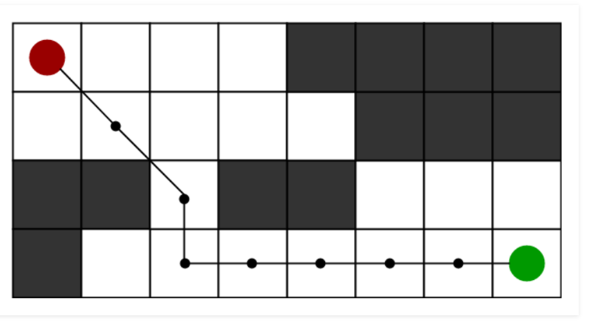
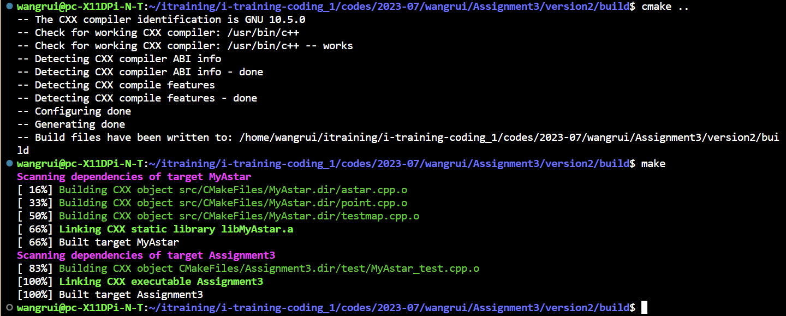
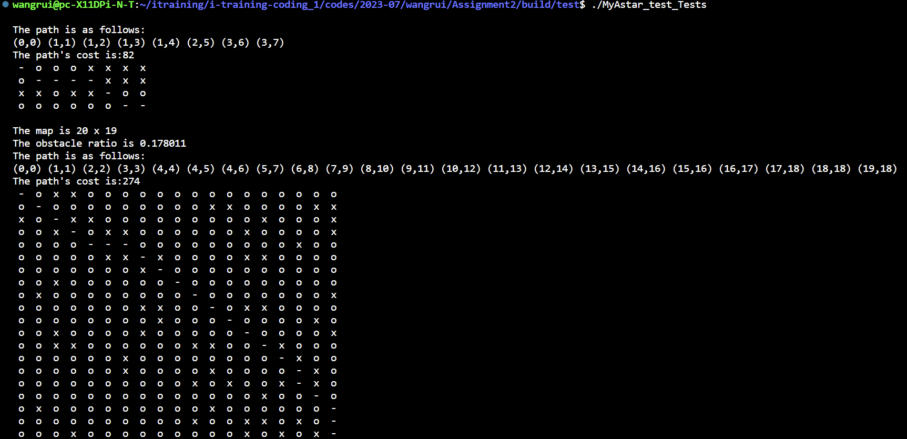
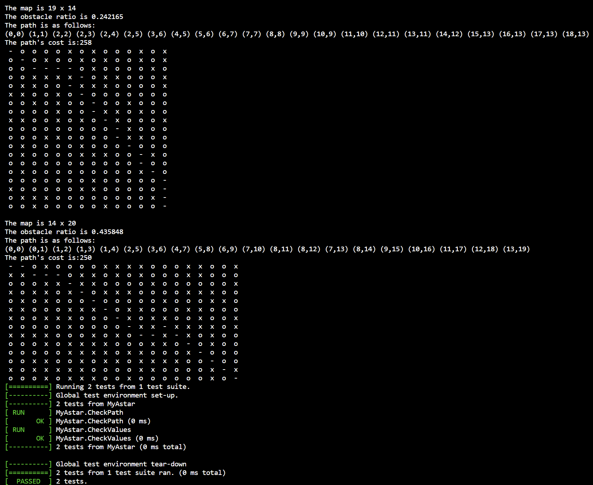
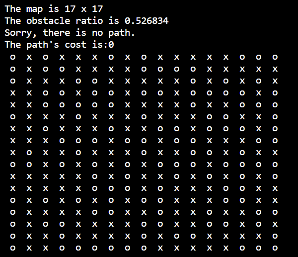

## 1 AStar题目

已知如下图地图，黑色表示障碍物无法通行，要求实现避障算法寻找从红色起点出发到达绿色终点的最优路径。

<center>图1题目

要求：

（1）对图中的地图进行建模，抽象成类，对数据进行封装；

（2）思考寻路算法的实现，对问题进行拆解，对算法实现也要求抽象接口类；

（3）使用给定的C++工程模板，按照模板编写CMakeLists.txt，以及GoogleTest单元测试，DoxyGen注释的使用。

工程模板如下：

**https://github.com/filipdutescu/modern-cpp-template.git**

## 2 算法原理

​		A*算法运行主要分为搜索、估算代价、再搜索三个步骤[12]。

​		A算法在运行前构建open_list（用于存储待处理的网格）和close_list（用于存储不再进行处理的网格）两个列表，其实现了对路径搜索过程中基于A*算法数据结构的数据存储、计算与判断。网格的状态仅可设置为允许通过或不允许通过两种状态，例如：存在障碍区的网格或处于边界的网格设置为不允许通过状态。首先，在搜索阶段，先将起始点所在网格A计入open_list，然后从A开始，检测其相邻的网格区域，采用八邻域搜索：搜索分为上下、左右、左上、左下、右上、右下八个方向，若被检测到的网格状态为允许通过，则将该网格加入open_list，否则跳过该网格并继续检测，直至检测完成所有的领域网格，然后将A设置为这些网格的父结点，其邻域网格为子结点。这样设置的目的在于进行后续路径追踪回溯，最后将A从open_list移出，并计入close_list中。


<center>图2 八邻域搜索

​		然后，成本计算阶段，引入了启发式代价函数：F=G+H。

​		其中，F为总代价之和，G为从起点到当前点的准确计算代价，H为当前点移动到终止点的估算代价。通常采用的有曼哈顿距离、欧几里得距离和对角线距离作为距离代价函数评估。AStar算法的优劣主要体现在了启发函数的选取上，也是体现A*算法启发式计算的核心技术部分。

​		然后是再搜索阶段，基于之前已完成的步骤，从open_list中选择F值最小的网格，设为V_0，针对被选择的网格V_0，首先将V_0移出open_list，加入close_list，然后检测所有与V_0相邻的网格，跳过其中在close_list中或状态为不允许通过的网格，若网格不在open_list中，则将其加入open_list；若网格已经在open_list中，则检查这条路径是否更优，即检查由V_0达到其相邻网格V_1是否具有更小的G值。若否，则不做任何操作；若具有更小的G值，则将V_1的父结点设置为V_0，然后更新V_1的F值与G值。

​		最后重复上述过程，直到终止点B加入到open_list，得证路径已找到，根据网格之间的父子结点关系，回溯终点到起点A。

​		若open_list为空后，终止点依旧未加入open_list，说明路径未找到。

## 3 算法流程


<center>图3 算法流程图

A*算法伪代码：

```
* 初始化open list和close list
* 将起点加入open list中
* 若open list不为空，则从open list中选取代价F最小结点m：
    * 若结点m为终点，则：
        * 从终点开始逐步追踪parent结点，一直达到起点；
        * 返回找到的结果路径，算法结束
    * 若结点m不是终点，则：
        * 将结点m从open list中删除，并加入close list中
        * 遍历结点m所有的邻近结点：
            * 如果邻近结点n在close list中，则：
                *更新n的代价G、H、F
                *更新父结点为结点m
            * 若邻近结点n也不在open list中，则：
                * 计算结点n的代价G、H、F
                * 设置结点n的父结点为结点m
                * 将结点n加入open list中
```


## 4 算法实现

### 4.1数据结构

- 全局常量
  - static const int str_cost  = 10 ：设置上下左右直走的代价
  - static const int dia_const = 14 ：设置对角走的代价

- 类Point：

  - int x，y ：结点坐标 ( x , y )
  -  int g：起始点到此结点的代价
  -  int _h：此结点到终点的预估代价
  -  int f：f = g + h，即总代价
  -  Point *_pre_point ：父结点
  -  int _is_obstacle：标记是否为障碍、路径结点
  -  bool _is_inopenlist：标记是否在open_list中

  -  bool _is_incloselist：标记是否在close_list中

- 类AStar
  - vector<vector<Point>> map：存储图
  - list<Point *> open_list
  - list<Point *> close_list
- 类 TestMap
  - vector<vector<int>> test_map：随机生成测试图


### 4.2 主要函数代码

A*算法：

```C++
bool AStar::startAStar(Point *start, Point *end) {
  _open_list.push_back(start);		//将开始结点加入open_list
  start->set_Point_inopenlist();	
  while (!_open_list.empty()) {		//若open_list不为空，进入循环
    auto bestpoint = findMinFPoint();	//寻找目前open_list中的最优结点
    _open_list.remove(bestpoint);		//从open_list中移出best point
    bestpoint->set_Point_outopenlist();	
    _close_list.push_back(bestpoint);	//将best point移入close_list
    bestpoint->set_Point_incloslist();
    if (bestpoint->get_Point_X() == end->get_Point_X() &&	//若为终点，返回true
        bestpoint->get_Point_Y() == end->get_Point_Y()) {
      return true;
    } else {
      set_ObtPointtoOpenlist(bestpoint, end);	//否则将best point临近结点移入open list
    }
  }
  return false;	
}
```

## 5. 实验

tree：

```shell
.
├── CMakeLists.txt
├── include
│   ├── astar.hpp
│   ├── point.hpp
│   └── testmap.hpp
├── src
│   ├── astar.cpp
│   ├── CMakeLists.txt
│   ├── point.cpp
│   └── testmap.cpp
└── test
    └── MyAstar_test.cpp
```

### 5.1 cmake

根目录下的cmake：

```cmake
cmake_minimum_required(VERSION 3.0.0)

project(Assignment3 VERSION 0.2.0 LANGUAGES CXX)
# 设置输出路径
set(EXECUTABLE_OUTPUT_PATH ${PROJECT_SOURCE_DIR}/build)
# 链接头文件路径
include_directories(${PROJECT_SOURCE_DIR}/include)
# 添加子目录
add_subdirectory(${PROJECT_SOURCE_DIR}/src)
# 编译可执行文件
add_executable(${PROJECT_NAME} ${PROJECT_SOURCE_DIR}/test/MyAstar_test.cpp)
# 设置gtest变量
set(GTEST_LIBS ${PROJECT_NAME} libgtest.a libgtest_main.a pthread)
# 链接库
target_link_libraries(${PROJECT_NAME} MyAstar)
target_link_libraries(${PROJEXT_NAME} ${GTEST_LIBS})
```

src下的cmake：

```cmake
add_library(MyAstar astar.cpp point.cpp testmap.cpp)
```

 

### 5.1 gtest案例

**test1：**检验点信息的G、H、F值是否正确

```C++
TEST(MyAstar, CheckValues) {
  std::vector<std::vector<int>> themap = {{0, 0, 0, 0, 1, 1, 1, 1},
                                          {0, 0, 0, 0, 0, 1, 1, 1},
                                          {1, 1, 0, 1, 1, 0, 0, 0},
                                          {0, 0, 0, 0, 0, 0, 0, 0}};
  myastar::AStar mymap(themap);
  mymap.startAStar(&mymap[0][0], &mymap[3][7]);
  EXPECT_EQ(mymap[1][1].get_G(), 14);
  EXPECT_EQ(mymap[1][1].get_H(), 88);
  EXPECT_EQ(mymap[1][1].get_F(), 102);
  EXPECT_EQ(mymap[2][6].get_H(), 19);
  EXPECT_EQ(mymap[3][6].get_G(), 72);
  EXPECT_NE(mymap[3][6].get_G(), 100);
}
```

**test2：**检验路径是否符合预期

```C++
TEST(MyAstar, CheckPath) {
  bool flag = 0;
  std::vector<std::vector<int>> themap = {{0, 0, 0, 0, 1, 1, 1, 1},
                                          {0, 0, 0, 0, 0, 1, 1, 1},
                                          {1, 1, 0, 1, 1, 0, 0, 0},
                                          {0, 0, 0, 0, 0, 0, 0, 0}};
  myastar::AStar mymap(themap);
  flag = mymap.startAStar(&mymap[0][0], &mymap[3][7]);
  std::vector<mypoint::Point *> path = mymap.set_Path(flag, &mymap[3][7]);
  std::vector<mypoint::Point *> result;
  result.push_back(&mymap[3][7]);
  result.push_back(&mymap[3][6]);
  result.push_back(&mymap[2][5]);
  result.push_back(&mymap[1][4]);
  result.push_back(&mymap[1][3]);
  result.push_back(&mymap[1][2]);
  result.push_back(&mymap[1][1]);
  result.push_back(&mymap[0][0]);
  EXPECT_EQ(flag, true);
  EXPECT_EQ(path, result);
}
```

### 5.2 随机测试

通过C++ random库设计实验随机在10-20生成行列数，在0.1-0.6之间生成图中的障碍比例，随机生成三个图案例，测试设计的A*是否可以布通。


### 5.3 测试结果






