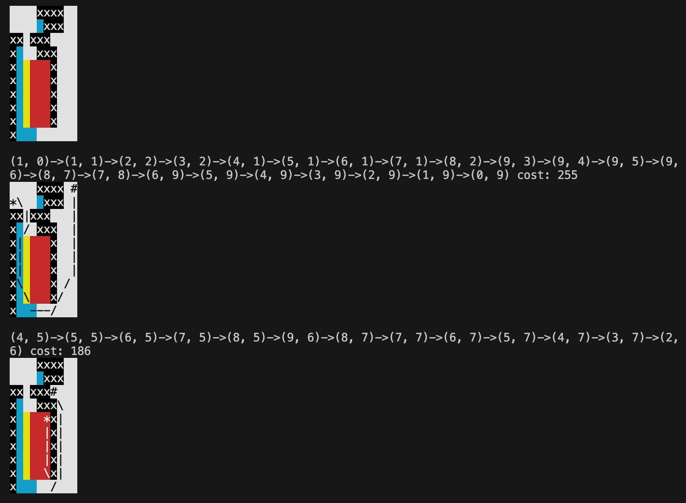
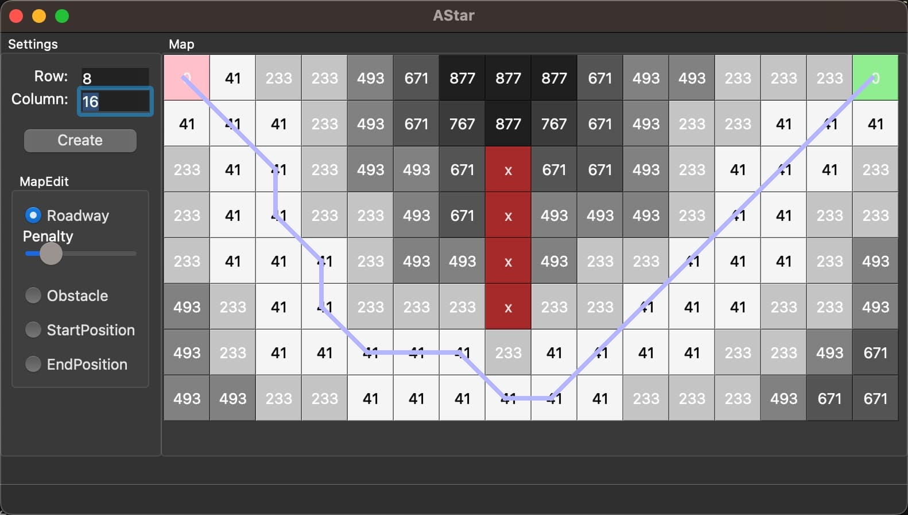
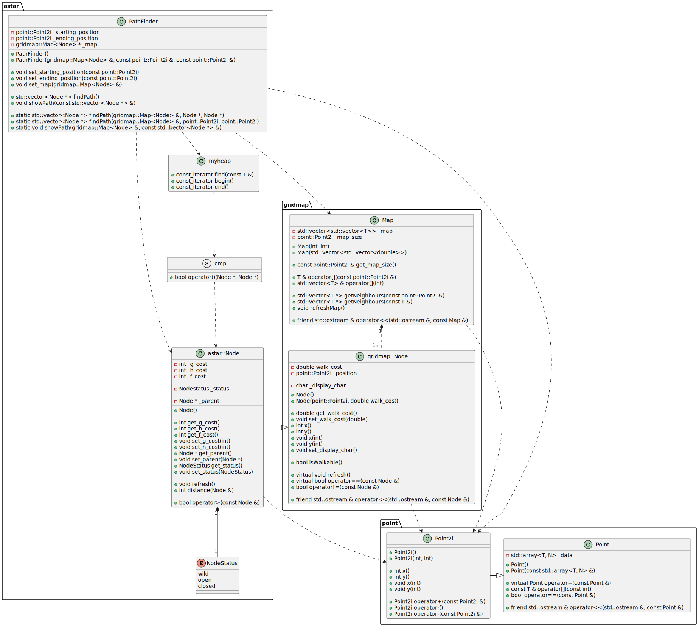
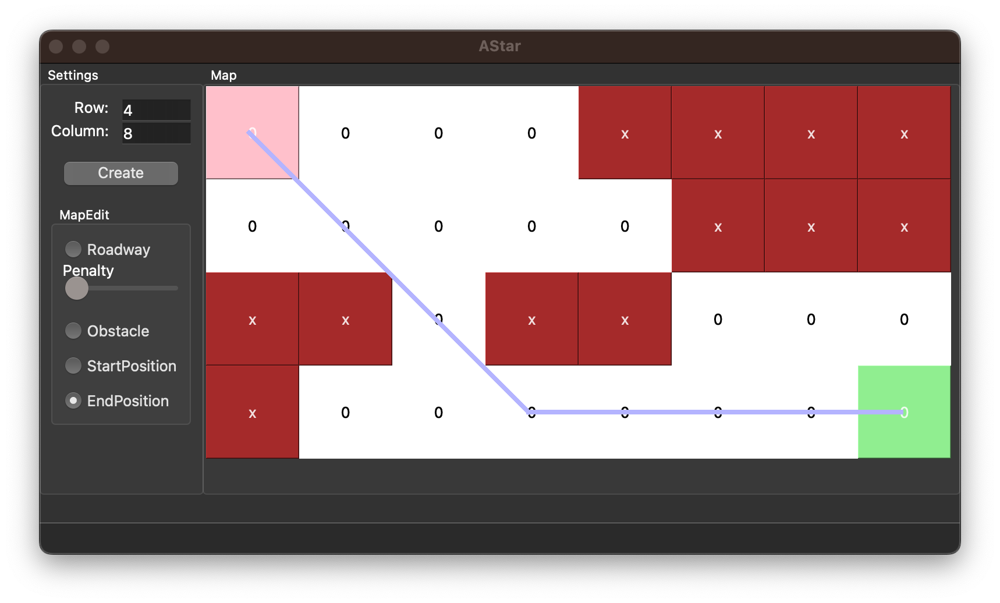
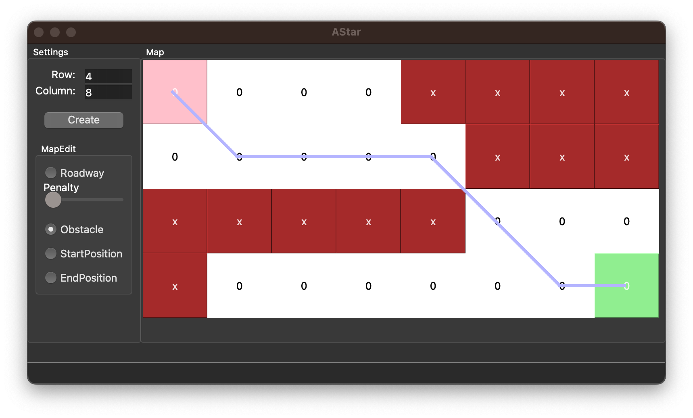
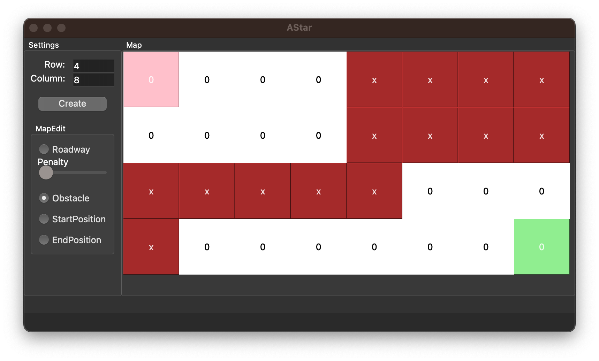
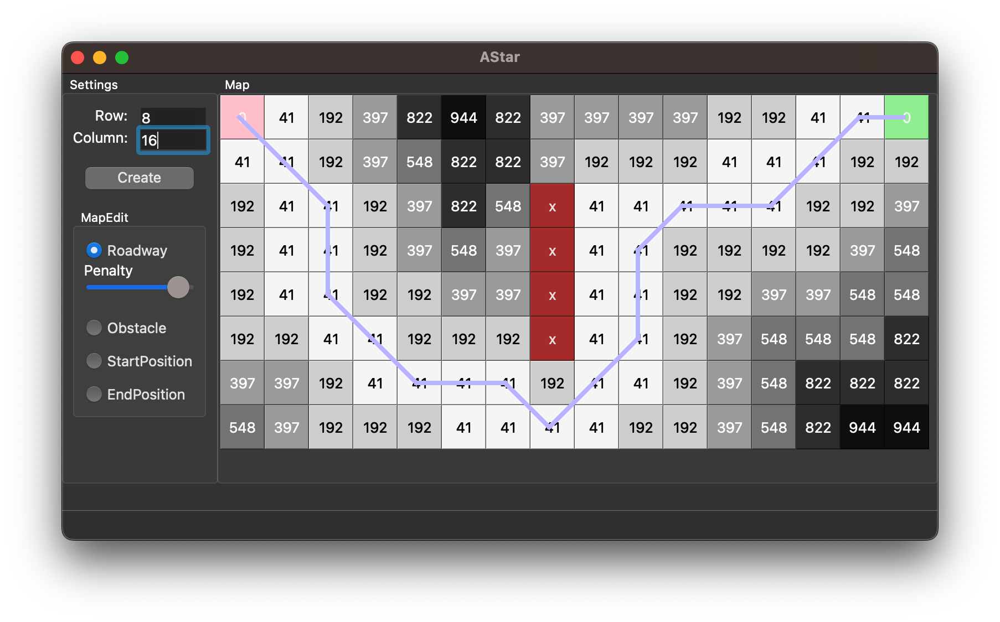
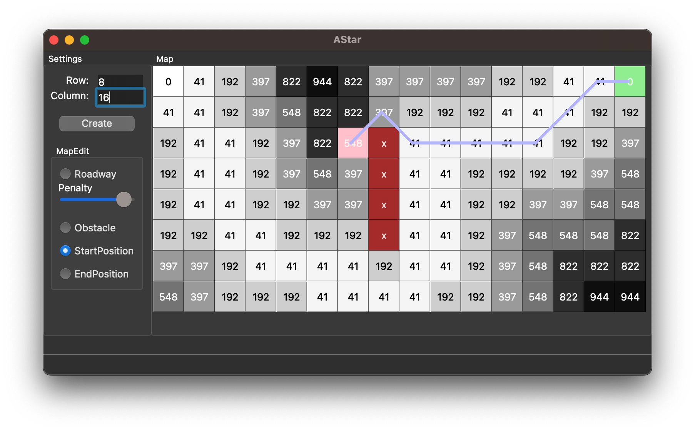
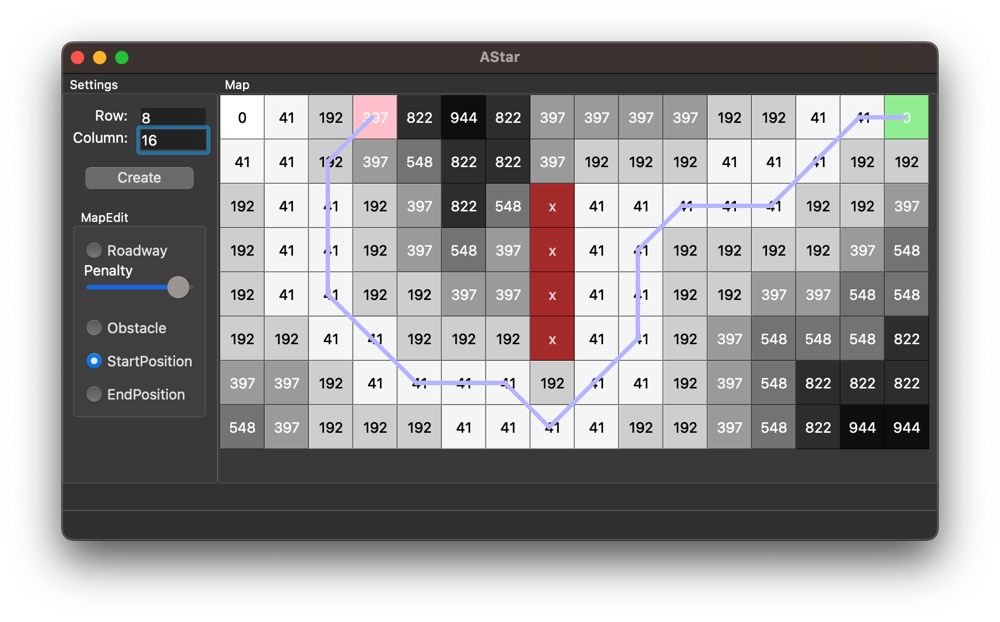
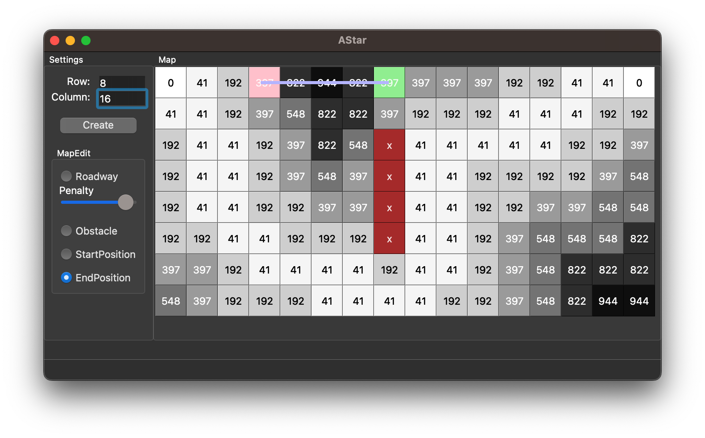

开发笔记在：
- [A\*算法初探究及优化 - 自动解贪吃蛇](https://www.guofan.fun/snake-astar/)
- [A\*算法深入探究 - 使用Qt和C++实现带权重版本的A\*](https://www.guofan.fun/cpp-qt-astar/)

## 结果展示

### Shell 端（会输出 cost 消耗）



### GUI 版本

*已经配置好 CMake 工程，可以到 GUI 目录下运行`cmake -S . -B build; cmake --build build; ./build/astar`体验一下交互（需要 Qt 环境）*



## 数据结构设计

类图如下，主要分为三个包：
- astar：A\* 算法的结点类以及寻路类
- gridmap：地图类，地图类不依赖于 astar 包，所以可以适用于其他寻路算法
- point：工具类，定义 gridmap 和 astar 包中所需要用到的点类



从类图中可以看出，包之间的依赖关系为单向，越针对的类依赖于越通用的类，符合软件工程的要求。

### astar 包中的输入输出

astar 包中发挥 A\* 算法作用的是 PathFinder 类，该类有以下输入：
- 地图对象的引用
- 起点坐标或结点
- 终点坐标或结点

有以下输出：
- 寻得的路径结点指针列表

### gridmap 包的输入

gridmap 包中创建地图的是 Map 类，该类有以下输入：
- 一个二维列表用来表征地图障碍以及道路，或者地图的长宽信息

输出为一个地图对象，该对象有以下特点：
- 可以通过某个结点获得其周围 8 个邻居结点
- 可以通过某个地图坐标获得其周围 8 个邻居结点
- 可以将地图可视化输出到终端
- 可以访问地图结点

## GUI 版本设计

- 使用 Qt 作为框架
- 使用按钮控件作为结点的可视化展示，这样做的理由是：
    * 作为 Qt 中已经定义好的控件，方便管理
    * 结点应拥有点击动作，按钮对于点击动作是自然的
    * 按钮可以显示文字，可以更换背景颜色，也符合结点需要展示的内容
- 在所有按钮之上覆盖一层 graphic view，用来绘制路径线条，需要设置鼠标穿透，不然按钮会不被点击到

## 测试用例及用例运行结果

### Google Test

使用 Google Test主要用来测试各个类的接口，运行结果如下：
```
[==========] Running 3 tests from 2 test suites.
[----------] Global test environment set-up.
[----------] 1 test from gridmapTest
[ RUN      ] gridmapTest.test0
[       OK ] gridmapTest.test0 (0 ms)
[----------] 1 test from gridmapTest (0 ms total)

[----------] 2 tests from astarTest
[ RUN      ] astarTest.test0
[       OK ] astarTest.test0 (0 ms)
[ RUN      ] astarTest.timetest
[       OK ] astarTest.timetest (26 ms)
[----------] 2 tests from astarTest (27 ms total)

[----------] Global test environment tear-down
[==========] 3 tests from 2 test suites ran. (27 ms total)
[  PASSED  ] 3 tests.
```

### 寻路算法测试

#### 通常情况，如题图给出的情形


挡住路线后：


#### 死路情况



#### 带权重的情况






