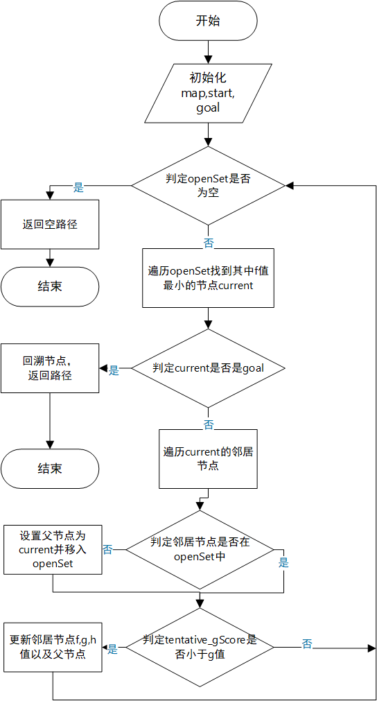
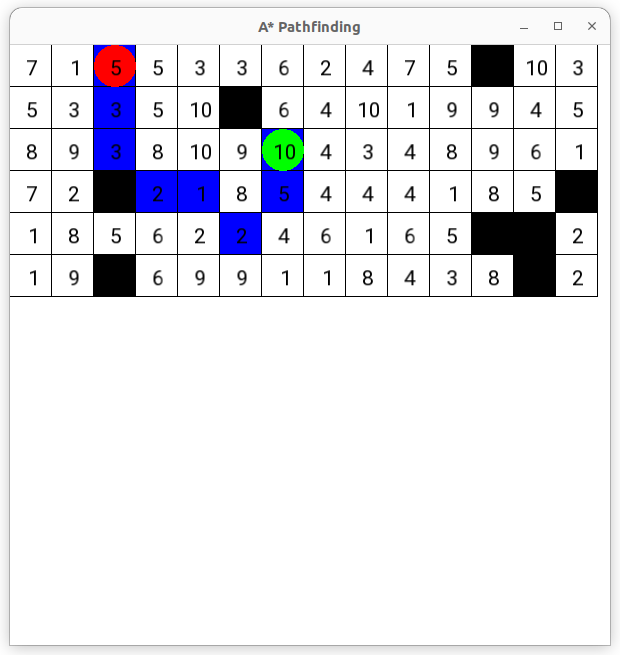

# 1.算法原理
A* 算法是一种广泛应用于图搜索和路径规划的启发式搜索算法。其主要原理是在图中找到一条从起点到终点的最短路径，同时兼顾搜索效率和路径质量。A算法通过结合实际代价（从起点到当前节点的权重之和g）和估计代价（从当前节点到目标节点的启发式估计代价h）来指导搜索方向，从而减少不必要的搜索。在A*算法中，首先将起点节点加入到开放列表（openset）中，并初始化其g值和h值。然后，算法进入主循环，每次从开放列表中选取f值最小的节点作为当前节点（f = g + h）。如果当前节点是目标节点，则路径搜索结束，开始回溯以构建最终路径。   

对于当前节点的每个邻居节点，计算从起点到邻居节点的临时g值（tentative_gScore）。如果这个g值小于邻居节点的已知g值，说明找到了一条更优的路径，于是更新邻居节点的g、h和f值，并将邻居节点的父节点设为当前节点。若邻居节点不在openset中，则将其加入openset。

该过程持续进行，直至找到目标节点或openset为空。最终，通过回溯目标节点的父节点，可以构建出从起点到目标节点的最优路径。

# 2.算法流程

 图1 算法流程图
# 3.数据结构设计
- AStarAlgorithm：定义A* 算法的寻路函数
- GridMap：定义地图所需的函数
- Node：定义节点
- RandomMap: 随机生成一个网格地图
- MapVisualizer:可视化地图和路径
## AStarAlgorithm的输入输出

发挥 A* 算法作用的是 findPath函数，输入为：

- 地图对象
- 起点坐标
- 目标坐标

输出为：

- 寻得的最佳路径结点列表

## GriMap的的输入输出

GriMap创建地图并提供地图相关函数，该类有以下输入：

- 宽 
- 高

输出为:

- 地图对象.

## RandomMap的输入输出

RandomMap随机生成一个网格地图,该函数有以下输入：

- 地图对象
- 起点坐标
- 目标坐标

输出为：

- 地图对象

## MapVisualizer的输入输出

MapVisualizer运用SFML将结果可视化,该类有以下输入：

- 地图对象
- 路径
- 起点坐标
- 目标坐标

输出为：

- 可视化结果

# 测试及运行结果

## Google Test
使用 Google Test来测试通路，死路，路径，节点，运行结果如下：

[==========] Running 2 tests from 1 test suite.
[----------] Global test environment set-up.
[----------] 2 tests from AStarTest
[ RUN      ] AStarTest.FindsPath
Start point: (4, 4)
Goal point: (9, 5)
[       OK ] AStarTest.FindsPath (2 ms)
[ RUN      ] AStarTest.NoPath
[       OK ] AStarTest.NoPath (1 ms)
[----------] 2 tests from AStarTest (4 ms total)

[----------] Global test environment tear-down
[==========] 2 tests from 1 test suite ran. (4 ms total)
[  PASSED  ] 2 tests.

## 算法测试

- 正常带权重结果为：

- 死路结果为:

