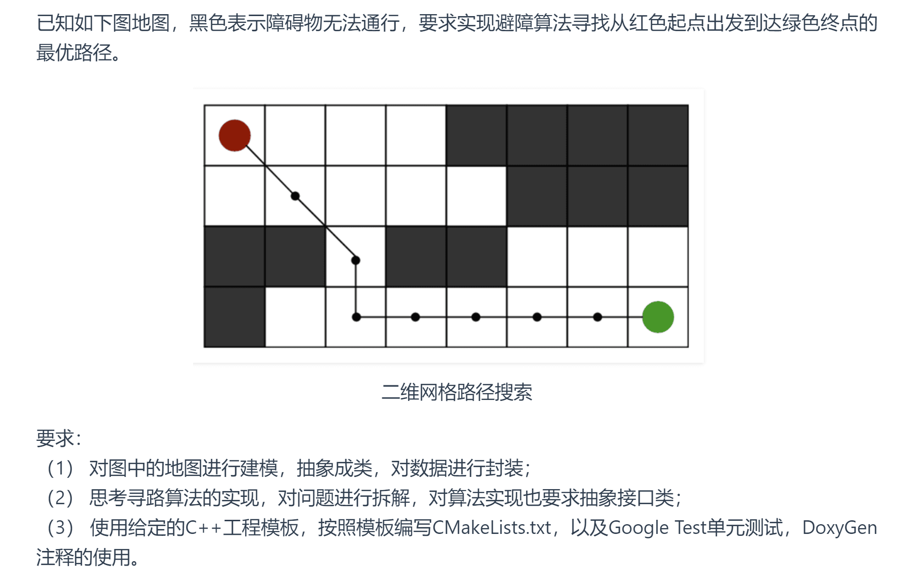
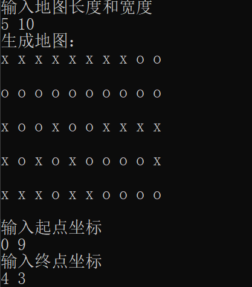
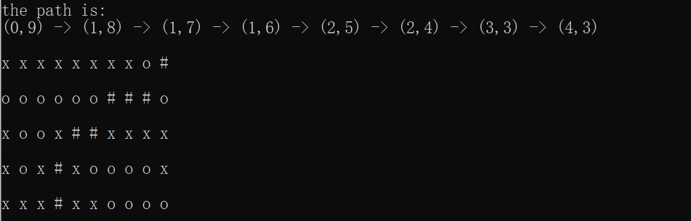
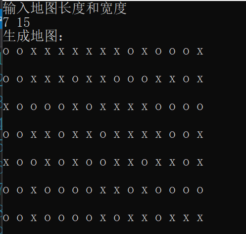
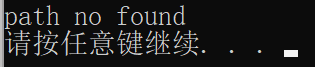

# 题目
## 题目描述


# 数据结构设计
## 1. Point类

**Point类表示地图上的一个点，并包含以下私有成员和公有方法:**

#### 私有成员：

* _x 和 _y：表示点的坐标。
* _F：该点的 F 值，即 G 值和 H 值的和，用于 A* 算法中的优先级判断。
* _G：从起点到该点的代价。
* _H：从该点到终点的估计代价。
* _parent：指向该点的父节点的指针，用于路径回溯。
#### 公有方法：
* 各种 getter 和 setter 函数：用于获取和修改私有成员的值。
* operator==：重载运算符以便比较两个点是否相同。
## 2. Map类

**Map类表示搜索空间，用于封装地图，并包含地图的长度、宽度等信息**

#### 私有成员：
* _length: 表示地图的长度。
*  _width：表示地图的宽度。
* _graph：表示地图的实际网格，用一个二维向量存储。(其中0表示可通过，1表示障碍)。
* _dir：表示移动方向的数组，用于找到相邻点

#### 公有方法：

* 构造函数：用于初始化地图；
* 各种 getter 和 setter 函数：用于获取和修改私有成员的值。
* visitGraph：访问地图上的某个点。
* showMap：打印地图。
* randomizeGraph：随机生成地图。

## 3. Astar类

**Astar 类实现了 AStar 算法，并包含以下成员变量和方法:**


#### 私有成员：

* _openList：打开列表，用于存储待检查的点，按 F 值排序。
* _closeList：关闭列表，用于存储已检查的点。

#### 公有方法：

* findPath：主函数，用于找到从起点到终点的路径。
* calcF、calcG 和 calcH：用于计算 F、G 和 H 值的辅助函数。
* isUseful：判断某点是否可用。
* isInOpenList 和 isInCloseList：判断某点是否在打开列表或关闭列表中。
* findSurround：找到当前点的所有相邻点。
* showPath：打印找到的路径。
# 输入和输出描述
## 输入流程：
```
//初始化起点和终点:
Point *start=new Point(0, 0);
Point *end=new Point(9, 9);

//初始化地图
Map map(10, 10);   //生成包含10*10大小的二维数组的Map对象，表示地图
map.randomizeGraph();   //随机初始化地图上每个点可通过或不可通过；


//调用A*算法，得到路径
//Astar astar;
auto path=astar.findPath(start,end,map);
```
## 输出流程：
```
auto path=astar.findPath(start, end,map);
for (auto p : path)｛
     cout << p->getX() << " " << p->getY() << endl;
｝
   
system("pause");
```


## 输入和输出样例：
#### 1. 样例1



#### 2. 样例2





# 主要算法思想
## 描述：
    A*（A-star）算法是一种启发式搜索算法，
    用于在图中找到从起点到终点的最短路径。
    结合了 Dijkstra 算法的优点（最短路径,
    贪婪最佳优先搜索的优点（启发式搜索）,
    以有效地找到最优路径。

## 算法流程：
```
function Astar(start, end, map):
    openList ← new PriorityQueue
    closedList ← new Set
    openList.push(start)
    start.G ← 0
    start.H ← heuristic(start, end)
    start.F ← start.G + start.H
    
    while not openList.isEmpty():
        current ← openList.pop()
        if current == end:
            return reconstruct_path(current)
        
        closedList.add(current)
        
        for neighbor in current.neighbors():
            if neighbor in closedList:
                continue
            
            tentative_g = current.G + distance(current, neighbor)
            
            if neighbor not in openList:
                openList.push(neighbor)
            else if tentative_g >= neighbor.G:
                continue
            
            neighbor.parent = current
            neighbor.G = tentative_g
            neighbor.H = heuristic(neighbor, end)
            neighbor.F = neighbor.G + neighbor.H
    
    return failure
```

# 总结：
### 关于数据结构的选择：
在算法中，openlist列表要存放待选择的节点、判断节点是否在列表中，且需要弹出列表中F值最小的节点并返回。刚开始选择list，但是每次都要手动遍历一遍找到f值最小的元素，时间复杂度较高；
后面考虑使用能自动保存最小值的数据结构，multiset和priorityqueue；但是priorityqueue基于堆实现，不支持遍历，
很难判断节点是否在列表中。而multiset基于红黑树实现，可以高效查找元素，最后采用了multiset作为openlist的数据结构。
### 遇到的问题：
定义std::multiset<Point*> openlist时，不能直接在 Point 类中定义比较运算符，原因是multiset 存储的是指向 Point 对象的指针，
而不是 Point 对象本身。
因此，需要一个函数对象（或函数指针）来比较这些指针所指向的对象，而不是比较指针本身。
需要为 std::multiset<Point*> 定义比较函数对象：
```
struct ComparePoints {
	bool operator()(const Point* p1, const Point* p2) const {
		return p1->getF() < p2->getF();
	}
};

std::multiset<Point*, ComparePoints> _openList;

```
### 使用的C++新特性：
- lambda表达式
```
bool Astar::isInOpenList(Point * now)
{
	//使用lambda表达式
	return std::any_of(_openList.begin(), _openList.end(), [now](Point* point) {
		return point->getX() == now->getX() && point->getY() == now->getY();
	});
}
```

- 智能指针
```
bool Astar::isUseful(int x, int y, Map &map)
{
	//使用 std::unique_ptr 代替裸指针，以避免手动管理内存。
	auto point = std::make_unique<Point>(x, y);
	return !(x < 0 || x >= map.getLength() || y < 0 || y >= map.getWidth() || map.visitGraph(x, y) == 1 || isInCloseList(point.get()));
}
```
- 区间for循环
