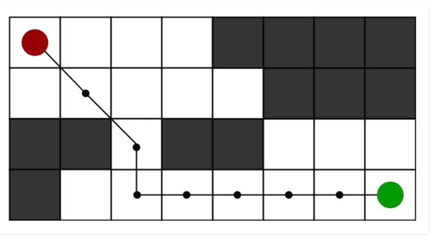
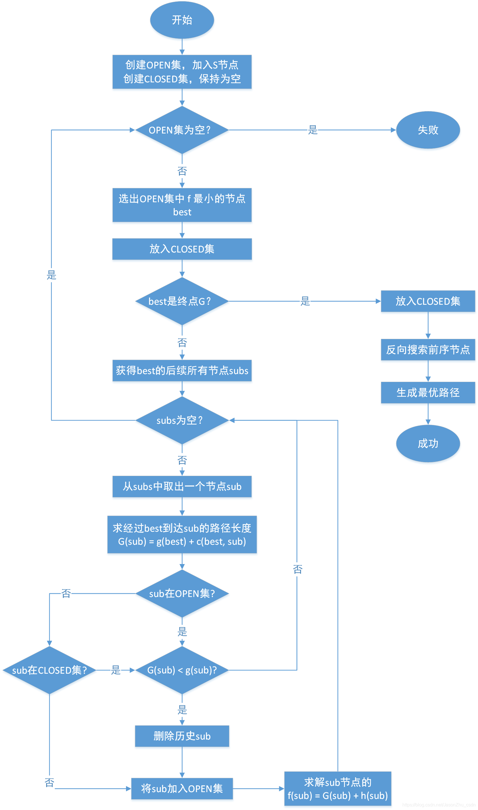
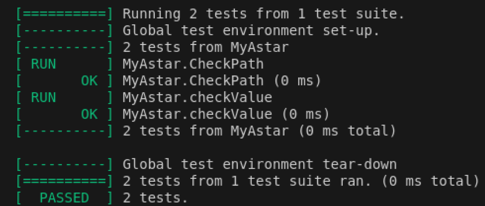
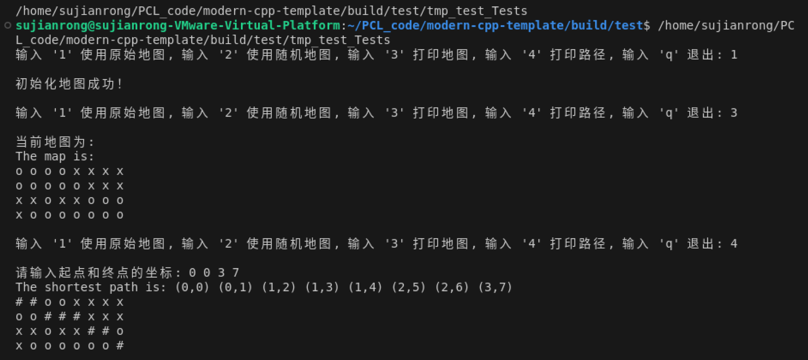
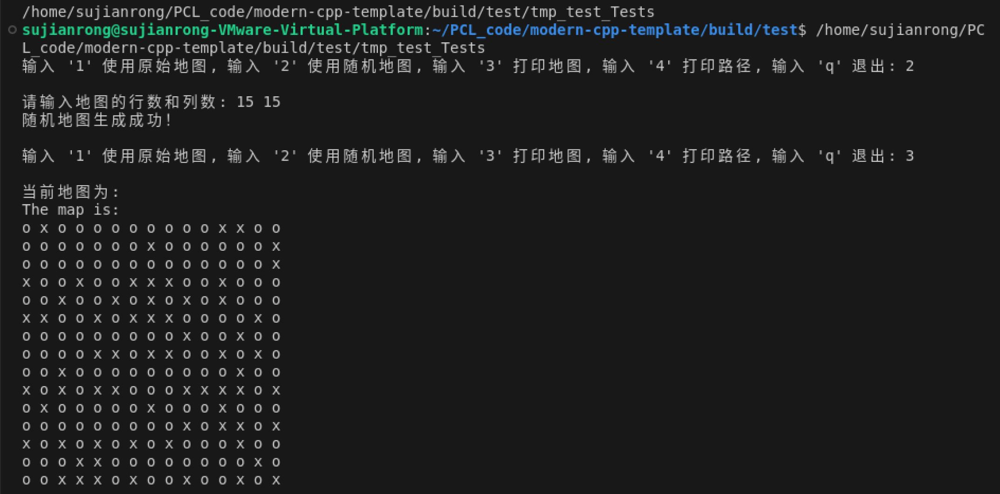
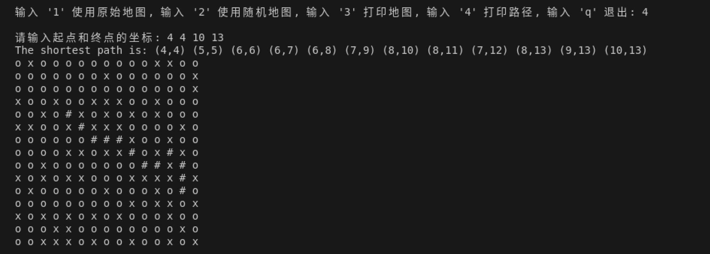

## 1. 问题描述
已知如下图地图，黑色表示障碍物无法通行，要求实现避障算法寻找从红色起点出发到达绿色终点的最优路径。

要求：
（1）对图中的地图进行建模，抽象成类，对数据进行封装；
（2）思考寻路算法的实现，对问题进行拆解，对算法实现也要求抽象接口类； 
（3）使用给定的C++工程[模板](https://github.com/filipdutescu/modern-cpp-template)，按照模板编写CMakeLists.txt，以及Google Test单元测试，DoxyGen注释的使用。

## 2. 算法原理
A*算法是一种启发式搜索算法，用于在图中找到从起点到终点的最短路径。它结合了Dijkstra算法和贪心最佳优先搜索算法的优点，通过以下步骤实现路径搜索：
#### 2.1 定义启发函数和代价函数
A*算法使用两个函数来评估每个节点：
- 代价函数g(n)：从起点到当前节点n的实际代价。
- 启发函数h(n)：从当前节点n到目标节点的估计代价，通常使用欧几里得距离或曼哈顿距离。
#### 2.2 优先队列（开列表）
维护一个待处理节点的优先队列，该队列按照节点的总估计代价f(n)排序，其中f(n)=g(n)+h(n)。起点节点首先被加入开列表，其g值为0，f值为h值。
#### 2.3 闭列表
维护一个已处理节点的列表，确保每个节点不会被重复处理。
#### 2.4 搜索过程
（1）从开列表中取出f值最小的节点n
（2）如果n是目标节点，搜索结束，路径找到
（3）否则，将n从开列表移到闭列表中
（4）对于n的每个相邻节点m，计算从起点到m的新代价g(m)。
- 如果m在闭列表中且新g(m)不小于旧g(m)，跳过；
- 如果m不在开列表中或新g(m)小于旧g(m)，更新g(m)和f(m)，并将m加入或更新在开列表中。
#### 2.5 重复搜索过程
直到找到目标节点或开列表为空（此时表示无路径）。

## 3. 算法流程图


## 4. 算法实现
#### 4.1 数据结构
- 全局常量
  - MoveCost1 = 10 ：上下左右横移的代价
  - MoveCost2 = 14 ：对角走的代价
- Node类
  - int n_x, n_y : 结点坐标 (x,y)
  - int n_G ：起点到该结点的代价
  - int n_H ：该结点到终点的代价
  - int n_F ：总代价
  - Node* parent ：父结点
- AStar类
  - std::list<Node*> openList ：开启列表
  - std::list<Node*> closeList ：关闭列表
- Map类
  - std::vector<std::vector<int>> m_map ：地图
  - int length ：行数
  - int width ：列数
#### 4.2 核心函数代码
```
Node* AStar::findPath(Node& startNode, Node& endNode, bool isIgnoreCorner, Map& a_map)
{
	openList.push_back(new Node(startNode.get_X_value(), startNode.get_Y_value()));
	while (!openList.empty()) {
		auto currentNode = getLeastFnode();	//在openList中找到F值最小的点
		openList.remove(currentNode);		//从openList中删除这个点
		closeList.push_back(currentNode);	//将这个点放入关闭列表中

		//找到当前周围8个格中可以通过的格子
		auto surroundNodes = getSurroundNodes(currentNode, isIgnoreCorner, a_map);
		//找到后分别处理这些格子
		for (auto& target : surroundNodes) {
			//如果当前点不在openList中，将其加入进去，并设置这个点的父节点为当前格，设置F，G，H
			if (!isInList(target, openList)) {
				target->set_parent(currentNode);

				target->set_G_value(calculate_G_val(currentNode, target));
				target->set_H_value(calculate_H_val(target, &endNode));
				target->set_F_value(calculate_F_val(target));

				openList.push_back(target);
			}
			//如果当前点已经在openList中，计算G值，如果比原来的大，就什么都不做，否则设置他的父节点为当前点，并更新G和F
			else {
				int tempG = calculate_G_val(currentNode, target);
				if (tempG < target->get_G_value()) {
					target->set_parent(currentNode);

					target->set_G_value(tempG);
					target->set_F_value(calculate_F_val(target));
				}
			}
			Node* resultNode = isInList(&endNode, openList);
			if (resultNode) {
				return resultNode;
			}
		}
	}
	return NULL;
}
```
## 5. 实验
#### 5.1 GoogleTest测试用例
TEST1：检验路径是否正确
```
TEST(MyAstar,CheckPath){
  	std::vector<std::vector<int>> mp = {
		{0,0,0,0,1,1,1,1},
		{0,0,0,0,0,1,1,1},
		{1,1,0,1,1,0,0,0},
		{1,0,0,0,0,0,0,0}
	};
  	AStar astar;
	Map mmap;
	Node startNode = Node(0, 0);
	Node endNode = Node(3, 7);
	mmap.initMap(mp);
	std::list<Node*> path = astar.getPath(startNode, endNode, true, mmap);

	std::list<Node*> result;
	result.push_back(new Node(0, 0));
	result.push_back(new Node(0, 1));
	result.push_back(new Node(1, 2));
	result.push_back(new Node(1, 3));
	result.push_back(new Node(1, 4));
	result.push_back(new Node(2, 5));
	result.push_back(new Node(2, 6));
	result.push_back(new Node(3, 7));

	int flag = true;
	std::list<Node*>::iterator it1 = path.begin();
	std::list<Node*>::iterator it2 = result.begin();
	for (; it1 != path.end() && it2 != result.end(); it1++, it2++) {
		if ((*it1)->get_X_value() != (*it2)->get_X_value() || (*it1)->get_Y_value() != (*it2)->get_Y_value()) {
			flag = false;
		}
	}
	EXPECT_EQ(true,flag);
}
```
TEST2：检验特定点的F、G、H值是否正确
```
TEST(MyAstar, checkValue){
	std::vector<std::vector<int>> mp = {
		{0,0,0,0,1,1,1,1},
		{0,0,0,0,0,1,1,1},
		{1,1,0,1,1,0,0,0},
		{1,0,0,0,0,0,0,0}
	};
  	AStar astar;
	Map mmap;
	Node startNode = Node(0, 0);
	Node endNode = Node(3, 7);
	mmap.initMap(mp);
	std::list<Node*> path = astar.getPath(startNode, endNode, true, mmap);

	int position = 4;
	std::list<Node*>::iterator it = path.begin();
	std::advance(it, position);
	EXPECT_EQ((*it)->get_F_value(), 80);
	EXPECT_EQ((*it)->get_G_value(), 44);
	EXPECT_EQ((*it)->get_H_value(), 36);
	EXPECT_NE((*it)->get_F_value(), 200);
}
```


#### 5.2 原始地图测试结果


#### 5.3 随机地图测试结果
根据输入的行数、列数、障碍物的比例，生成随机地图，测试A*算法是否可行

