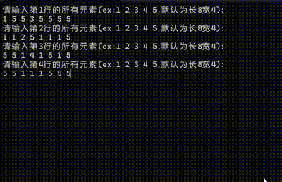
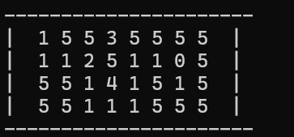
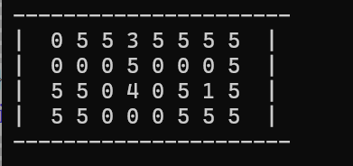
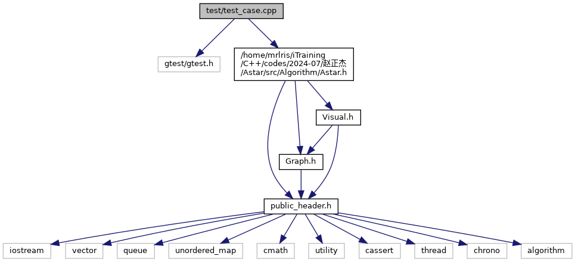
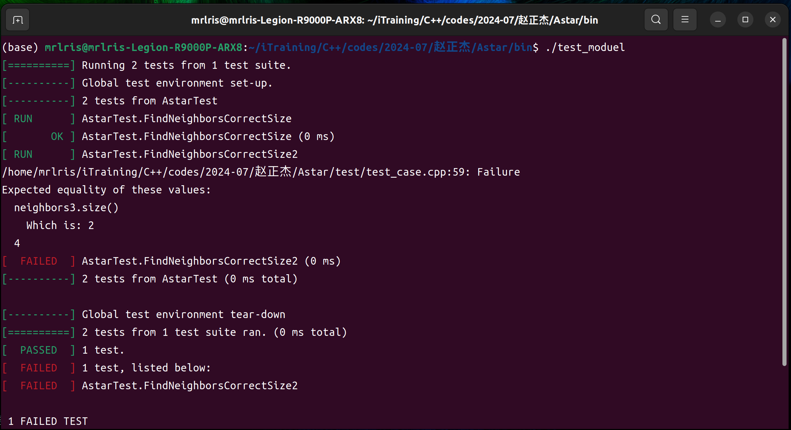

# Astar算法简单实现

## 本项目实现了Astar算法的简单实现，并提供了可视化的界面。
- 输入：起点和终点坐标
- 输出：从起点到终点的最短路径（以可视化的形式呈现）
- 基本实现思路：
    首先我们把地图看作一个二维数组，数组中的每个元素代表一个格子，数组的行数和列数代表地图的大小。
    然后我们定义一个类，包含地图信息、起点和终点坐标、障碍物坐标等信息（这里由于我们实现的是权重版本，所以我们默认障碍物就是权重很高的坐标点）。
    然后我们定义一个Astar算法的类，该类包含算法的主体部分，包括启发函数、代价函数、路径规划等。
    最后我们使用该类来进行路径规划，并将结果以可视化的形式呈现。
- Astar伪代码如下：
```c++
        PriorityQueue frontier;
        frontier.put(start, 0);
        map<Node, Node> came_from; // Tracks the path
        map<Node, double> cost_so_far; // Tracks the cost
        came_from[start] = None;
        cost_so_far[start] = 0;

        while (!frontier.empty()) {
            Node current = frontier.get();

            if (current == goal) {
                break;
            }

            for (Node next : graph.neighbors(current)) {
                double new_cost = cost_so_far[current] + graph.cost(current, next);
                if (cost_so_far.find(next) == cost_so_far.end() || new_cost < cost_so_far[next]) {
                    cost_so_far[next] = new_cost;
                    double priority = new_cost + heuristic(goal, next);
                    frontier.put(next, priority);
                    came_from[next] = current;
                }
            }
        }

        return make_pair(came_from, cost_so_far);
```
## 实验结果





## 整体架构图（由Doxygen自动生成）


## 简单生成的gtest测试用例(failed为人为设置的失败测试用例)
