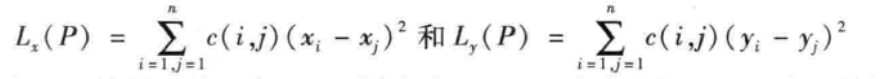
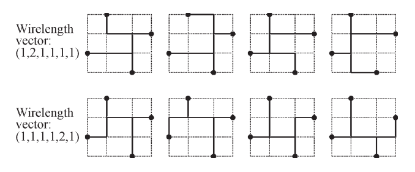
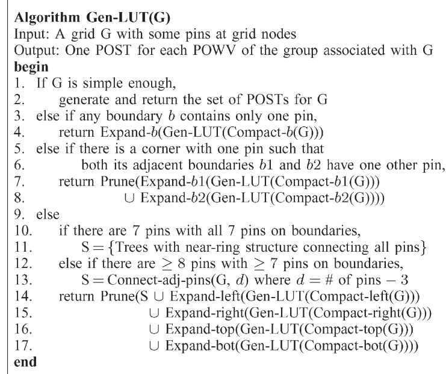

### 一、布局

#### **布局算法：二次线长布局算法+力矢量布局**

设计目标：调整不同元胞在元胞中的摆放位置，使得元胞在版图中的连线最短，同时确保在布局中没有重叠

> 二次线长布局分为两个阶段
>
> 第一阶段：依据元胞的中心对元胞进行布局，从而对二次线长函数最小化
>
> 第二阶段：将元胞中集中在许多元胞重叠的大的结群打散，从而使所有单元原来的重叠消除

```\
输入：线网连接，限制的版图区域
输出：所有元胞的x坐标和y坐标
```


#### 数据结构设计

1、元胞可以抽象成一个含有x，y坐标的结构体

2、网表抽象为二维map，记录不同元胞之间的连线情况，同时x，y代表元胞在map中所处的位置信息


#### 算法主要思想

**第一阶段：全局布局（二次线长布局）**

> 在全局布局的过程中，将元胞的坐标抽象成为中心点的坐标，不考虑其面积、大小以及布局的合法化，仅仅是以最优化模块之间的线长为目标。

```
已知线网的的连接，限制的版图区域，求不同元胞在版图中摆放的位置，使得所有元胞在版图中的连线最短。
求：所有的元胞的x坐标和y坐标。

1、列出所有连接的元胞线网的X的总线长L(p)：所有的x距离的差的平方
2、分别对所有参数中的x求偏导，并令偏导为0
3、列出方程组，解出来的x阵列就是所需要求的解
对于Y方向也是同理

该算法只是以中心点作为元胞的坐标，所有没有考虑到不同元胞的大小，会存在重叠的问题
```

距离计算代价函数



通过求偏导数，解出x和y。

**第二阶段：详细布局（力矢量布局）**

> 用于在已经布置好的版图中，新加入一个元胞，通过找到让该元胞平衡的状态，来确定该元胞在版图中的位置。
>
> 采用力学中的质点弹簧系统来建模，每个元胞运动吸引其他元胞，其中吸引力与距离成正比。如果所有元胞到达它们的平衡位置，线长将得到最小化。**将目标转化为将所有的元胞放在一个力平衡的位置上。**——**称为零力目标**（ZFT）

```
1、以二次线长布局过后的布局为初始布局
2、为每个布局中的元胞设定坐标，并标记为UNMOVED
3、对元胞按照元胞的连接数进行排序，该顺序就是元胞迭代的顺序
4、迭代的取出每一个元胞，并寻找它的ZFT位置，直到所有的都完成
5、若ZFT位置被占据，则移动到其他的位置

第5步确定p的ZFT时，若ZFT被元胞q占据，则移动位置的确定
1、如果可能，将p移动到靠近q的位置
2、若交换p，q后，代价变小，则交换
3、链式移动，p移动到q，q移动到下一个，以此类推
4、波状移动，p移动到q，再重新计算q的ZFT
```

Loss为权重乘以坐标差的累计和

**时间复杂度**

假设元胞的数量为n

二次线长布局的时间复杂度为：O(n^2)，需要遍历一遍map，找到各个节点之间的连线信息

力矢量布局的时间复杂度为：O(n^2)


### 二、布线

#### 布线算法：FLUTE算法

设计目标：找到能将节点连接的最小斯坦纳生成树

> 在EDA的布线中，各个板块的IO接口以及时钟接口之间，通常是走的斯坦纳线，而直接求斯坦纳最小树是NP完全问题，使用FLUTE算法可以将RSMT问题转化为查找表的问题

```
输入：pin结点，以及结点的位置
输出：将所有结点连接起来的斯坦纳树
```

#### 算法数据结构设计

**1、POWV（Potentially optimal wirelength vectors）**

在FLUTE算法中，会使用一种带有信息（权重）的数据结构（向量）来表示一种斯坦纳树，任意一棵斯坦纳树都可以使用唯一的POWV来表示，一个POWV向量可以表示多棵不一样的斯坦纳树，如下图。

> 前面三位表示x方向上的length
>
> 后面三位表示y方向上的length



**2、POST（potentially optimal Steiner tree）**

对每一个POWV都会对应存储一个POST，也就是说，不是存储所有的斯坦纳树，只是存储一个可能的斯坦纳树，因为同一个向量的所有斯坦纳树的代价总和总是一样的。POWV和POST会构建成一个映射关系，同时将其存入到一个Table中，表中还包含POWV的总权重。而此时，权重最小的则可代表一个最小斯坦纳生成树。

**3、table可以使用哈希表来进行设计**

使用POWV做表头，权重和POST作为value，给出节点后，生成所有的可能的POWV表，再通过权重对其进行排序，取其POST作为斯坦纳树结果。

#### 算法主要思想

```
总体流程：
所有N点线网根据pin脚的位置都可以划分到n！个group中，每个group中存有POWV，对于一个线网最优线长可由POWV来获得，FLUTE算法首先会预计算这些POWV形成一个查找表。
与POWV一起存储的还有POST，一个POWV对应多个POST，一个POST只有一个POWV
基于此，要得到一棵RSMT，只需要计算线网所在的组对应的POWV的线长，然后返回对应的POST即可
上述查找表算法最高支持9点线网，对于9点以上的需要递归的切分线网
```

* 生成查找表算法



#### 时间复杂度

时间复杂度为：O(nlgn)


### 三、静态时序分析

#### 单元库

在静态时序分析中，单元库（library）是指一个集合，其中包含了各种标准的逻辑元件、时序元件和组合元件的建模。单元库中的元件通常带有特定的时钟延迟和逻辑功能，以及电压和温度等方面的参数，通过使用单元库，可以在时序分析中模拟和评估设计的时序特性，以帮助发现和解决潜在的时序冲突和时序失效问题。


#### 互连寄生

互连寄生是指在集成电路或电子系统中，由于导线或连接器的存在，引起的非理想的电特性和效果。主要包括电容和电阻，互连寄生会对电路的信号传输、功耗、噪声和时序等方面产生不良的影响。

电阻寄生：互连导线的电阻会引起信号的衰减和功率损耗。较长的导线通常具有更大的电阻。

电容寄生：互连导线的电容会引起信号的延迟和功耗。电容会存储和释放电荷，导致信号传输速度变慢。


#### 单元时延（NLDM表格）

单元时延（NLDM表格），全称为非线性延迟模型（Non-Linear Delay Model），是一种常用的静态时序分析中的时延模型。在数字电路设计中，时延模型用于描述逻辑元件（如门级电路或时序元件）的输出到输入之间的传播延迟。

NLDM表格是一种常见的时延模型，它以表格的形式表示输入到输出之间的传播延迟。表格的输入是逻辑元件的输入端的不同组合，并且通常包括输入的电压和电流等参数。表格的输出是逻辑元件的输出端的延迟时间，通常以纳秒或皮秒为单位。

NLDM表格通常由电路设计工具根据所用的逻辑元件和工艺库生成。基于这个模型，可以进行静态时序分析，以评估电路的时序性能，如时钟周期、信号传输延迟和时序失效等。


#### 线网时延（Elmore计算）

线网时延，也称为Elmore时延，是一种常用的近似计算方法，用于估计电路中导线上的传播延迟。它是一种简化的时延模型，适用于传输线上电压/电流从输入端到达输出端的时间。

```
Elmore计算基于以下假设和简化：
1、传输线上的时延主要由传播速度和传输线上的等效电容决定。
2、传播速度是恒定的，不考虑传输线上的阻抗匹配或反射等因素。
3、传输线被近似为一系列等效电容连接起来的节点。

根据这些假设，Elmore计算使用以下步骤来估计线网时延：
1、将电路中的传输线划分为一系列节点，每个节点对应于传输线上一个等效电容。
2、从输入端开始，依次计算每个节点的时延。每个节点的时延等于前一节点的时延加上当前节点的等效电容与前一节点电流之积。
3、在达到输出端后，最后一个节点的时延就是整个线网的传播延迟。
```


#### 串扰噪声的定义

噪声是指电路中任意节点上不希望出现的电压或电流的偏差。当噪声作用于某个电路节点上时，它可以瞬间破坏该节点上存储的逻辑信息。如果这一破坏状态被锁存到锁存器中，那么将会导致功能性错误。

主要有毛刺和延时噪声。


#### 时序检查（Setup/Hold）

时序检查是在数字电路设计中进行的一种重要时序分析，用于验证和确保输入信号在时钟边沿触发时的稳定性和正确性。

Setup Time：是指在时钟边沿到达之前，输入信号必须稳定在其有效值的时间。如果输入信号在设置时间窗口内没有稳定，可能会导致电路中的逻辑冲突和错误。

Hold Time：是指在时钟边沿到达之后，输入信号必须继续保持在其有效值的时间。如果输入信号在保持时间之前改变或不稳定，也会导致电路中的逻辑错误。


#### 时序路径定义

时序路径（Timing Path）是指信号从一个寄存器节点（如时钟触发器）通过逻辑路径传播到另一个寄存器节点的路径。它描述了数据在电路中的传输和处理过程，并对时序分析和时序优化提供了重要信息。

通过分析时序路径，可以确定信号在路径中的传播延迟，包括设置时间和保持时间等重要时序要求。时序路径分析可用于预测时钟频率、检测时序冲突、优化时序性能，以及验证设计是否满足时序规约等。


#### 时序约束命令


### 四、EDA性能

* 如何解决EDA软件中的性能问题？

  算法：优化数据结构，提高算法性能，降低算法的复杂度

  硬件：确保计算机的硬件资源重组，对于一些矩阵操作可以考虑使用GPU加速

  分布式：将问题拆解成可以并行计算的小问题，开发支持并行计算的EDA工具

  ... ...

  

### 五、EDA后端

* 请简述EDA后端软件开发的流程。每个阶段主要在做哪些工作？


### 六、EDA工具

* 常见的EDA仿真工具和Debug工具分别有哪些？它们有什么优势和不足？

  仿真工具：

  - ModelSim/QuestaSim (Mentor)
  - VCS (Synopsys)
  - Xilinx Vivado Simulator (Xilinx)
  - Incisive (Cadence)
  - Icarus Verilog

  优势：

  - 高度准确和精确的模拟功能。
  - 可以模拟各种不同级别的设计，从门级仿真到系统级仿真。
  - 支持时序和功能仿真，可以检测和调试设计中的逻辑错误和时序问题。

  不足：

  - 仿真时间较长，尤其是对于大型和复杂的设计。
  - 需要大量的计算资源（CPU和内存）。
  - 对于某些特定的设计场景，可能需要针对特定工具进行配置和优化。