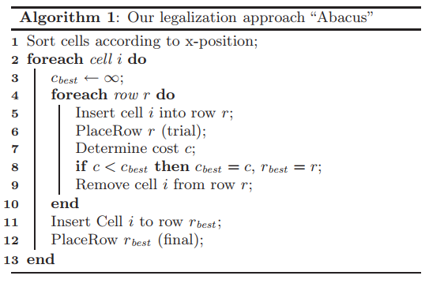
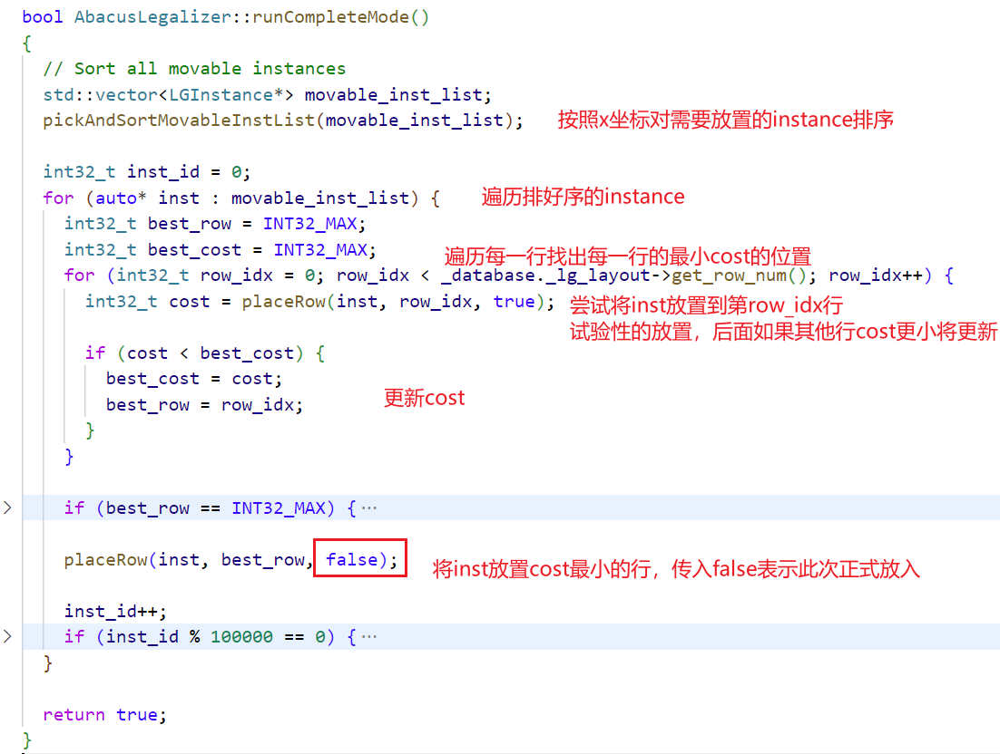
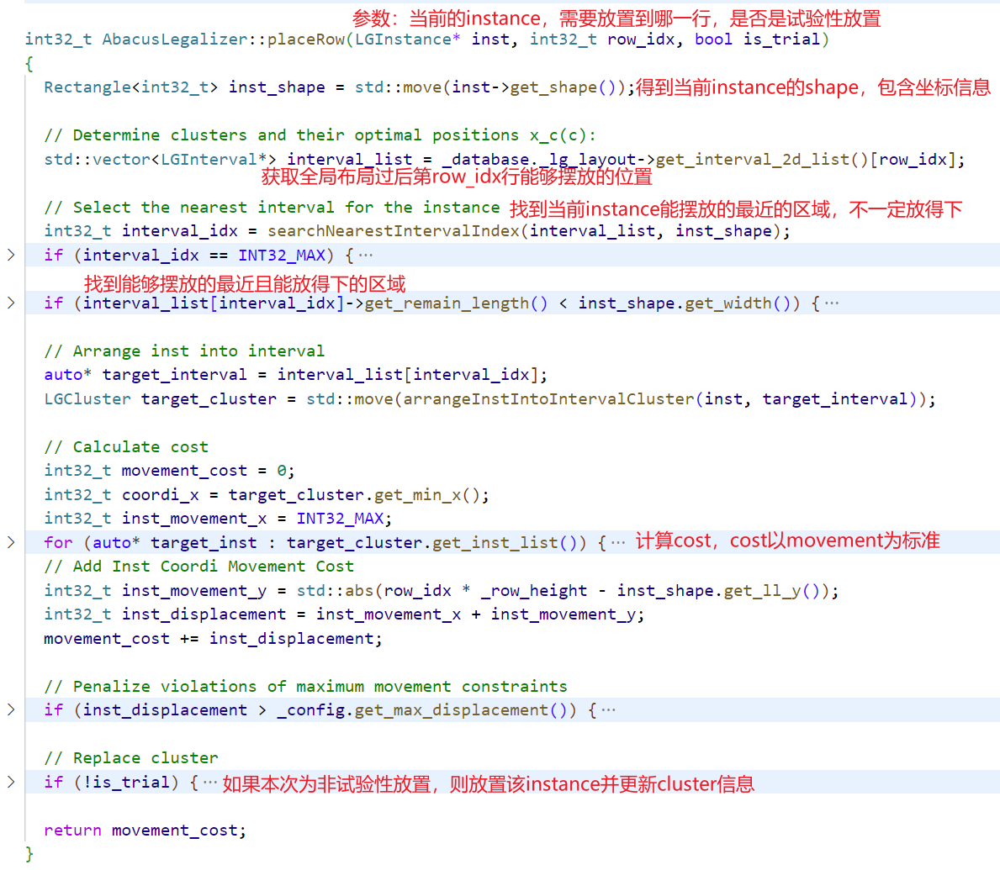
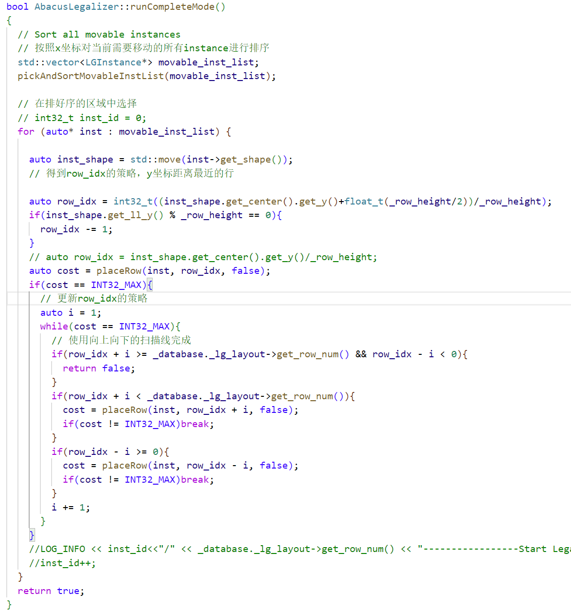
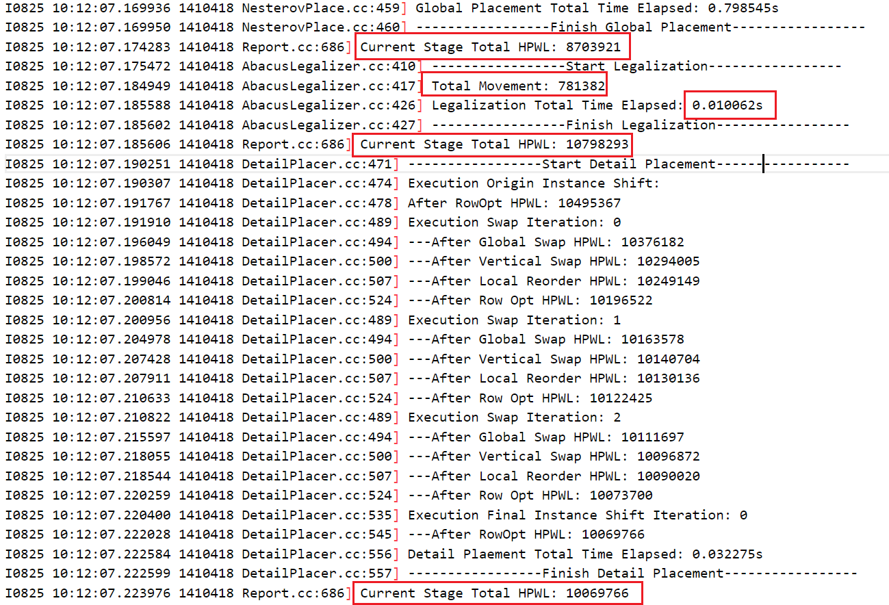
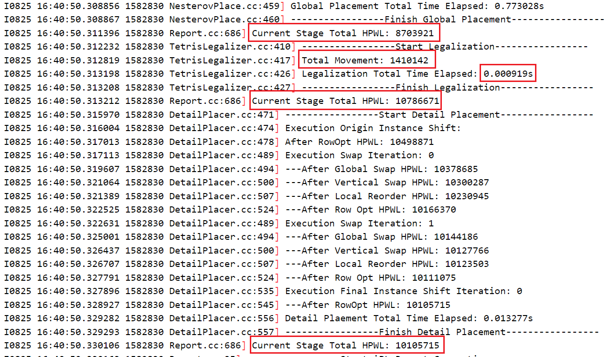
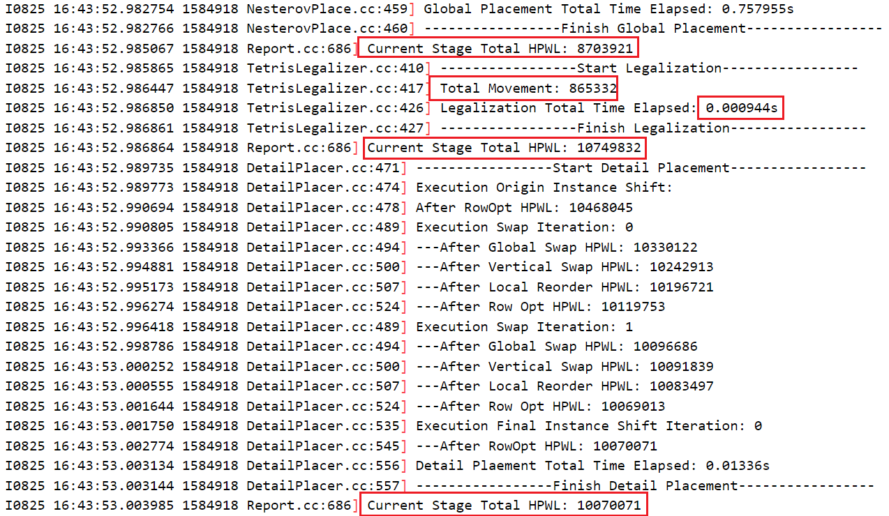
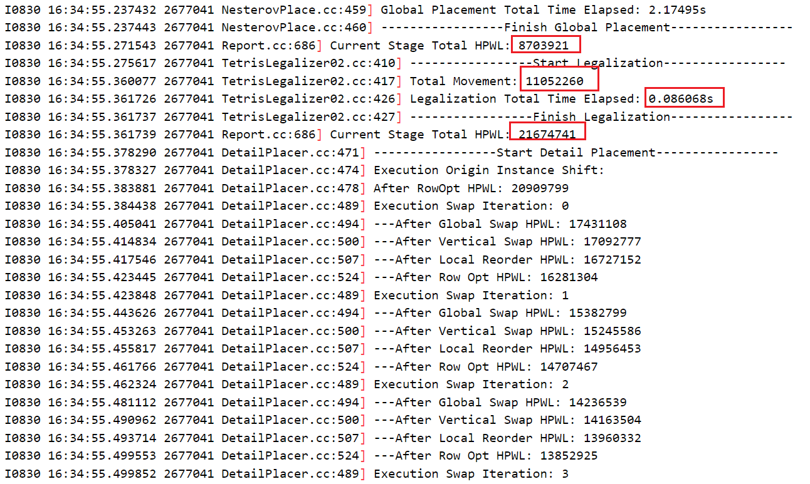
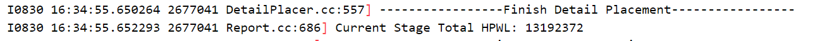

## iEDA工程代码时间—布局合法化（LG）

### 一、理论知识

布局合法化是全局布局以后的一个过程，在全局布局过后，规划版图中的宏单元会放置在相应的位置并保持不再移动，于此同时，对于标准单元的规划，也会通过一些相关算法完成大致位置的摆放，这些摆放是基于相关优化目标下进行的，例如线长，面积等，但是在全局布局中并不会考虑标准单元之间的非法情况，即标准单元重叠的问题，因此在布局合法化中，需要完成的任务就是在尽可能的不破坏全局布局的布局结构的情况下，使得所有标准单元不再重叠。核心算法用到的是`Abacus`算法和`Tetris`算法。

### 二、Abacus算法

> 同一时间只放置一个单元

**算法伪代码**



**核心代码**



```
1、根据单元的x坐标进行排序
2、对于每一个排序好的单元，按照顺序取出每一个单元
3、遍历第一行，找出当前行中放置该单元后能够使得cost最小的位置
4、按照第3步的方式遍历每一行，找出全局中能够放置当前单元并使得cost最小的位置
5、放置该单元
```

**placeRow解析**

> 这个函数是`AbacusLegalizer`中的一个函数，它用于在布局合法化过程中放置一个实例（instance）到一个行（row）中。函数的输入参数包括一个`LGInstance`实例指针、行的索引`row_idx`和一个标志`is_trial`，用于指示是否是试验性放置。

该函数主要完成了以下工作：
- 在给定的行中找到合适的间隔来放置实例。
- 计算放置实例的移动代价，包括实例在`x`和`y`方向上的移动代价以及超过最大移动约束的处罚。
- 进行非试验性放置时，更新簇的信息和间隔的剩余长度。



```
函数的主要步骤如下：
1. 获取实例的形状（inst_shape）。
2. 从_layout对象中获取指定行的间隔列表（interval_list）。
3. 通过搜索找到最近的间隔，即与实例重叠的间隔（interval_idx）。
   - 如果找不到重叠的间隔，则返回INT32_MAX表示失败。
4. 检查选定的间隔是否能够容纳实例的宽度，如果不行，则查找最近的非满间隔，并重新选择。
   - 如果找不到合适的间隔，则返回INT32_MAX表示失败。
5. 将实例安排到选定的间隔中，形成一个簇（target_cluster）。
6. 计算移动代价（movement_cost）：
   - 从簇中的每个实例计算到目标位置的x方向移动代价，并累加到movement_cost中。
   - 计算实例在y方向上的移动代价。
   - 将实例在x和y方向上的移动代价相加，得到实例的位移代价（inst_displacement）。
   - 将实例位移代价加到movement_cost中。
7. 根据最大移动约束处罚超过最大移动约束的位移代价。
8. 如果is_trial为false，即非试验性放置，则替换簇的信息（replaceClusterInfo）和更新间隔的剩余长度（updateRemainLength）。
9. 返回移动代价（movement_cost）。
```

### 三、Tetris算法

`Abacus`是在`Tetris`算法上的改进，在`Tetris`中，对于`placeRow`的选择是一个单次即可完成的过程，即在当前行中找到了能够合适的位置以后即将该`instance`放置到该行。因此整体算法流程相似，但复杂度会降低很多。

```
1、根据单元的x坐标进行排序
2、对于每一个排序好的单元，按照顺序取出每一个单元
3、遍历第一行，找出当前行中放置该单元后能够使得cost最小的位置
4、放置该单元

若改行无法放置该单元，进行换行策略选择，重新执行，直到所有行都无法放置，返回false
```



因此对`iEDA`原始代码`Abacus`算法调整成`Tetris`只需要确定两个策略即可：1、如何选择当前`instance`初始行的策略。2、若初始行无法放置当前`instance`后，选择其它行的调整策略。

* 选择初始行策略

  > 合法化是在全局布局过后的步骤，应尽可能的减少相关单元的移动，且尽可能地保证单元移动后和移动前地位置相近，因此最好是在该单元所在行的附近行进行移动

  1、加上`_row_height`后做除法

```
auto row_idx = int32_t((inst_shape.get_center().get_y()+float_t(_row_height/2))/_row_height);
if(inst_shape.get_ll_y() % _row_height == 0){
  row_idx -= 1;
}
```

​		2、直接使用`y`坐标与`_row_height`做整数相除

```
auto row_idx = inst_shape.get_center().get_y()/_row_height;
```

* 换行策略

```
if(cost == INT32_MAX){
  // 更新row_idx的策略
  auto i = 1;
  while(cost == INT32_MAX){
    // 使用向上向下的扫描线完成
    if(row_idx + i >= _database._lg_layout->get_row_num() && row_idx - i < 0){
      return false;
    }
    if(row_idx + i < _database._lg_layout->get_row_num()){
      cost = placeRow(inst, row_idx + i, false);
      if(cost != INT32_MAX)break;
    }
    if(row_idx - i >= 0){
      cost = placeRow(inst, row_idx - i, false);
      if(cost != INT32_MAX)break;
    }
    i += 1;
  }
}
```

### 四、实验结果

* 使用原始的`Abacus`算法



* 初始行策略使用：加上`_row_height`后做除法



* 初始行策略使用：直接使用`y`坐标与`_row_height`做整数相除



* 使用手册上`Tetris`的方法






* 对比

|                             |  Abacus   |     1     |     2     |      Tetris       |
| :-------------------------: | :-------: | :-------: | :-------: | :---------------: |
|        全局布局HPWL         |  8703921  |  8703921  |  8703921  |      8703921      |
|    合法化移动总Movement     |  781382   |  1410142  |  865332   | 11052260(14.144)  |
|       合法化运行时间        | 0.010062s | 0.000919s | 0.000944s |     0.086068s     |
|       布局合法化HPWL        | 10798293  | 10786671  | 10749832  | 21674741（2.007） |
|        详细布局HPWL         | 10069766  | 10105715  | 10070071  |     13192372      |
| Average Congestion of Edges | 0.728164  | 0.718681  | 0.713207  |     0.713207      |
|       Total Overflow        | 10.000000 | 10.000000 | 10.000000 |     10.000000     |
|      Maximal Overflow       | 2.000000  | 2.000000  | 2.000000  |     2.000000      |
|       Peak BinDensity       |     1     |     1     |     1     |         1         |
|         Total HPWL          | 10069766  | 10105715  | 10070071  |     13192372      |
|         Total STWL          | 10862347  | 10863122  | 10864139  |     14100332      |
|          Max STWL           |  437405   |  442445   |  460685   |      518305       |

**结果分析**

* 将`Abacus`换成`Tetris`后，在同样的全局布局的版图中

  * `Movement`会增加

    因为在`Abacus`中计算的是每一个单元在所有行中的最小`cost`，而`Tetris`中则是计算的是周围行内，会存在差异性，这样的差异性在**较为密集**的全局布局中体现更为明显。

  * 合法化运行时间会减少

    很显然，`Abacus`算法能够降低`Movement`就是以牺牲时间复杂度作为代价的，每一次`instance`的放置，平摊下来都会多出`_row_nums-1`轮次

  * 布局合法化`HPWL`存在不确定性

    在实验中表现出来的是减少的特性，但实际上是表现出的不确定性，因为`Abacus`算法中的`cost`仅仅是以当前能够移动的最少的`x`和`y`的总和作为基准，并没有将线长给加进去，所以对于线长来说使用`Abacus`算法仅仅是一个贪心策略，不一定能够达到全局最优的效果

* 感觉`Abacus`算法还是有点暴力


### PS：在重新复盘Tetris算法过后

最开始并没有完全理解要求完成的任务所描述的`Tetris`算法，仅仅是在`Abacus`的基础上置换了一个选择初始行和换行的策略，所以在最开始的代码当中调用的依然是原始的`placeRow`函数，在这个函数中的操作依然选择的是距离当前`instance`当中最近的`internel`，所以能够达到在时间减小的情况之下能够使得`HPWL`也减小的情况，这样的结果显然是存在偶然性的，因为找到的解都不一定都是最优解，与全局布局的结果有关。

当使用手册上描述的`Tetris`算法后，最终运行期间的`Movement`变为原来的14倍多，而`HPWL`也是原来的2倍左右。

