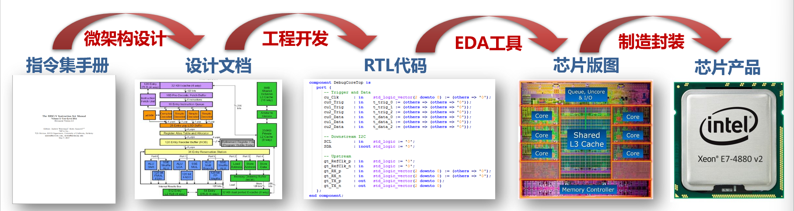

## 1、EDA设计流程

**处理器芯片设计**

* 处理器架构设计：将指令集手册定义到功能实例化，形成设计文档
* 功能开发：将设计文档开发成RTL级逻辑运算代码
* 版图设计：用EDA工具将设计好功能等RTL代码物理化成GDS版图
* 芯片制造：将设计好地版图通过光刻制造封装形成芯片

**EDA问题模块拆解**

逻辑综合->物理设计->版图后处理->单元可设计->签核分析->电路仿真->物理验证->封装测试->EDA数据库->芯片测试集->GUI和智能流程

### 物理验证

形式化验证

* 使用形式化的数学推理和逻辑推断来验证设计是否满足特定的规范和设计
* 可以检查设计功能正确性、安全性、时序一致性、死锁和状态覆盖

仿真验证

* 使用电路模拟图，时序图来进行验证

时序验证

* 使用时序弧来进行验证

DRC+ERC（设计规则检查+电学规则检查）

LVS（版图和原理图一致性检查）：原理图提取+版图比较

* 从电路设计的原理图中提取出关键的布局和连接信息，生成一个原理图模型
* 将原理图模型和电路版图进行比较，检查电路的布局、互联、元件位置等是否与原理图一致。

### 签核

RC提取

时序验证

> 采用时序分析等方法验证设计是否满足时序收敛，包括反向标定，时序与功耗检验、时序与信号完整性的检验和当代低功耗纳米线性设计中的多模式多端角检验。

噪声

电源

电源电压降

## 2、EDA设计流程图

