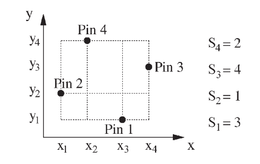
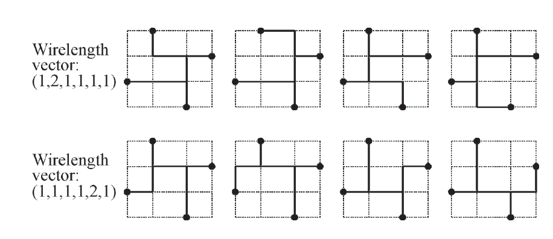

## FLUTE: Fast Lookup Table Based Rectilinear Steiner Minimal Tree Algorithm for VLSI Design 

> 用于VLSI设计的基于快速查表的直角斯坦纳最小树算法


论文组织结构

第一部分：简介

第二部分：对于低网络引脚纬度的FLUTE算法实现

第三部分：生成POWVs（potentially optimal wirelength vectors）和POST（potentially optimal Steiner tree）算法

第四部分：如何减少lookup table的尺寸

第五部分：推导给定网络的所有POWVs

第六部分：高纬度的网络划分为低纬度

第七部分：实验结果

第八部分：总结


### LOOKUP TABLE APPROACH FOR LOW-DEGREE NETS  

> 对于低纬度网络的查找表方法



```
含有n个pin的网络的度数degree为n
xi为X方向上第i条竖直线
yi为y方向上第i条水平线
si = k 表示当前第i个结点在第k条竖直线上，将s使用x的降序排序
将金属长度表达成一个向量，分别为水平方向长度和竖直方向长度的叠加
```

一个最优的RSMT总是能够基于Hanna网格构造出来

* 使用向量来表示一棵潜在的最小树

  > 前面三位表示x方向上的length
  >
  > 后面三位表示y方向上的length

  

具有同样位置信息的结点它的POWV也一样

可以将边界以外的点映射到边界上


### GENERATION OF LOOKUP TABLE  

> 生成lookup 表

Boundary-compaction technique：界限压缩技术

算法伪代码


