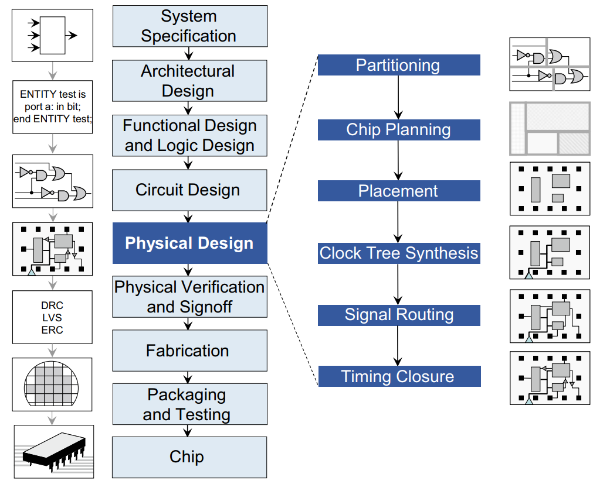

```
必会：
VLSI超大规模集成电路设计流程
电路划分算法，KL算法、FM算法、多级划分框架
芯片规划流程，布图规划，引脚分配，电源和地线布线算法
```


第二章（功能设计划分），第三章（芯片规划）

第四章（电路元件的几何布局），第五章，第六章：电路布线

第七章：同步电路的特定布线和时钟树综合

第八章：满足特定的技术和性能要求去确保最终制作的布局满足系统目标


集成电路->多芯片模块mutil-chip modules（MCM）->印刻电路板printed circuit boards（PCB）


## 第一章 绪论

### 电子设计自动化（EDA）

EDA（Electronic Design Automation），全称电子设计自动化，是用来辅助超大规模集成电路设计生产的工业软件，涵盖电路芯片设计、制造、封装、测试整个流程。随着芯片设计的复杂程度不断提升，基于先进工艺节点的集成电路规模可达到数十亿个半导体器件，不借助EDA已经无法完成芯片设计。

EDA工具是集成电路设计和制造流程的支撑，是集成电路设计方法学的载体，也是连接设计和制造两个环节的纽带和桥梁。

采用软件来实现自动化

> EDA将设计者的需求分为电子系统层次结构中的多个级别，包括集成电路、多芯片模块和印制电路板

EDA工具总是面向整个设计过程的自动化，并将设计步骤链接成一个完整的设计流。

### VLSI设计流程



系统规范—架构设计—功能和逻辑设计—电路设计—物理设计—物理验证和签收—制造—封装和测试—芯片

物理设计关键步骤还可以细分

划分—芯片规划—布局—时钟树综合—布线—时序收敛

* 系统规范

  定义系统的总体目标和高级需求：功能、性能、物理尺寸、生产技术

* 架构设计

  模拟和混合信号模块集成

  存储管理——串行或者并行——寻址方案

  计算核的类型核数量（处理器，数字信号处理单元，特别的DSP算法）

  芯片内外的通信，对标准协议的支持

  硬、软IP模块的使用

  引脚分配、封装、管芯封装接口

  电源需求

  工艺技术核层堆栈的选择

* 功能和逻辑设计

  * 功能设计

    每个模块的输入、输出和时序行为

  * 逻辑设计（用硬件描述语言HDL，如Verilog和VHDL定义芯片的功能和时序行为）

  * 逻辑综合工具自动使HDL转变为底层的电路单元。即映射为信号网列表或网表和特定的电路单元

* 电路设计

  一些关键的低端的单元必须在晶体管级来进行设计，这就是所谓的电路设计。

  包括：静态RAM模块、I/O、模拟电路、高速函数（乘法器）以及静电放电保护电路

* 物理设计

  所有的设计组件（宏模块、单元、门）都实例化为几何表示

  * 划分
  * 布线规划
  * 电源和地网布线
  * 布局
  * 时钟网综合
  * 总体布线
  * 详细布线
  * 时序收敛

* 物理验证
* 制造：fabrication
* 封装和测试


### VLSI设计模式

> 全定制和半定制

* 半定制标准设计模式：
  * 基于单元：通常采用标准单元和宏单元，包含许多预定义元件（从元件库复制而来）
  * 基于阵列：采用门阵列或者FPGA，包含若干制备好的元件，通过预布线相连

* 全制定设计

  需要有版图编辑器

* 标准单元设计，有固定的电源和接地端口

  布局的自由度较少，复杂度大大降低

* 宏单元

  较大块逻辑，执行可重用的功能

* 门阵列

  具有标准逻辑功能的硅片，但是没有链接

* 现场可编程门阵列（FPGA）

  逻辑单元和互连都是预先制造好，但是用户可以通过开关来配置

* 结构化ASIC（无通道门阵列）


### 版图层和设计规则

* 版图层

  硅作为扩散层，多晶硅、铝和铜作为互连层；多晶硅作称为poly层，其余曾称为Metal1层、Metal2层等。
  
  单元之间的布线是完全在金属层进行的。
  
* 设计规则

  大致分为三类

  * 尺寸规则：任何组件（形状）的尺寸
  * 间距规则：组件形状之间的间距
  * 覆盖规则：组件形状之间的覆盖量


### 物理设计优化

物理设计的目标：最小芯片面积、最小线长和最少过孔

最优化的目标：提升电路性能，可靠性


* 版图优化

  > 满足约束：工艺约束、电气约束、几何约束


### EDA常用术语

逻辑设计：将HDL描述映射到电路门和门在网表级的连接的过程。

* 结果通常是单元或其他基本电路元件和连接的网表。

物理设计：决定单元（或者其他电路元件）和它们的连接在集成电路版图中几何布置的过程。连接拓扑从网表中得到。

* 物理设计的结果是几何和功能都正确的表示，用标准文件格式，例如GDSII流。

版图验证包括：

* 设计规则检验（DRC）——遵守所有的技术需求
* 版图和原理图一致性检验（LVS）——是否和原始网表一致
* 天线规则检验——没有天线效应
* 电气规则检验——遵守所有的电气需求

```
组件：有基本功能的电路元件
模块：一个电路划分或者一部分构件的集合
块：具有形状的组件，有固定尺寸的电路划分
单元：用不同构建建立的逻辑或者功能单位。如：INV，NAND，NOR，常用来指标准单元和宏单元
标准单元：一种预先决定功能的单元，在标准单元里，逻辑设计是将标准单元排列在行里来实现的
宏单元：一种没有预先定义尺寸的单元。可以指大型物理版图，如SRAM，CPU核
引脚：一个电子终端，用于连接给定的构件到它的外部环境
层：制造工艺等级，在这个等几种，设计构件在芯片上成型。
接触层：硅核金属层之间的直接连接，接触层经常用在单元内
过孔：金属层之间的连接，通常用来连接不同层的布线结构
线网或信号：必须在相同电势下连接的引脚或终端的集合
供电网：提供电流给单元的电源（VDD）和地网（GND）
网表：设计中连接的所有信号网和构件的集合，或者是所有网和分段设计的连接引脚的列表。
网表可以组成：1、面向引脚，每个设计构件都有一个相关线网的列表。2、面向线网，每一个线网都有一个相关构件的列表。网表在逻辑综合中创建，是物理设计的关键输入。
线网权重（W）：用来表示线网的重要性或关键性

网表的表示方法：连接图和连接矩阵
```

### 第一章总结

* 什么是EDA？

  EDA全称是Electrical Design Automation（电子设计自动化），是芯片设计中的辅助软件工具也是必不可少的一个工具，随着芯片中集成的半导体和电路规模越来越大，EDA工具也越来越重要。

* 超大规模集成电路（VLSI）的设计流程？

  系统规范—架构设计—逻辑功能设计—物理设计—物理验证—制造—封装—测试—芯片

* 其中物理设计包括哪些部分？

  物理设计包括：布图规划，布局规划，布线，时钟树综合，时序分析


## 第二章 网表和系统划分

一般采用分治的策略进行芯片设计，先将模块进行布局，然后将结果转换为几何划分。

### 介绍

> 降低现代集成电路设计复杂度的方法是将它们划分为更小的模块。

划分的主要目标是将电路进行划分，使得子电路之间的连接数最小化，且符合设计约束。

### 术语

```
元胞：构成组件的任何逻辑或功能单元
划分或块是由元胞和组件构成的
多元划分的问题是将电路划分为K个部分
```

### 优化目标

在平衡划分大小时，将所有割边数或割边的权重数最小化，称为最小割划分算法

### 划分算法

> Kernighan-Lin算法（KL）、KL拓展算法、Fiduccia-Mattheyses（FM）算法
>
> **模拟退火法**、随机爬山算法

KL算法：对于一个含有2*N个元胞且要划分的区域为N：N的，使用的是两个不同划分之间的元胞进行交换，通过计算能够是当前增益达到最大。

FM算法：划分不平衡的算法，其中需要一个平衡因子来控制移动以后是否平衡。通过计算能够使得移动以后使得当前达到增益最大。可用于超图中。


### 多级划分框架

> 从粗粒度网表，到细粒度网表

为了提高网表划分的可扩展性，FM算法被嵌入到了一个多级框架中去，包含几个不同的步骤。

1、原始的展平的网表被进行层次结群。

2、将FM算法应用到这个结群网表中。

3、部分网表在非粗粒度阶段被解开结群。

4、在细粒度阶段，FM算法增量式应用到部分被解开结群的网表中。

5、第3和第4一直继续知道所有网表解开结群为止。


* 结群

  连接紧密的结点被结群，结群之外的连接保持原来网表的结构。通常结群的大小会受到限制，从而防止结群的退化。

  合并结点后，结群的权重是它所包含的成员结点的权重综合

* 多级划分

  当结构过多的时候，FM算法会收到一定的限制，复杂度会很高，所以通过多级划分的方式可以减小复杂度

* 基于多FPGA的系统划分


### 第二章总结

* 什么是网表划分？

  

* 网表划分算法KL算法？

  

* 网表划分算法FM算法？

  


## 第三章 芯片规划

芯片规划处理大规模模块：高速缓存、嵌入式内存及面积已知、形状固定或可变或集成电路IP核等。

**芯片规划主要包括了三个主要阶段：布图规划、引脚分配、电源规划**

布局规划：根据模块的面积和长宽比来优化芯片的大小、降低互连线长度和改善时延，从而确定了这些模型的位置和大小。

引脚分配：通过输出信号线连接到块引脚。I/O布局为芯片的输入和输出引脚确定焊盘的位置，通常在芯片的边缘。这一步最理想在布局规划前进行。

电源规划：建立电源供电网，电源网和底线网。


### 布图规划介绍

布图描述了模块之间的关系

布局规划阶段确保：1、每个芯片模块被分配了一个形状或位置，便于进行门布局。2、每个有外部连接的引脚被分配了一个位置，这样内部和外部的线网都可以进行布线了。


### 布图规划的优化目标

每个模块的位置和它的长宽比

* 全局边界框的面积和形状：影响电路性能、成品率、制造代价
* 总线长，最小生成树
* 面积和总线长的组合
* 信号时延

### 术语

```
矩形划分：将芯片面积划分为一组块或非重叠矩形的几何
布图规划二划分：通过不断对矩形进行划分得到的一个矩形划分，从整个芯片开始，反复用水平或垂直割线将其划分为两个小矩形。
二划分树或者二划分布图规划树：有k个叶子和k-1个内部节点的二叉树，每个叶子代表一个块，每个内部节点代表一条水平或垂直割线。
布图树：一棵表示层次化布图的树。每个叶子节点代表一个块，每个内部节点代表一个水平分割或垂直分割。
约束图：对一个布图表示，包括两个有向图，垂直约束图和水平约束图，可以得到块之间的相对位置关系。
垂直约束图：节点权重表示块的高度。最长路径，相当于布局所需的最小垂直高度。
水平约束图：结点权重代表块的宽度。最长路径，相当于布局所需的最小水平宽度。
序列对：块排列的一个有序对。用S+和S-表示，用于区分序列是左右关系还是上下关系。
```

### 布图的表示

> 布图的表示方法：1、约束图，2、序列对

布图、约束图（垂直约束图，水平约束图）、序列对

问题：

如何将一个布图转化为一个约束图对（垂直&水平）

* 垂直约束图：从下到上，从左到右，先绘制所有的有向箭头，再删除不能直接相连的箭头

如何将一个布图转化为一个序列对

* 序列的规则，先考虑垂直方向，再考虑水平方向
  * a在b的左边，s1<a,b> s2<a,b>
  * a在b的上面，s1<a,b> s2<b,a>

如何将一个序列对转化为一个布图

> 已知布图的起始点，每个块的宽和高，布图的布局方向（一般是左下到右上）

* 

### 布图规划算法

> 布图优化算法：给定一个块的几何，布图尺寸的选择决定了布图面积的最小值，以及每个块的方向和大小。
>
> **群生长，模拟退火法**：寻求1、在满足布图面积上限的条件下，最小化互连线总长度。2、同时优化总线长和面积。


* 布局尺寸变化

  寻找最小面积布图的尺寸和相应的每个块的尺寸。

  * 构造所有块的形状函数
  * 确定顶层布图的形状函数
  * 找出布图和每个独立块的尺寸和位置

群生长

基于群生长的方法中，布图是由迭代的增加块，直到所有块都被分配完。

* 线性排序

  终端网：没有被其他没被安置的相关块

  新网：在部分构造排序的任何块上都没有引脚

  持续网：在部分构造排序上至少在块上有一个引脚，以及在无序块上至少有一个引脚

  以终端网减去新网的值作为增益，排序后每次都进行迭代，得到最终线性排序的序列

* 群生长

  按照线性排序的顺序，依次将最优块放置在布图上
  
  

模拟退火（SA）

是一种迭代算法，从一个初始解开始，寻求目标函数解的不断改进。在每次迭代中，要考虑当前解的局部邻域解。


### 引脚分配

在引脚分配中，所有线网（信号）被分配到唯一的引脚位置，这样设计性能才是最优化的。优化目标包括块内外的最大化线网可布性和最小化电寄生参数。

引脚分配可以用来连接功能或电等价的元胞引脚。

优化目标：建立一个块和所有它与其他块的引脚的连接关系。


### 电源和地线布线

电源和地线网分布设计

> 供电网VDD和GND，为每个元胞提供电源，每个元胞都必须与VDD和GND相连。
>
> 供电网是：大型的、跨越整个芯片的、再信号布线之前布线

电源和地线网的物理设计有两种方法：平面法，主要用于模拟电路或者定制块设计中。网格法，主要用于数字集成电路设计中。


### 第三章总结

* 芯片规划的步骤：布图规划、引脚分配、电源和地线分配
* 布图用什么来表示？
* 布图规划有哪些算法？


## 第4章 全局和详细布局

将电路划分成小模块和对版图进行布局规划，从而确定块的轮廓线和引脚位置后，要求解优化目标（最小化元件间的总线长），布局要确定每个块中的标准单元或逻辑元件的位置。

全局布局：分配大概的位置，给可变动的器件

* 忽视可布目标的特殊形状和大小，不会试图去排列它们的位置到有效的行和列中去。
* 进行全局定位和全局分布密度

详细布局：明确器件的位置使其成为合理的元胞位置并确保没有重叠

* 通过局部操作（交换两个元件）或移动一个行中的几个元件来为其他元件提供位置空间，从而增量式的改进每个标准单元的位置。

合法化：将可布元件布置到行列中去，并消除重叠。

### 介绍

布局的目标：为了确定所有电路元件在一个（平面）版图中的位置和方向，给出解的约束（如没有元胞的重叠）和优化目标（如总线长最小化）

### 优化目标

布局器通常优化目标是总线长。

* 几种划线模型的选择
  * 单链模型
  * 星形模型
  * 最小生成树模型（克鲁斯卡尔）（RMST）
  * 直线最小树

* 带线网权重的总线长

  * 所有网络的线长与权重的乘积之和

* 最大割数

  最小化某一个布局总的割数

* 布线拥挤度（可以使用密度来表示：即布线所需要的轨道数与可提供的轨道数的比值）

  当所有穿过边的布线数小于最大的布线数时，则说明该布局是可布线的

* 信号延时

  对于给定的涉及，布局的总线长影响最大时钟频率，主要依赖于线网的时延和门时延。

  电路时序通常使用静态时序分析法（STA）进行验证，对线网和门时延进行估算。常见的术语包括实际到达时间（AAT）和需求到达时间（RAT），可对电路中每个结点v进行估算。

### 全局布局

> 全局布局确定布局的大致位置，详细布局消除重叠的因素

最小割划分、二次布局、力矢量布局、模拟退火

* 最小割布局：利用划分算法将网表和版图区域划分为较小的子网表和子区域。子网表和子区域重复划分到更小的部分，直到每个子区域包含少量的元胞。当实现最小割布局时，网表被划分为每个子区域拥有它自己唯一的子网表。

  版图划分的方向：割方向交替法（垂直割线和水平割线交替划分）、割方向重复法（先用单一方向划分，直到达到最小以后，在换方向）

  在版图划分的过程中，通常会将版图划分的方向和最小割划分算法结合起来，这样才能够在版图上最终定位某一个模块的位置。

  * 最小化割网的标准算法KL算法和FM算法

  * 有外部链接的最小割布局

    假设每个元胞分别被布置在它们各自的区域中心。如果相关的i拦截接近下一个划分割线，在做下一个割线时则不用考虑这些结点。

* 解析布局（最小化目标函数）

  * **二次线长布局**：分为两个阶段
    * 第一阶段：依据元胞的中心对元胞进行布局，**从而对二次线长函数最小化**。
    * 第二阶段：将元胞中集中在许多元胞重叠的大的结群打散，从而使所有的单元原来的重叠消除。**详细布局将所有元胞位置合法化并产生一个高质量的、无重叠的布局。**
  
  
  第一阶段方法：迭代求解线性方程：共轭梯度法（CG）、逐次超松弛法（SOR）
  
  第二阶段方法：详细布局：最小割布局、力矢量布局
  
  * 二次线长布局具体算法：
  
  ```
  已知线网的的连接，限制的版图区域，求不同元胞在版图中摆放的位置，使得所有元胞在版图中的连线最短。求：所有的元胞的x坐标和y坐标。
  
  1、列出所有连接的元胞线网的X的总线长L(p)：所有的x距离的差的平方
  2、分别对所有参数中的x求偏导，并令偏导为0
  3、列出方程组，解出来的x阵列就是所需要求的解
  对于Y方向也是同理
  
  该算法只是以中心点作为元胞的坐标，所有没有考虑到不同元胞的大小，会存在重叠的问题
  ```
  
  * **力矢量布局**
  
    用于在已经布置好的版图中，新加入一个元胞，通过找到让该元胞平衡的状态，来确定该元胞在版图中的位置。
  
    采用力学中的质点弹簧系统来建模，每个元胞运动吸引其他元胞，其中吸引力与距离成正比。如果所有元胞到达它们的平衡位置，线长将得到最小化。**将目标转化为将所有的元胞放在一个力平衡的位置上。**——**称为零力目标**（ZFT）
  
    * 对于每一个元胞，都有一个理想的最小ZFT位置。
    * 通过迭代的移动每个单元或者交换元胞到这个位置或相邻近位置，逐步改善布局结果
  
    > 个人认为：这个方法不能让每一个元胞都到达力的平衡状态，使用一次迭代或者交换，就会打乱原始平衡的元胞。
  
  * 基本力矢量布局算法
  
    > Loss为权重乘以坐标差的累计和
  
  ```
  1、任意初始布局
  2、为每个布局中的元胞设定坐标，并标记为UNMOVED
  3、对元胞按照元胞的连接数进行排序，该顺序就是元胞迭代的顺序
  4、迭代的取出每一个元胞，并寻找它的ZFT位置，直到所有的都完成
  5、若ZFT位置被占据，则移动到其他的位置
  
  第5步确定p的ZFT时，若ZFT被元胞q占据，则移动位置的确定
  1、如果可能，将p移动到靠近q的位置
  2、若交换p，q后，代价变小，则交换
  3、链式移动，p移动到q，q移动到下一个，以此类推
  4、波状移动，p移动到q，再重新计算q的ZFT
  ```
  
* 模拟退火算法

  列出损失函数，使用带动量的梯度下降，最终计算出使得损失函数最小的最优解。

  #####

* 现代布局算法

  #####

### 合法化和详细布局

> 合法化：寻求合法的、没有重叠的布局，从而减少对线长、时序和其他设计目标的不利影响。

目标：消除元胞中的重叠

使用贪心算法

* 按照x坐标进行排序，并进行贪心处理，贪心选择策略为移动到当前元胞最近的，可用的合法位置，但不能超出行的范围。

* 缺点
  * 没有对网表进行考虑
  * 产生了大量的空白区域


## 第五章  总体布线

在总体布线中，具有相同点位的引脚用线路相连。

### 介绍

给定一个布局和一个网表：确定必要的连接数

需要优化的布线目标：最小化总线长，最大时序松弛

总体布线可分为：固定的裸片布线（芯片外形和所有布线资源都是固定的），可变的裸片布线（可以根据需要添加新布线轨道）

常见的几种布线算法

* 总体布线：粗粒分配布线到**布线区域**
* 详细布线：细粒分配布线到**布线轨道**，包括线网排序，引脚排序。用于完善总体布线。
* 时序驱动布线：线网拓扑优化和资源分配到关键线网
* 大信号网布线：电源（VDD）和地线（GND）布线
* 几何技术：非曼哈顿和时钟布线

### 术语和定义

```
布线轨道（列）：一条可用的水平（垂直）接线通路。
布线区域：包含了布线轨道的区域。
规格一致的布线区域：由均匀分布的水平和垂直网格线形成，产生芯片区域上规格一致的网格。
规格不一致的布线区域：由水平和垂直边界形成，与外部引脚连接或宏单元边界对齐。
通道：一个矩形不限区域，在两个相对边上由引脚，而在另两边则没有引脚。
水平通道：在顶端和低端边界上有引脚的通道。
垂直通道：在左右边界上有引脚的通道。
通道容量：代表了可用的布线轨道或者列的数量。
开关盒：水平和垂直通道的交集。
2D开关盒：四个边界都有端子的开关盒。
3D开关盒：六个边界都有端子的开关盒，包括顶部和底部。
```

### 优化目标

1、确定一个给定布局是否可布线。2、在可用布线区域中确定所有线网的一个粗略布线。

最小总线长度，减少线网上的信号时延

