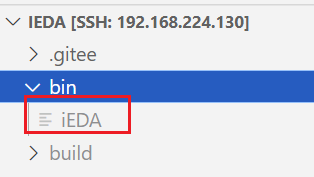
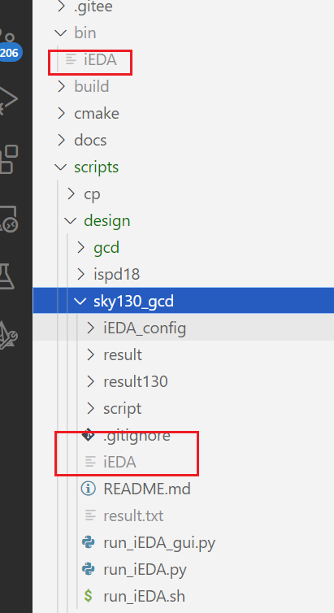
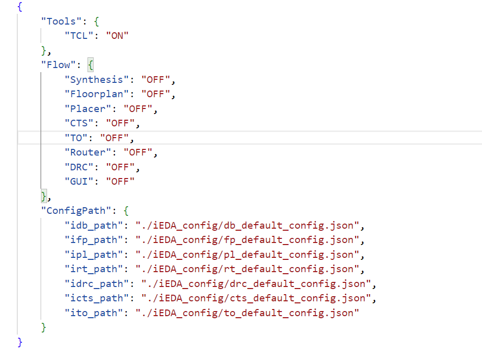
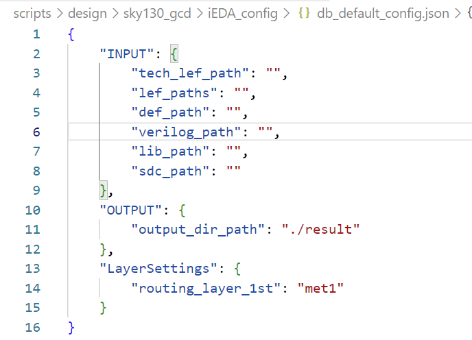
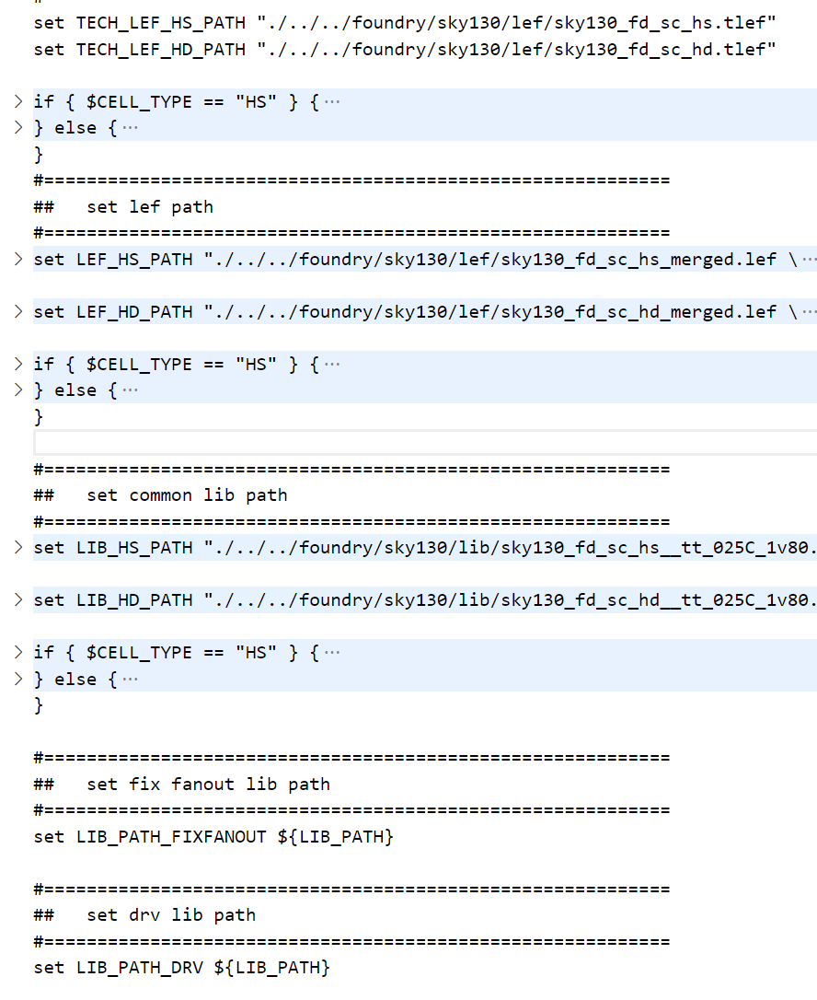
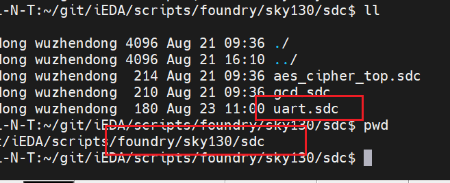
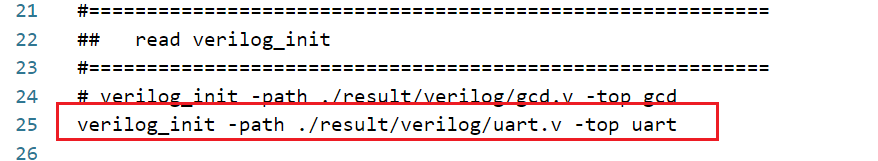

### 一、使用iEDA步骤

* 克隆远程仓库

```
// 从oscc/iEDA建一个fork，然后克隆
git clone https://gitee.com/wzd520/iEDA.git
```

* 进入iEDA目录开始构建项目

```
// 使用16核进行构建项目
bash build.sh -j 16
```

> 项目构建完毕以后会在bin目录下生成可执行文件iEDA



> 将iEDA复制到脚本文件夹目录下



* 在`sky130_gcd`下便可以进行点工具以及tcl命令的运行，如以下命令

  > 为了便于查找各个属性，可以将输出的文本捕获起来

```
./iEDA -script script/iFP_script/run_iFP.tcl >> result130/fp.txt 2>&1
./iEDA -script script/iNO_script/run_iNO_fix_fanout.tcl >> result130/ino.txt 2>&1
./iEDA -script script/iPL_script/run_iPL.tcl >> result130/ipl.txt 2>&1
./iEDA -script ./script/iPL_script/run_iPL_eval.tcl >> result130/ipl.txt 2>&1
./iEDA -script ./script/iCTS_script/run_iCTS.tcl >> result130/icts.txt 2>&1 ./iEDA -script ./script/iCTS_script/run_iCTS_eval.tcl >> result130/icts.txt 2>&1 ./iEDA -script ./script/iCTS_script/run_iCTS_STA.tcl >> result130/icts.txt 2>&1
./iEDA -script ./script/iTO_script/run_iTO_drv.tcl >> result130/ito.txt 2>&1 ./iEDA -script ./script/iTO_script/run_iTO_drv_STA.tcl >> result130/ito.txt 2>&1
./iEDA -script ./script/iTO_script/run_iTO_hold.tcl >> result130/ito.txt 2>&1 ./iEDA -script ./script/iTO_script/run_iTO_hold_STA.tcl >> result130/ito.txt 2>&1 ./iEDA -script ./script/iTO_script/run_iTO_setup.tcl >> result130/ito.txt 2>&1
./iEDA -script ./script/iPL_script/run_iPL_legalization.tcl>> result130/ipl.txt 2>&1 ./iEDA -script ./script/iPL_script/run_iPL_legalization_eval.tcl >> result130/ipl.txt 2>&1
./iEDA -script ./script/iRT_script/run_iRT.tcl >> result130/irt.txt 2>&1 ./iEDA -script ./script/iRT_script/run_iRT_eval.tcl >> result130/irt.txt 2>&1 ./iEDA -script ./script/iRT_script/run_iRT_STA.tcl >> result130/irt.txt 2>&1 ./iEDA -script ./script/iRT_script/run_iRT_DRC.tcl >> result130/irt.txt 2>&1
./iEDA -script ./script/iDRC_script/run_iDRC.tcl >> result130/idrc.txt 2>&1
./iEDA -script ./script/iPL_script/run_iPL_filler.tcl >> result130/ipl.txt 2>&1 ./iEDA -script ./script/DB_script/run_def_to_gds_text.tcl >> result130/gdsii.txt 2>&1
./iEDA -script ./script/iSTA_script/run_iSTA.tcl >> result130/ista.txt 2>&1
```

### 二、单个tcl命令执行的过程—以run_iFP.tcl为例

> 关键代码段+代码段解析

**代码段1，初始化设置**

```
#===========================================================
##   init flow config
#===========================================================
flow_init -config ./iEDA_config/flow_config.json

#===========================================================
##   read db config
#===========================================================
db_init -config ./iEDA_config/db_default_config.json
```

使用`json`文件对一些属性进行初始化设置，在`iEDA_config`有一些`.json`文件，将这些文件通过脚本命令读入即可将里面定义的一些数据进行初始化。


`flow_config.json`中的初始化数据如下，初始化一些顶层的设置和一些其它`json`路径



而`db_default_config.json`是对一些库文件的初始化以及输出路径的初始化内容



**代码段2，定义路径变量**

```
#===========================================================
##   reset data path
#===========================================================
source ./script/DB_script/db_path_setting.tcl
```

执行另一个`.db_path_setting.tcl`脚本文件，里面涉及到一些set命令对包括`.lef`、`.lib`等文件路径的定义



****

**代码段3，读入相关数据文件**

```
#===========================================================
##   read lef
#===========================================================
source ./script/DB_script/db_init_lef.tcl

#===========================================================
##   read verilog_init
#===========================================================
# verilog_init -path ./result/verilog/gcd.v -top gcd
verilog_init -path ./result/verilog/uart.v -top uart

#===========================================================
##   read def
#===========================================================
#def_init -path $PRE_RESULT_PATH/$DESIGN.def
```

读入`.lef`文件，`verilog`文件，`def`文件，**通过修改`verilog`文件的可以使用不同的设计来进行灵活替换**

### 三、修改工艺库

**使用sky130工艺并将gcd换成uart**

一、替换相关文件

* 替换`.v `文件

  综合`uart.v`文件，并拷贝至`design/sk130_uart/result/verilog`路径下


* 替换`.sdc`文件

  将`uart.sdc`拷贝至`foundry/sky130/sdc`路径下




二、修改`tcl`中相关属性

* 修改`script/db_path_setting.tcl`中的`sdc`路径


* 修改`script/run_netlist_to_def.tcl`中的`read verilog`


* 修改`script/iFP_script/run_iFP.tcl`中的`read verilog`



> 配置完以后便可以使用
