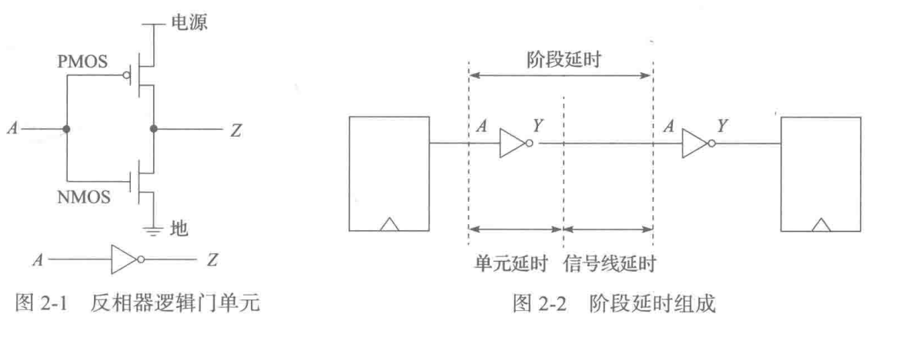
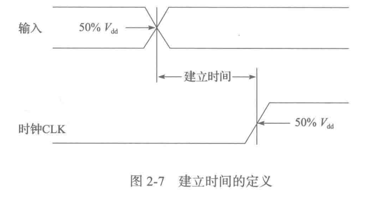
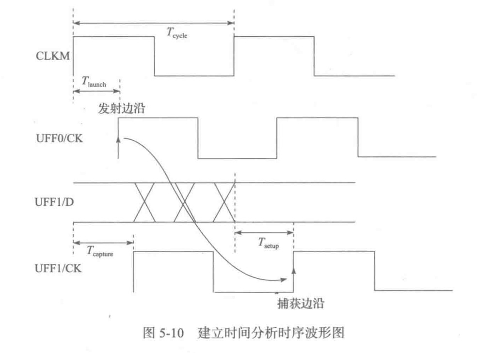
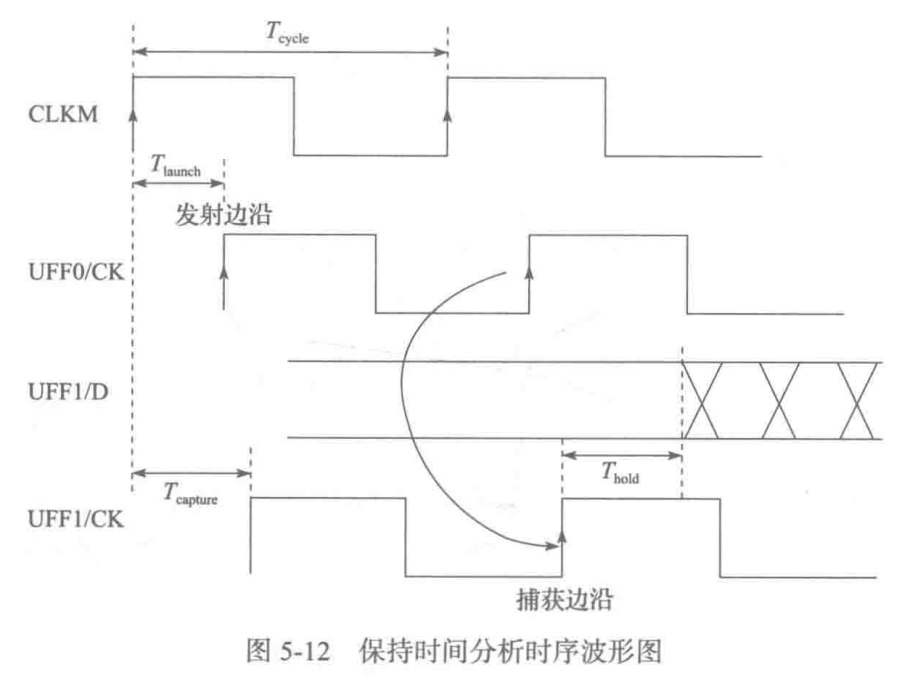

## 第一章 引论

> 集成电路：在一块很小的硅单晶片上，利用半导体工艺制作出许多二极管、晶体管以及电阻、电容等，并连接成能完成特定电子技术功能的电子电路。

### 静态时序分析技术

静态时序分析既要检验门级电路的最大延迟、以保证电路在指定的频率下能够满足建立时间的要求，同时要检验门级电路的最小延迟、以满足保持时间的需求。

**静态时序分析优缺点**

* 优点
  * 分析执行速度快
  * 不需要测试向量
  * 对于有时序路径的时序，测试覆盖率可以近乎达到100%
  * 能够完成动态仿真所不能实现的复杂分析
* 缺点
  * 不能验证设计的功能
  * 智能验证同步时序电路的时序特性
  * 不能自动识别设计中的特殊路基

## 第二章 静态时序分析的基础知识

### 逻辑门单元

反相器：根据输入数据的逻辑电平进行逻辑取反的求值运算，并通过输出导出求值结果。

逻辑门延时：逻辑单元自身逻辑求值的时间。信号线延时：逻辑信号从逻辑门单元的输出端口开始在互连线上传播到下一级逻辑输入端口的延时。

### 门单元的时序计算参数

组合逻辑门单元相关的时序参数主要包括信号转换延时和逻辑门延时

**1、信号转换延时**

> 输入端口或输出端口的信号电平由高到低或由低到高所需要的时间即为信号转换延时。

可以调整上升沿和下降沿的阈值，来设置不同的上拉跨度和下降跨度

**2、逻辑门延时**

> 通过由晶体管组成的逻辑门可以使高、低电平输入信号进行逻辑求值并产生对应的高电平或者低电平信号输出。

### 时序单元相关约束

时序单元相关约束信息包括：建立时间、保持时间、恢复时间、移除时间以及最小脉冲宽度

**1、建立时间**

在时钟信号到来之前需要保持的时间，一般是以50%为间隔

**2、保持时间**

时序单元要实现正确的逻辑功能，信号在时钟沿有效后必须保持的最小时间长度。

**3、恢复时间**

保证单元正常的逻辑功能，要求低电平复位信号或者高电平清零信号在时钟有效沿之前保持的最小时间长度。

**4、移除时间**

保证单元正确的逻辑功能，要求低电平复位信号或者高电平清零信号在时钟有效沿之后继续保持有效的最小时间长度。

**5、最小脉冲宽度**

脉冲波形的开始到结束之间的最小时间间隔。

时序路径

起点到终点

### 时钟特性

> 时钟的时序特性
>
> 时钟周期：时钟频率的倒数
>
> 时钟占空比：时钟信号高电平在一个周期之内所占的时间比率
>
> 时钟转换时间：时钟信号的电压从标准供电电源电压的10-90的时间间隔
>
> 时钟延迟：时钟延迟是指时钟信号从时钟源输出端口到达时序单元时钟输入端口所需要的传播时间
>
> 时钟偏斜
>
> 时钟抖动

### 时序弧

用于表达时序的一种数据

> 静态时序分析是基于时序弧数据的时序分析。
>
> 时序弧的信息一般分为连线延时和单元延时，单元延时中的时序弧分为基本时序弧和约束时序弧

### PVT环境

工艺、工作电压、工作温度等参数设置的组合简称为PVT

1、TYP（Typical）工艺
包括典型的工艺，典型的工艺温度、典型的有效电源电压

2、BCF（Best-Case Fast）

包括最快的工艺、最低的工艺温度、最高的有效电源电压

3、WCS（Worst-Case Show）

包括最慢的工艺、最高的工艺温度、最低的有效电源电压

### 时序计算单位

基于温度、电压、电流、电阻、电容负载和时间等不同类型的变量银子进行计算

## 第三章 单元库时序模型

### 基本时序模型简介

**快速时序模型**

> 通过时序信息库对应单元的时序弧信息，把需要建模的时序路径的时序弧近似为某些单元的时序弧组合

**接口逻辑模型**

使用一种结构化的方法，将原始电路简化为只包含接口逻辑的一个小电路。

**抽取时序模型**

从一个模块的门级网表中抽取模块的时序信息，可以隐藏单元的内部实现细节，有利于保护知识产权。

### Synopsys工艺库模型

线性延时模型：通过线性方程来计算单元的门延时和输出端转换延时

非线性延时模型：由驱动模型和接受模型组成

复合电流源延时模型：指定输入信号转换时间和逻辑门的输出负载值，通过电路仿真模拟出逻辑门的延时和输出转换时间

### 延时计算模型

1、CMOS通用延时计算模型

逻辑门固有的本征延时、输入信号转换延时、信号连线延时、输出信号转换延时

2、CMOS非线性延时计算模型

逻辑门延时、信号互连线连线延时

由输入信号转换时间与输出负载作为索引，时序分析时以一个二维查找表的形式来计算延时。

计算过程：查找表中索引参数的某个采样点延时可直接查表得出，再通过插值算法来计算延时。

#### 互连线计算模型

芯片内的互连线大致可以分为以下3种

1、短线，局部互连线

2、中长线，模块间互连线

3、长线，全局互连线

* 集总C模型

  当导线的电阻部分很小且驱动单元的转换频率在较低范围内，就可以很合理地只考虑导线地电容部分，并把分布的电容集总为单个电容。

* 集总RC模型

  当导线长度超过几微米后会有明显地电阻，因此采用电阻电容模型。

* 分布RC模型

* 传输线模型

#### 线负载时序模型

### 引脚电容值计算

每一个单元的时序模型除了延迟信息外，还包含输入引脚的电容信息

* 方法一、对流入输入引脚的电流进行积分
* 方法二、基于输出转换时间结果，通过查找表的方法来确定对应的输出电容负载

### 功耗模型计算

> 包括开关功耗，短路电流功耗，哑阈漏流功耗，开关功耗和短路电流功耗组成动态功耗

动态功耗是单元在转换过程中电源电流的积分

静态功耗（哑阈漏流）计算方法，设置单元的输入信号为固定电平，然后对单元的哑阈漏流进行瞬态分析，得到哑阈漏流功耗值。

### 时序信息建模基本方法

> 考虑两方面的延迟信息
>
> 1、输入端口到输出端口的延迟信息，即时序弧
>
> 2、输入端口之间存在的时序约束信息，建立或保持时间约束

## 第四章、时序信息库文件

> 时序信息库文件中记录着逻辑门延时、输出信号转换延时和功耗等信息，这些信息在用于时序分析时被调用，来计算延时值和功耗值。时序文件的内容主要由组、属性、和因子组成。

这一章是对一些库文件的介绍

## 第五章、静态时序分析的基本方法

### 时序图

从逻辑电路图转化为时序图，需要标记中间的逻辑节点，生成中间结果后，再绘制时序图。

### 时序分析策略

> 基于路径的时序分析策略和基于模块的时序分析策略

1、基于路径的时序分析策略：基于时序图寻找从起点到终点的所有路径并进行时序分析

2、基于模块的时序分析策略：基于图的时序分析策略，基于时序图找到从起点到终点的所有路径，在进行时序分析时只基于该路径下延迟最严重的结点进行计算。

### 时序路径延时计算方法

1、组合逻辑之间路径延时计算方法

把逻辑门延时和信号线延时逐一相加来实现

2、时序逻辑之间路径延时计算方法

通过逻辑路径的逻辑门延时和信号线延时逐一相加来实现

### 时序路径的分析方法

对建立时间和保持时间进行分析

1、建立时间分析：在时钟捕获信号有效沿到来前，数据信号必须提前达到稳定状态的时间

2、保持时间分析：为保证时序单元对数据读取正确，数据在时钟有效沿到来之后仍需要保持稳定的时间

## 第六章、时序约束

### 时钟约束

* 创建时钟

  时钟源点：根据情况定义为设计中的一个端口

  时钟周期：时钟振荡周期，频率的倒数

  时钟占空比：默认百分之50，高低电平在一个周期中的占比

  时钟转换延时：高低电平之间进行切换所需要的延时

  时钟不确定性：抖动、偏斜等

  时钟延迟：从时钟源输出端到达时序单元时钟输入端传播延时。

* 生成时钟

  > 基于主时钟并通过相关逻辑转换后，在相位、频率、占空比等方面和主时钟有一定变化的分支时钟。

* 虚拟时钟

* 最小时钟脉宽

### I/O延时约束

* 设置输入延时：在一个有效时钟周期内，外部逻辑的输出数据到达设计输入端口所占用的延时
* 设置输出延时：在一个有效时钟周期内，输出端口数据到外部逻辑所占用的延时

### I/O环境建模约束

> 主要包括：
>
> 输入驱动建模
>
> 输出负载建模

### 时序例外

1、多周期路径设置

2、伪路径设置：某些时序路径在某特定的工作状态下不工作，要求非常宽松，不会有真正的工作信号通过

3、最大演示和最小延时设置

### 恒定状态约束

### 屏蔽时序约束

> 针对单元具体端口内部的时序弧并且进行屏蔽，等价于移除该单元内部的时序弧，时序分析时，与该时序弧相关的所有时序路径都被移除

### 时序设计规则约束

1、最大转换时间

2、最大电容负载

3、最大扇出

> 扇出指逻辑单元输出端直接连接的下级逻辑单元输入端的个数。
