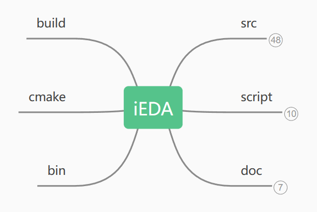
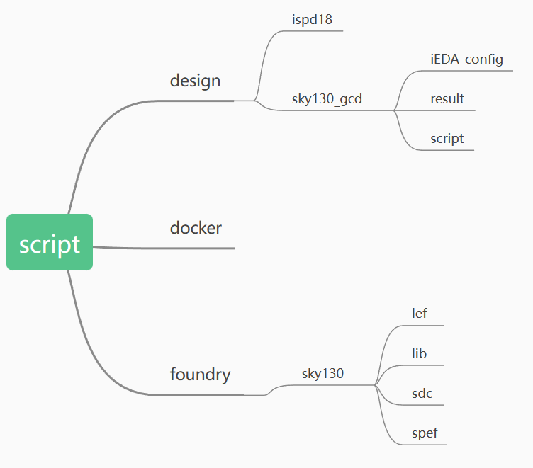
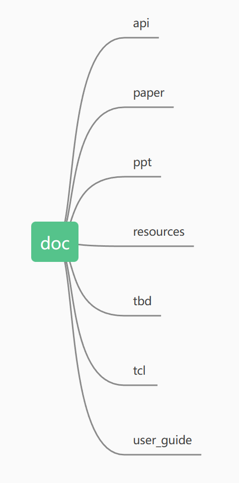
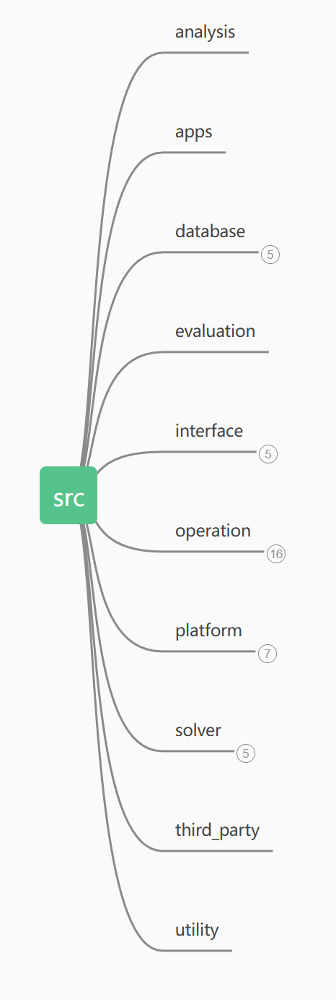

### iEDA工程文件目录概况

* 主目录iEDA下

| iEDA/  |                     内容概况                     |
| :----: | :----------------------------------------------: |
|  bin   |                cmake运行输出目录                 |
| build  |           cmake编译和工程构建文件输出            |
| cmake  |        包含构建和管理Cmake项目的配置信息         |
|  doc   |         包含项目的相关学习资料和项目向导         |
| script | 需要读取的数据和工艺文件，以及脚本文件和输出结果 |
|  src   |                 项目编写的源代码                 |

* 一级目录script下

| iEDA/script/ |                         内容概况                          |
| :----------: | :-------------------------------------------------------: |
|    design    | 包含iEDA的设置，各个点工具集成的tcl命令，以及运行输出结果 |
|    docker    |                 兼容docker环境的文件设置                  |
|   foundry    |                    存放sky130工艺文件                     |

* 一级目录doc下

  > 该目录下存放的是一些跟iEDA相关的学习资料和阅读指南，想要了解iEDA的可以通过该目录下的文件和推荐链接进行学习。

* 一级目录src下

|  iEDA/src/  |                           内容概况                           |
| :---------: | :----------------------------------------------------------: |
|  analysis   |                  对外提供的算法分析拓展接口                  |
|  database   |              将数据解析以后使用不同的类进行存放              |
| evaluation  |                   对算法好坏进行评估的模块                   |
|  interface  | 对外提供的可以使用的交互接口代码，包括gui，python，tcl，shell等 |
|  operation  | 点工具功能模块的实现：iCTS，iDRS，iECO，iFP，iLR，iLO，iMP，iNO，iPDN，iPL，iPW，iRT，iSTA，iTM，iTO |
|  platform   | 对点工具功能的拓展，保证点工具的独立性，类似本地化外部接口，用于适配更多的功能实现 |
|   solver    |           提供指定算法解决方案，包含聚类布线布局等           |
| third_party |                     使用到的第三方依赖库                     |
|   utility   |                实用程序的开发，可简化开发过程                |

* 二级目录iEDA/src/operation

| iEDA/src/operation |                           内容概况                           |
| :----------------: | :----------------------------------------------------------: |
|        iCTS        | 时钟树构建，支持在特定的约束下进行，采用较为准确的时序模型进行时序信息的估算和传播，以最小设计成本为目标构建时钟树。 |
|        iDRS        | 设计规则检查工具，实现的设计检查包括：短路违例、金属最小间距、最小宽度、最小面积、孔洞面积、最小步长、通孔包围、金属最小线段间隔、金属最小凹槽、金属最小Jog间隔、金属最小ConnerFill间隔、Cut层最小间隔相关检查。 |
|        iECO        |                           没有源码                           |
|        iFP         |                           布局规划                           |
|        iIR         |                           没有源码                           |
|        iLO         |                           没有源码                           |
|        iMP         | MacroPlacer，宏布局器，根据给定的约束条件和优化目标在芯片的物理布局中为宏单元找到最佳位置，比如：处理器，存储器，接口等。 |
|        iNO         | 网表优化模块，支持扇出优化，通过插入缓冲器使线网满足最大扇出约束。 |
|        iPDN        |   电源分配网络，提供稳定可靠的电源供应以确保系统正常运行。   |
|        iPL         | iEDA的布局模块，支持全局布局，合法化，详细布局；支持对布局结果进行违例检查；支持在布局阶段插入buffer进行长线优化；支持增量式合法化； |
|        iPW         | iEDA电源模块，可以解析VCD的波形文件，可输出功耗分析报告，包括不同类型功耗和不同分组功耗。 |
|        iRT         | iEDA布线模块，将分布在芯片核内的模块，标准单元和输入输出接口单元按逻辑关系进行互连，并为满足各种约束条件进行优化。集成了全局布线和详细布线。 |
|        iSTA        |      静态时序分析模块，分析模式分为OCV模式和AOCV模式。       |
|        iTM         |                           没有源码                           |
|        iTO         | 时序优化模块，主要包括时序设计规则违例检查，建立时间违例检查，保持时间违例检查。 |

