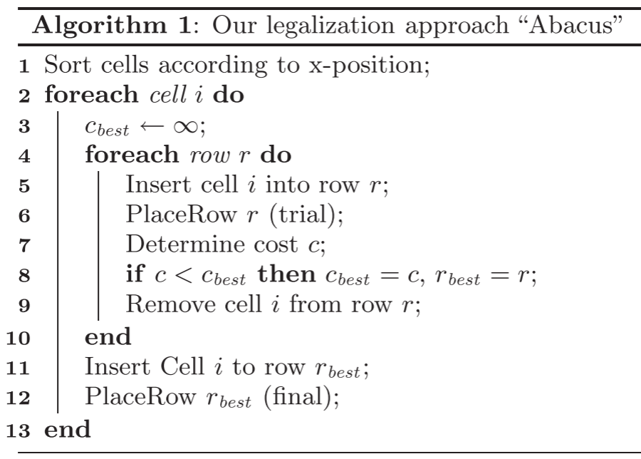
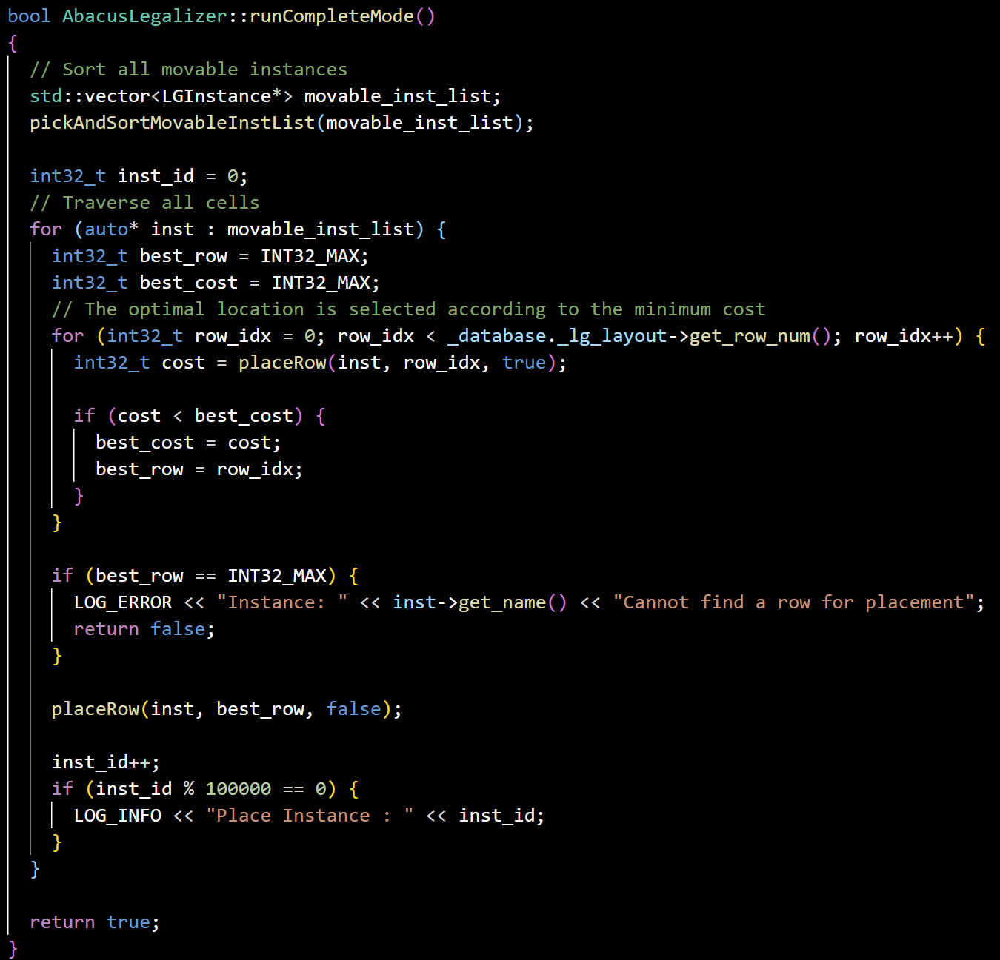
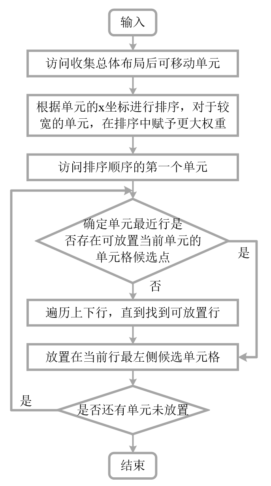
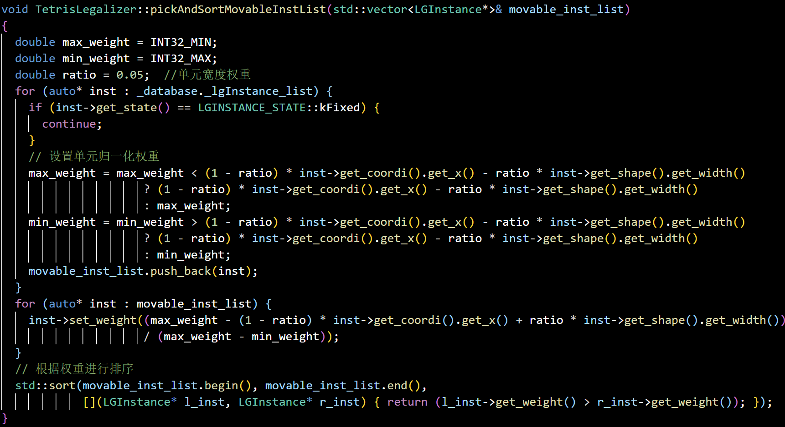
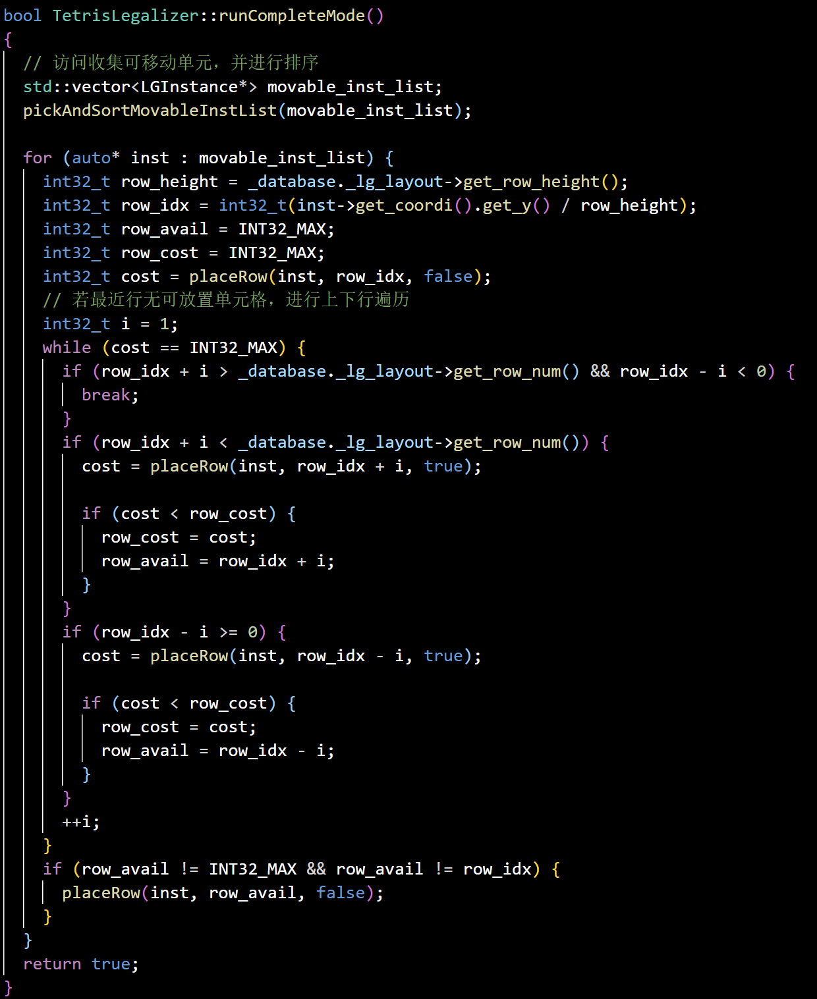
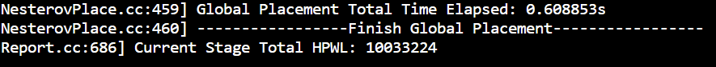
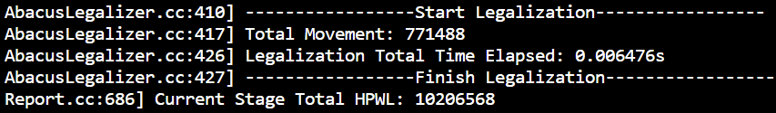
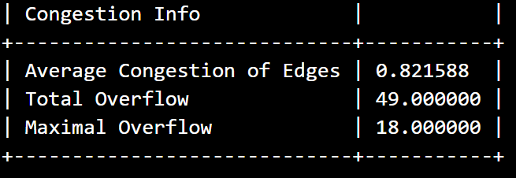
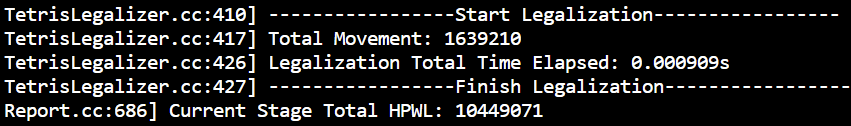

**iEDA布局合法化算法学习记录**

## 1 布局合法化

布局分为总体布局、合法化、详细布局三个主要环节。合法化是在对总体布局后的电路布局进行调整，使电路的位置、大小和形状满足设计规则和性能要求。尽可能维持总体布局的大致位置，减少单元的总移动的情况下，消除单元之间的重叠。

## 2 Abacus合法化算法

Abacus伪代码：

首先根据单元的x坐标进行排序（第1行），然后单元被合法化（2-13行）。单元格i的合法化通过将其移动到行（第4-10行）完成。在每行中，单元格根据其在全局布局中的x坐标插入。第6行中的`PlaceRow`放置该行的所有单元格，使该行单元格总移动最小，并且不重叠。第7行评估单元 i 在此位置的代价，然后移除单元 i （第9行），在各行遍历后，选取最优行（第11行），最终将其放置（第12行）。

iEDA中的Abacus算法实现：

## 3 Tetris合法化算法

Tetris合法化算法是Abacus算法的简化版，主要简化在其不会选择全局最小代价解，而是基于贪心算法，只寻求每个单元的局部最优位置，不会寻找该行单元的全局最优解。

Tetris算法流程图：

采用线性加权：
$$
weight_{i}=\alpha_{1}x_{i}-\alpha_{2}width_{i}
$$
其中$$\alpha_{1}+\alpha_{2}=1$$且$$\alpha\geq0$$

- $$weight_{i}$$为单元$$i$$的权重
- $$\alpha$$为系数权重
- $$x_{i}$$为单元$$i$$的全局布局后的x坐标
- $$width_{i}$$为单元$$i$$的宽度

权重归一化：
$$
weight_{i}=\frac{weight_{max}-weight_{i}}{weight_{max}-weight_{min}}
$$
Tetris算法实现：

- 单元设置权重与排序

  

- Tetris算法：

  

## 4 实验结果

实验在工艺sky130，设计gcd下进行。

总体布局后的半周线长为：10033224

Abacus Legalizer算法运行结果：总移动量为77 1488，运行时间：0.006476s，总半周线长为1020 6568，average congestion of edges：0.821588

Tetris Legalizer算法运行结果：总移动量为1639210，运行时间：0.000909s，总半周线长为1044 9071，

average congestion of edges：0.821588

|                             |  Abacus   |   变体    | 变化百分比 |  Tetris   | 变化百分比 |
| :-------------------------: | :-------: | :-------: | :--------: | :-------: | :--------: |
|        全局布局HPWL         | 10033224  | 10033224  |     0      | 10033224  |     0      |
|       布局合法化HPWL        | 10206568  | 10442189  |     2%     | 21162638  |    207%    |
|        详细布局HPWL         |  9747528  |  9952628  |     2%     | 14934342  |    153%    |
|          总移动量           |  77 1488  |  1639210  |   112.4%   | 1101 0560 |   1427%    |
|          运行时间           | 0.006476s | 0.000909s |    -85%    | 0.008076s |    124%    |
|         Total STWL          | 10486232  | 10735963  |     2%     | 15931292  |    151%    |
|          Max STWL           |  431405   |  442565   |     2%     |  470625   |    109%    |
| Average Congestion of Edges | 0.821588  | 0.821588  |     0      | 0.821588  |     0      |
|       total Overflow        |    49     |    49     |     0      |    49     |     0      |
|      Maximal Overflow       |    18     |    18     |     0      |    18     |     0      |

Tetris算法单元宽度权重的影响系数汇总：

| ratio | total movement | 百分比 |   HPWL   | 变化百分比 |
| :---: | :------------: | :----: | :------: | :--------: |
| 0.00  |    1639210     | 0.00%  | 10449071 |   0.00%    |
| 0.01  |    1623850     | -0.94% | 10449071 |   0.00%    |
| 0.13  |    1623850     | -0.94% | 10449071 |   0.00%    |
| 0.14  |    1615690     | -1.43% | 10442189 |   -1.65%   |
| 0.15  |    1631050     | -0.50% | 10442189 |   -1.65%   |
| 0.16  |    1615690     | -1.43% | 10442189 |   -1.65%   |
| 0.19  |    1615690     | -1.43% | 10442189 |   -1.65%   |
| 0.20  |    1631050     | -0.50% | 10442189 |   -1.65%   |
| 0.21  |    1615690     | -1.43% | 10442189 |   -1.65%   |
| 0.23  |    1615690     | -1.43% | 10442189 |   -1.65%   |
| 0.24  |    1623252     | -0.97% | 10452423 |   0.81%    |
| 0.25  |    1642148     | 0.18%  | 10472447 |   5.62%    |
| 0.26  |    1626788     | -0.76% | 10472447 |   5.62%    |
| 0.27  |    1626298     | -0.79% | 10470721 |   5.21%    |
| 0.28  |    1627258     | -0.73% | 10470945 |   5.26%    |
| 0.29  |    1627922     | -0.69% | 10472123 |   5.54%    |
| 0.30  |    1637680     | -0.09% | 10460178 |   2.67%    |

**注：**百分比为负数表示减少，正数表示增加。

ratio的选取对算法有影响，0.00-0.30对total movement影响百分比均值为-0.92%，total HPWL影响百分比均值为0.46%. 在sky130 gcd设计下最优ratio选择在0.20左右。

