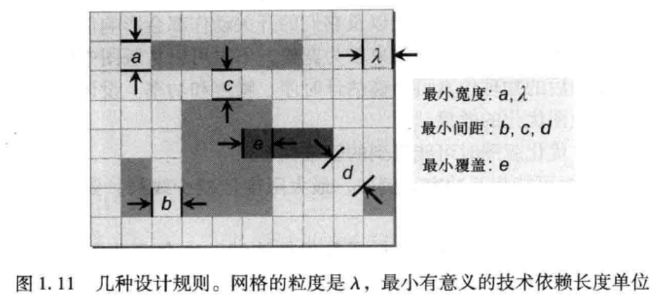

## 第1章 绪论

| 名词                   | 术语 |
| ---------------------- | ---- |
| 超大规模集成电路       | VLSI |
| 现场可编程门阵列       | FPGA |
| 专用集成电路           | ASIC |
| 多芯片模块             | MCM  |
| 印刷电路板             | PCB  |
| 设计规划检验           | DRC  |
| 版图和原理图一致性检验 | LVS  |
| 电气规则检验           | ERC  |
| 地网                   | GND  |

### 1.1 VLSI设计流程

1. 系统规范

   目标与需求包括功能、性能、物理尺寸和生产技术

1. 架构设计

   1. 模拟和混合信号模块的集成；
   2. 存储管理——串行或者并行——和寻址方案；
   3. 计算核的类型和数量，例如处理器和数字信号处理(DSP)单元——和特别的DSP算法；
   4. 芯片内外的通信、对标准协议的支持等；
   5. 硬、软IP模块的使用；
   6. 引脚分配、封装、管芯封装接口；
   7. 电源需求；
   8. 工艺技术和层堆栈的选择。

2. 功能和逻辑设计

   逻辑设计可用寄存器传输级来描述，即用硬件描述语言（HDL）定义芯片的功能和时序行为。常见的HDL为Verilog和VHDL。

3. 电路设计

   电路设计：一些关键的低端的单元必须在晶体管级来进行设计。在电路级设计的单元包括静态RAM模块、I/O、模拟电路、高速函数（乘法器）以及静电放电（ESD）保护电路。电路级设计的正确性主要用电路仿真工具（例如SPICE）来验证。

4. 物理设计

   物理设计直接影响了电路性能、面积、可靠性、功率和制造产量。

   1. 性能：长的布线有明显的更长信号时延。
   2. 面积：互连模块之间的布局距离大导致芯片更大且处理速度更慢。
   3. 可靠性：大量的通孔能显著地降低电路的可靠性。
   4. 功率：栅极长度更小的晶体管实现更快的开关速度，其代价是泄漏电流和制造变异性高；更大的晶体管和更长的线会导致更大的动态功耗。
   5. 产量：布线靠得太近，在制造中易发生短路，从而降低产量，但是门散布太远，布线更长，并且开路的概率更高，会破坏产量。

   关键步骤：

   1. 划分：将电路分解成更小的子电路或者模块，使其单独设计或者分析
   2. 布图规划：决定子电路或模块的形状和布置，以及外部端口、IP或宏模块的位置
   3. 电源和地网布线：在布图规划中，分布电源（VDD）和地线网（GND）在芯片各处
   4. 布局：确定每个模块中的所有单元的空间位置
   5. 时钟网综合：决定时钟信号的缓冲、门控和布线，以满足规定的偏移和延迟需求。
   6. 总体布线：分配布线资源用于连接
   7. 详细布线：分配布线到指定的金属层，以及在总体布线资源中指定布线轨道。
   8. 时序收敛：通过专门的布局和布线技术来优化电路性能。

5. 物理验证

   当物理设计完成后，版图必须全面验证来确保正确的电气和逻辑功能。

   1. 设计规则检查（DRC）验证版图满足所有工艺方面的约束。DRC也验证化学机械抛光层密度。
   2. 版图与原理图一致性检验（LVS）验证设计功能。从版图导出的网表与逻辑综合或者电路设计产生的原始网表进行比较。
   3. 寄生参数提取从几何表示的版图元素中导出电气参数；对于网表，同样可以验证电路的电气特性。
   4. 天线规则检查旨在防止天线效应，它会通过在没有连接到PN结节点的金属线上积累多余电荷，在制造的等离子刻蚀步骤时破坏晶体管栅极。
   5. 电气规则检查（ERC)验证电源和地连接的正确性，以及信号转换时间、容性负载和扇出在合适的边界内。

6. 制造

   表示为GDSII流格式，进行流片制造。

7. 封装和测试

### 1.2 VLSI设计模式

全定制与半定制

半定制设计模式：基于单元与基于阵列。

标准单元：有固定尺寸和功能的预定义模块。

宏单元：较大块逻辑，执行可重用的功能。

门阵列：具有逻辑功能的硅片，但没有连接。

### 1.3 版图层和设计规则

1. 版图层

   主要材料：

   1. 单晶硅衬底掺杂构建n和p沟道晶体管；
   2. 二氧化硅，用来作为绝缘体；
   3. 多晶硅，形成晶体管栅极和作为互连材料；
   4. 铝和铜，用于金属互连。

   硅作为扩散层。多晶硅、铝和铜层作为互连层；多晶硅层称为poly层，其余层称为Metal1层、Metal2层等。过孔和接触层连接不同的层——过孔连接金属层，而接触层连接poly层和Metal1层。

2. 设计规则

   1. 尺寸规则：最小宽度：任何组件（形状）的尺寸，例如边界的长度或者形状的范围。
   2. 间距规则：最小间距；
   3. 覆盖规则：最小覆盖。

   

### 1.4 物理设计优化

目标：最小芯片面积、最小线长和最少过孔；

最优化目标：提升电路性能、可靠性等。

- 在版图优化中，三类约束必须满足：

  （1）工艺约束，用于指导特定工艺节点的生产制造，是从工艺限制中提取出的。

  （2）电气约束保证设计达到预期的电气行为。

  （3）几何（设计方法）约束是为了减小设计过程的整体复杂度。

- 优化版图遇到的困难：

  （1）优化目标可能相互冲突；

  （2）约束常导致间断；

  （3）由于集成电路规模的提升以及互连要求的不断增加，各种约束将更加严厉。

- 解决问题经验法则：

  （1）设计模式需要自己定制流程；

  （2）设计一个芯片，使用几何约束可以简化设计难度；

  （3）设计过程可以划分为若干顺序步骤；

  （4）进行基本优化选择适当模型。

### 1.5 算法和复杂性

- 算法运行时间（时间复杂度）
- 解的质量

#### 1.5.1 算法类型

启发式算法：

1. 确定性：算法所作的所有判断可重复；
2. 随机性：算法所作的部分判断为随机的。

结构化方面：

1. 构造：启发式算法开始于一个初始的、不完整的（部分）解，增加组件，直到获得完整的解。
2. 迭代：开始于一个完整的解，不断的改进当前解，直到达到预设的终止标准。

#### 1.5.2 解的质量

与最优解（次优解）作比较

### 1.6 图论术语

最小生成树（MST）

矩形最小生成树（RMST）

斯坦纳最小树（SMT）

## 第4章 全局和详细布局

将电路划分为小模块和对版图进行布图规划，确定块的轮廓线和引脚位置后，要求优化目标，布局要确定每个块中的标准单元或逻辑元件的位置。

全局布局分配大概的位置给可变动的器件，详细布局明确器件的位置使成为合理的元胞位置并确保没有重叠。为进行时序优化，详细位置对电路时延的估计更加准确。

### 4.1 介绍

布局的目的：确定所有电路元件在一个版图中的位置和方向，给出解的约束（如无元胞重叠）和优化目标

电路元件有矩形形状，用点表示，线网用边表示。。

可变动的元件布局对随后的布线阶段的质量起决定作用。

布局包括全局布局、详细布局和合法化。

### 4.2优化目标

布局必须产生设计中的所有线网都可以布线的版图。

信号时延或串扰等电效应应必须考虑。

布局器对加权总线长、割边数、线拥挤度或最大信号时延等的估算，优化布线质量。