## 第一章 集成电路物理设计方法

### 1.1 数字集成电路设计挑战

1. 复杂性：现代数字电路设计非常复杂。芯片集成度高，包含大量的电路元件和复杂的逻辑功能。设计师需要管理大规模的设计和处理复杂的电路特性。
2. 时序关注：数字电路中的信号传输必须满足严格的时序要求，以确保正确的数据流和操作。时序设计和验证是一个复杂的过程，需要考虑信号延迟、时钟分配、时钟同步等方面。
3. 功耗和热管理：现代数字电路功耗日益增长，特别是在移动设备和便携式应用中。功耗管理变得至关重要，需要在性能和功耗之间取得平衡，并采取适当的电源管理和热管理技术。
4. 物理布局与布线：物理设计包括布局和布线，它们直接影响电路的性能和可靠性。合理的布局和布线可以提高电路的工作频率、减小功耗和优化时序，但在复杂设计中往往需要克服布局约束和布线困难。
5. 设计可靠性：在集成电路设计中，设计的稳定性和可靠性是至关重要的。电路需要经受电压噪声、温度变化和工艺变化等因素的影响，并保持稳定的操作。设计者需要考虑这些因素并采取适当的技术和方法来提高设计的可靠性。
6. 设计周期和成本：数字电路设计的时间和成本是一个重要的考虑因素。设计周期通常很长，需要设计、验证和修复各个阶段的问题。芯片制造的成本也很高，因此设计者需要努力确保设计的正确性和可制造性，以最小化重新设计和制造的成本。

### 1.2 数字集成电路设计流程

#### 1.2.1 集成电路设计流程的发展和整合

1. 设计数据
2. 布图布电规划
3. 时序驱动布局--重视SI
4. 时钟树综合
5. 布线--SI预知、预防
6. 功耗分析和低功耗
7. RC提取
8. 静态时序分析
9. 设计优化
10. 物理设计验证
11. 等价检查
12. 设计签核

#### 1.2.2 展平式物理设计

标准逻辑门单元库的建立，采用了自下而上的方法，先将晶体管设计好，经过仿真，版图建立，再对逻辑门单元仿真建模。

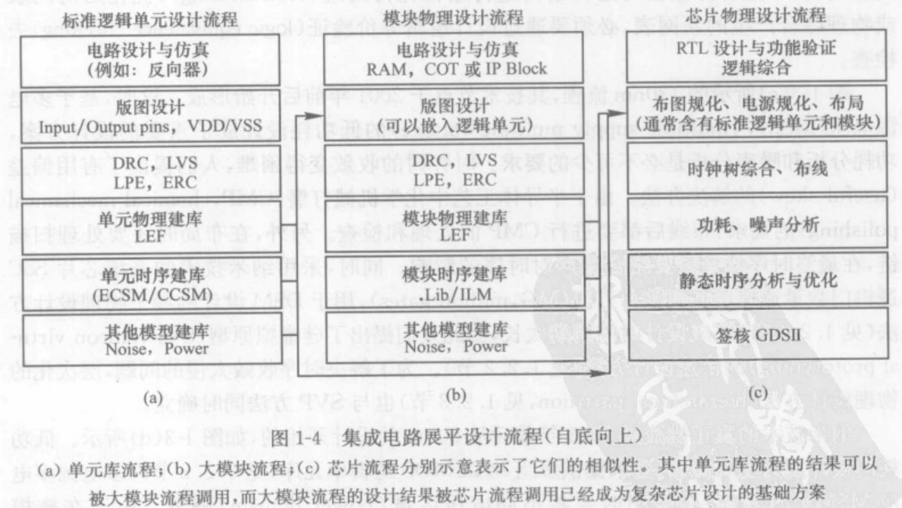

集成电路展平设计流程（自底向上）

#### 1.2.3 硅虚拟原型设计

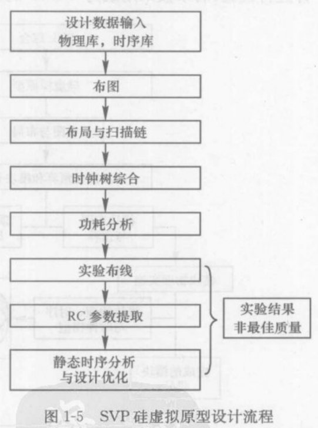

硅虚拟原型设计方案与展平化的区别：

1. 在布图阶段可以考虑整个设计进行分割
2. 布线时用实验布线法（trial route）
3. 在做RC提取时，用集总电容模型和定制连线负载模型作为时序预估计算

#### 1.2.4 层次化物理设计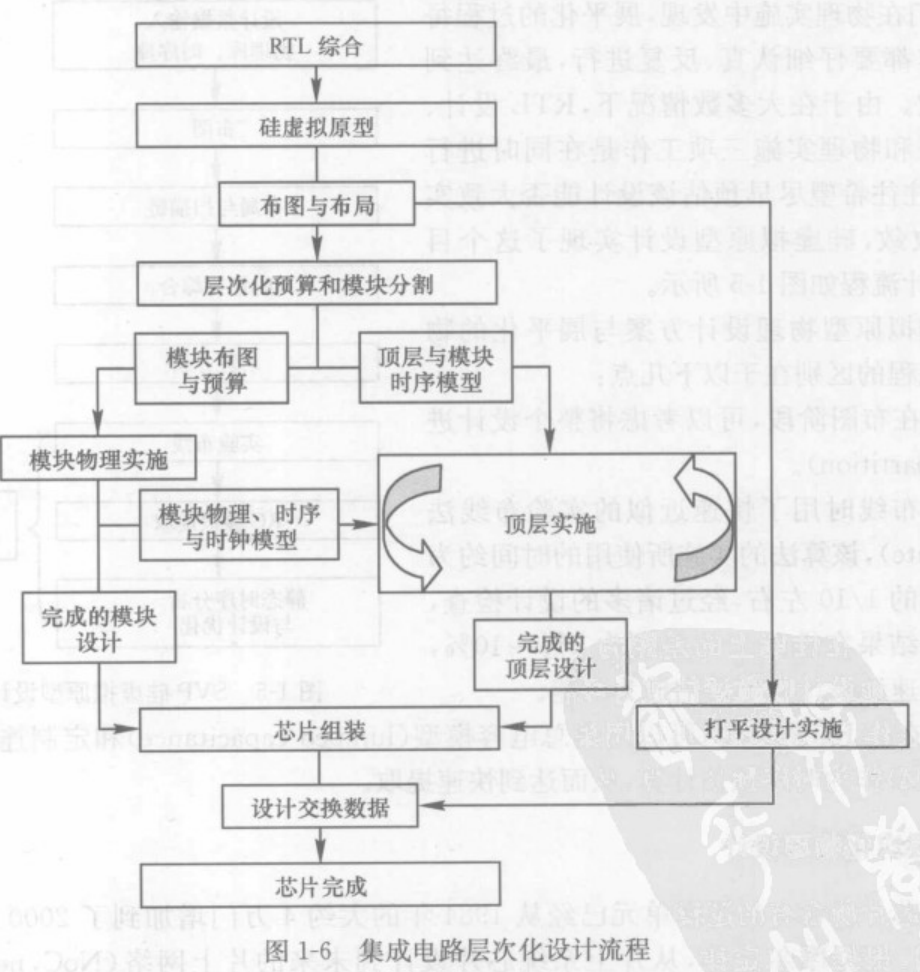

展平化设计实施周期长，优点时不用分配边界约束，能够在芯片的全局范围内进行优化，容易获得更好的时序结果；

层次化设计能够将串行作业转变为并行实施，很大程度上能够节约设计的周期，缩短芯片产品面市时间。但需要丰富的经验，每个模块与顶层之间的时序约束需要各自独立实现收敛。若不能收敛，则会要求在顶层重新做约束分配。

### 1.3 数字集成电路设计收敛

当代集成电路实现设计收敛任务的三大部分工作：

- 数据系统：由读取、处理和储存的功能组成
- 优化引擎：主要是指基于算法去实现逻辑优化、布局优化和布线优化的EDA工具方法。
- 分析引擎：主要是指由设计工程师借助EDA工具用于时序分析、功耗分析和噪声（信号完整性）分析的EDA工具。

#### 1.3.1 时序收敛

对布局布线后的数据进行静态时序分析STA，满足要求后则认为实现了时序收敛

静态时序分析的最主要方法为“项目评审技术”PERT或关键路径方法CPM。

静态时序分析最重要的任务时寻找最长延时路径以及最坏情况下的延时。

总延时由逻辑门（器件）延时与互连线延时组成：逻辑门的延时大小不仅取决于输入信号的转换时间和负载电容的大小，还取决于输出信号的状态（上升或下降）以及其他管脚状态（高电平或低电平）。

#### 1.3.2 功耗分析

1. 功耗分析：分为静态功耗分析与动态功耗分析
2. 低功耗分析：减小时钟电路的功耗。采用时钟门控电路、多电源电压、衬底电压偏置方法


#### 1.3.3 可制造性分析（DFM）

1. 设计检验：检验光刻分辨率带来的影响并进行校正；
2. 设计产额和制造：工艺中化学机械打磨的制造过程引起的互连线厚度不均匀对RC的影响与产额直接相关。
3. 设计质量：其他未知参数变化引起时序的收敛问题时保证设计质量的重要因素。

时序收敛的目的是保证芯片在要求的工作环境中，达到理想的性能，它通过静态时序分析等手段，预测芯片在各种条件下的工作频率，同时借助于约束和优化引擎从而达到路径优化最终实现主频的提高；

功耗分析的结果则体现了芯片的能耗大小，芯片内部电压降和电流的分布，也反映了芯片工作稳定的程度，我们需要将芯片的功耗、压降、电迁移等参数控制在一定的范围内；

可制造性设计是纳米工艺条件下所研究的一个热点，它的目的是提高良品率，从而降低生产成本，提高产品的利润。

三者相辅相成，共同指导并约束着数字集成电路的物理实现。

### 1.4 数字集成电路设计数据库

数据库是设计系统的心脏，数据库的好坏在很大程度上决定了EDA工具性能的优劣。

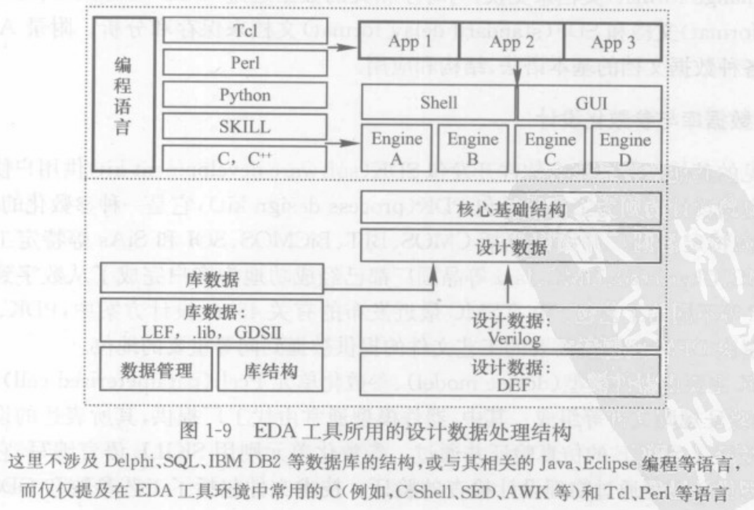

## 第二章 物理设计建库与验证

随着集成电路工艺尺寸的不断缩小，决定芯片速度的主要因素是由器件的工作速度与布线布局方案产生的互连线延迟特征共同组成。

半导体工艺和版图设计质量是保证器件优良性能的保证，很大程度上决定了电路的工作速度和芯片面积大小。

### 2.1 集成电路工艺与版图

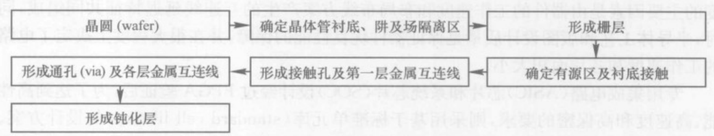

简化的CMOS电路工艺顺序

#### 2.1.1 CMOS器件的寄生闩锁效应

产生的根本原因：两个寄生晶体管的电流增益乘积大于1，使电流不断放大，形成正反馈回路。故要减小闩锁效应必须降低寄生双极晶体管的基极偏置电压，减小基极偏置电阻和两管增益值。

预防闩锁效应的方法是增加well tap或保护环。

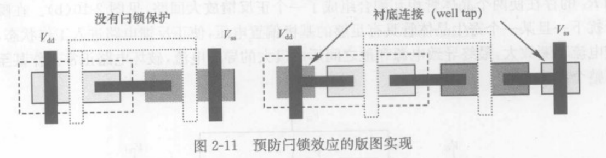

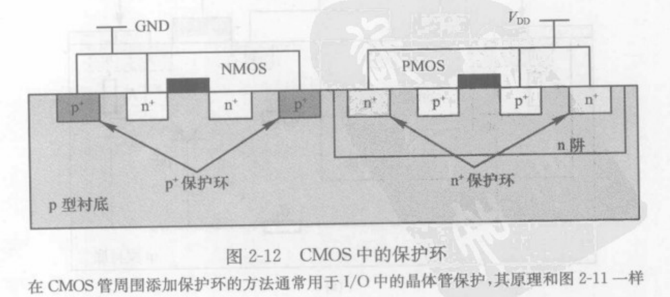

防止闩锁效应的方法是采用SOI材料代替硅材料，使每个晶体管与周围器件相隔离，避免了器件之间的耦合，从根本上消除了闩锁效应的产生。

#### 2.1.2  版图设计基础

根据电路功能和性能要求以及工艺条件的限制，设计工艺制造过程中必须的光刻掩模版图。

版图实现分为：

- 全自动设计
- 半定制设计
- 全定制设计

1. GDSII数据及其产生

采用二进制格式记录版图几何图形、拓扑关系、结构、层次及其信息。

1. 工艺技术文件

晶圆代工厂提供给设计者用于后端版图设计的技术文件，用于与EDA工具交互工艺信息的常用文件。

1. 映射文件

版图设计数据库与GDSII数据之间进行相互转换。

### 2.2 设计规则检查

设计规则检查DRC，检查版图中所有因违反设计规则而引起潜在短路、断路或不良效应的物理验证过程。

DRC检查的方法：将版图中所有几何图形与设计规则规定的尺寸、间距进行比较，并将所有违反规则的地方反标到版图告诉设计者，修改错误。

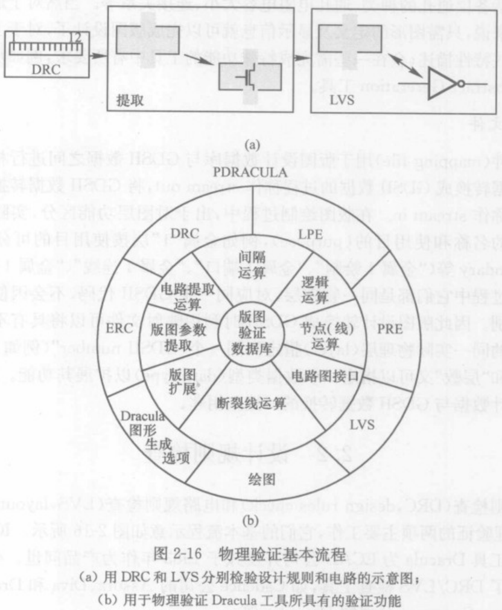

### 2.3 电路规则检查

LVS，目的是验证版图与电路原理图的电路结构是否一致，确保版图与设计电路完全一致。检查内容：

1. 所有信号的电气连接关系是否一致；
2. 器件类型尺寸是否一致。

LVS文件由晶圆代工厂提供，一般由器件提取规则、电路比较规则、器件捆绑规则组成。

### 2.4 版图寄生参数提取与设计仿真

#### 2.4.1版图寄生参数提取

基于全定制设计方法开发的标准单元库在完成版图工作后，确保版图符合设计要求且连接正确要进行DRC和LVS检查。

完成DRC与LVS后还需进行版图（电容）寄生参数提取（LPE，layout parastic extraction）和寄生电阻提取（PRE，parasitic resistance extration）。

完整寄生参数包括R、C、L（电感）、K（互感）。

#### 2.4.2 版图设计仿真

RC寄生参数提取输入文件需要GDSII文件、技术文件与电路图（或DEF文件）

GDSII含有完整的物理信息，技术文件含有工艺过程的三维空间尺寸及各种材料的介电常数，RC提取工具根据电路图结构（或DEF文件）就可以建立空间寄生参数的分布，并将结果用标准寄生参数格式（SPF或SPEF)文件写出，同时产生晶体管级的网表供后仿真使用。

对于大规模数字电路，例如数字芯片，先进行寄生参数RC提取产生标准寄生参数格式SPF文件，然后进行延时计算得到标准延时格式SDF文件并反标到门级网表，再进行相应的门级后仿真，检查其性能是否达到要求。同时用SDF文件进行静态时序分析STA。

### 2.5 逻辑单元库的建立

逻辑单元的建库流程：

1. 方案设计与论证：了解建库所针对的工艺、器件模型、设计规则以及与工艺技术相关的技术资料，确定单元库所支持的EDA工具及设计流程，确定单元库单元种类、数量、性能要求等。
2. 电路设计：包括按照电路性能要求和晶圆厂提供的验证规则文件制定电路设计、仿真和验证方案。电路设计同样包括了标准逻辑单元、存储单元和输人输出单元的设计过程。
3. 版图设计：是建库的主要工作之一，它和工艺紧密相关。版图设计经过DRC和LVS检验合格后，则根据实际应用建立逻辑单元物理库。
4. 标准单元特征化和库模型生成：建立单元库中所有单元电路在不同工作条件下的性能参数与符合标准的各种模型库文件以用于电路仿真、综合、布局布线、时序、功耗等分析。
5. 设计验证：验证单元库建立的各种模型库完成后验证其一致性与工作的兼容性。

#### 2.5.1 逻辑单元类别

单元库根据在芯片中的应用，分为：

1. 标准单元
2. 模块宏单元
3. 输入输出单元

与单元库相关的标准数据格式包括以下：

1. 电路级（SPICE或CDL网表），用于器件级仿真或LVS检查。
2. 符号级（逻辑图），用于逻辑分析，包括单元名称，符号，输入输出端口。
3. 版图级GDSII文件，用于记录版图的完整信息。
4. 硬件描述语言（HDL)所阐述的网表文件：Verilog HDL或VHDL。
5. 物理库LEF文件，它是版图级的抽象文件，主要用于布局、布线。
6. 时序库liberty文件，用于电路综合，时序分析。
7. 功耗库，用于功耗分析。
8. 噪声库，用于信号完整性(signal integrity)分析。
9. 其他库，例如，用于PCB设计的I/O的IBIS模型。

以上1-3主要用于版图设计，类型4-8主要用于布局与布图，9用于测试和板级PCB设计仿真。

#### 2.5.2 逻辑单元电路

1. 标准单元

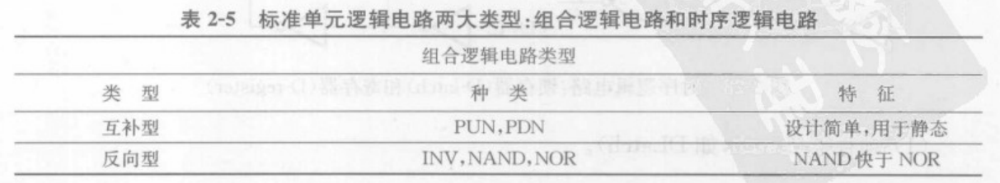

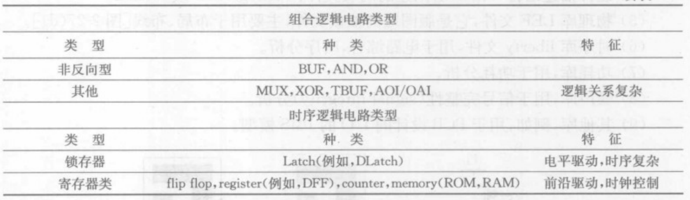

- 组合逻辑电路，指任意时刻的输出信号与信号作用前的电路的状态无关，输出仅取决于该时刻输入信号的电路，包括：
  1. 反向逻辑电路。
  2. 非反向逻辑电路。
  3. 其他常用逻辑电路。
  4. 特殊功能的逻辑电路。
- 时序逻辑电路：在任意时刻，输出信号不但同当前的输入相关还同上一时间的输出相关，具有记忆功能包括：
  1. 锁存器
  2. 寄存器类

1. 模块单元
2. ROM
3. RAM，包括SRAM与DRAM
4. 专用模块
5. “黑盒子”商业IP模块
6. 模块单元
7. 输入输出单元

包括输入信号、输出信号、三态、双向、电源与接地单元。

#### 2.5.3 物理单元建库与数据文件

1. 标准单元

包括反相器、与门、寄存器、选择器、全加器等多种基本单元。

为实现工具的自动布局布线，建库特殊的设计规则：

（1）所有单元都是等高或整数倍的矩形；

（2）为保证放置时不引起DRC错误，所有版图要用预先定义的模板进行设计。

（3）所有单元的输入输出端口的位置、大小、形状都尽量满足网格间距的基本要求，以提高布线器的效率；

（4）电源线和地线位于单元上下边界，以便于连接共享，减小芯片面积。

1. 模块单元

包括各种规模的数字模块：RAM、ROM、电压比较器等，也包括模拟模块：运算放大器、ADC/DAC、振荡器等。

1. I/O单元

芯片与印刷电路板通信的接口电路统称为I/O电路。必须具有较大驱动能力，抵御静电放电的能力，抗噪声干扰的能力以及足够的带宽和放电保护功能。

组成大致分为三部分：PAD接口、信号缓冲器电路和静电放电保护电路ESD。

1. 标准单元中的特殊单元

   （1）填充单元：把扩散层连接起来满足DRC规则和设计需求，并形成电源线和地线轨道。

   （2）电压钳位单元：数字电路中某些信号端口，或闲置信号端口需要钳位在固定的逻辑电平上；隔离普通信号和特殊信号的作用，在作LVS分析或形式验证时不引起逻辑混乱。

   （3）二极管单元：避免加工过程中天线效应导致器件栅氧击穿，避免器件失效。

   （4）去耦单元：避免动态电压降对电路动态供电电压下降或地线电压升高，引起动态电压降。

   （5）时钟缓冲单元：为保证时钟到达各个触发器时间偏差尽可能小。

   （6）延时缓冲单元：调整电路路径延时以符合时序电路。

   （7）阱连接单元：限制电源或地与衬底之间的电阻大小，减小闩锁效应。

   （8）电压转换单元：低功耗多多供电多电压转换。

   （9）隔离单元：用于低功耗设计，与电压转换结合使用做成双重功能的单元。

   （10）开关单元

2. 物理库交换格式（LEF）文件的产生

在逻辑综合产生门级网表和物理设计做布线布局的过程中的两个重要库文件：物理库文件（对版图的抽象描述，使自动布局布线成为可能并大大提高工具效率）和时序库文件。

为便于管理和应用分为技术LEF文件（定义设计规则与晶圆厂的工艺信息）和单元LEF文件（定义标准单元、模块单元、I/O单元和各种特殊单元的物理信息）。

#### 2.5.4 时序单元建库与数据文件

器件延时和互连线延时两部分。

1. 器件延时：⼀般用非线性延迟模型（non-linear delay model）算出，采用查表的方式，根据 输⼊转换时间和输出负载在二维表格中找到对应门单元的延迟和输出转换时间，输出转换时间又作为下一级电路的输⼊转换时间。
2. 互连线延时：⼀般用线负载模型（wire load model，WLM）算出，根据连线的扇出来估算连线的RC寄⽣参数。半导体厂商根据已经生产出来芯片的统计结果，在相同⼯艺下，计算出在某个设 计规模内（如0~40000门）负载扇出为1时连线的平均长度，负载扇出为2时连线的平均长度，负载扇出为3时连线的平均长度等等。
3. 集成电路仿真程序（SPICE）

使用电路网表和器件模型对电路各个节点进行直流分析、交流分析和瞬态分析等各类精确电路仿真。

1. 器件延时基本定义

信号通过一个逻辑门时经历的时间反映了门对输入信号变化响应的快慢。

1. 器件延时理论模型

   （1）开关线性RC模型：得出器件延时

   （2）K-Factor模型：查找表中得出的延时数据

   （3）NLDM模型：采用特征方程计算延时

   （4）SPDM模型：可伸缩多项式模拟延时数据

   （5）ECSM模型：建立物理模型处理时序、功耗、噪声等

   （6）CCSM模型：与ECSM相似。

2. 功耗

主要是电路状态跳变时引起的动态功耗。

1. 噪声

互连线间耦合电容的存在。

1. 时序库文件

   描述单元库各个单元时序信息的重要库文件。

   （1）时序库文件格式：liberty、TLF、ALF等

   （2）时序库的PTV条件：process：工艺、temperature：温度、voltage：电压

   （3）时序库中的线负载模型

   （4）时序库中的单元信息：延迟时间表、功耗数值表，单元特征（面积、静态功耗、端口类型、逻辑关系）

### 2.6 工艺过程中的天线效应

工艺过程中电荷积累导致晶体管被击穿，导致器件损坏，简称PAE（process antenna effect）

## 第三章布图规划和布局

### 3.1 布图规划

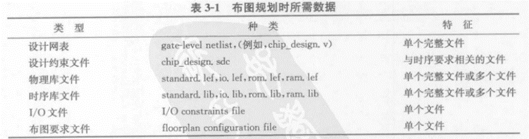

关系到芯片的**时序收敛、布线通畅、电源稳定以及良品率**

三大内容：布图规划、电源规划和布局

#### 3.1.1 布图规划的内容和目标

数据的完整性和准确性是布图规划的可靠保证。

布图规划的目标分为4部分：

（1）确定芯片的面积。

（2）确保时序的收敛

（3）保证芯片的稳定

（4）满足布线的要求

#### 3.1.2 I/O接口单元的放置与供电

（1）I/O单元的类型与布局

（2）I/O单元的供电

可分为信号接口（选择驱动的大小）与电源（供电电源的数量计算和摆放）两种类型

I/O单元分为三类：给模拟器件供电的I/O单元、给数字器件供电的I/O单元和隔离数字供电I/O单元和模拟供电I/O单元隔离I/O单元。

#### 3.1.3 布图规划方案与延迟预估

（1）展平式设计

根据标准单元布局，采用静态时序分析方法，对整个芯片的延迟做出估算，用时序违例（负值剩余时间）评估哪种布图规划更合理。

延迟主要有门延迟和线延迟。

（2）层次化设计

将大规模的顶层设计分解成多个子模块，每个子模块并行完成布局布线，最后在顶层组装。

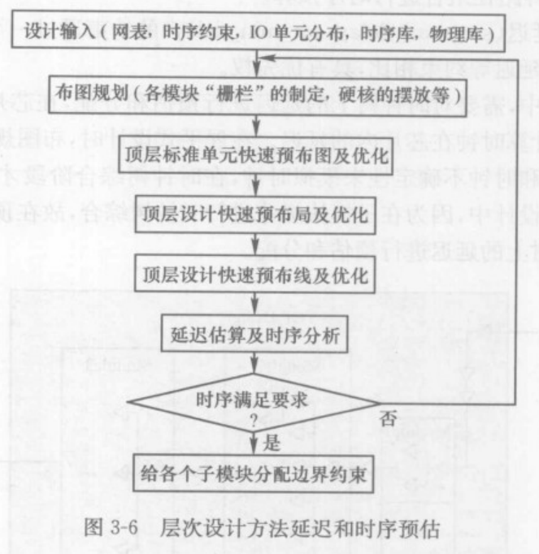

三步骤：芯片顶层设计规划、子模块分割与实现以及芯片顶层组装的实现。

#### 3.1.4 模块布放与布线通道

布线轨道（routing track）芯片内部专门用于布线的路径

布线通道（routing channel）是每两条或多条布线轨道的空间。

### 3.2 电源规划

给整个芯片的供电设计出一个均匀的网络。

三部分内容分析：电源网络设置、数字与模拟混合供电、单电源与多电源供电电源网络设置。

#### 3.2.1 电源网络设计

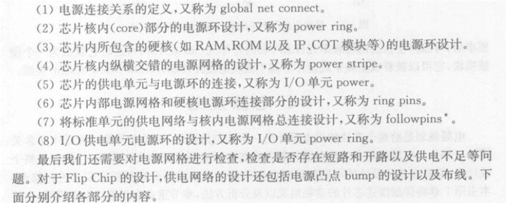

1. 全局电源

   全局电源网络连接：把相应端口和网络连接到合适的电源和接地网络上。

   1. 电源和接地网络
   2. 接高电压和接低电压网络
   3. 电源和接地端口
   4. 填充单元网络

2. 电源环线

均匀供电，也是连接供电I/O单元和标准单元的桥梁。

电源网络为了平均分布电流，缩短电流回路，有效减小电压降，避免电流分布不均时造成的热点现象以及电迁移问题。

电源环设计主要有3个参数：电源环的宽度 、电源环的间距 、电源环的对数 。电源环宽度的估算：
$$
w=\frac{I_{p}}{C_{d}·4n}·k
$$
I_{p}:芯片的峰值电流；

C_{d}：厂家工艺库所给出的电流密度的上限；

*n*：电源环的数量；

*k*：调整因子，根据芯片的供电I/O单元分布决定。

一般情况为最小间距的2倍左右，但也会尽量减小电源环之间的间距，从而增大电源环的耦合电容，起到过滤电源噪声的作用。

一般宽线需要打孔散热。

金属的层数*n*由芯片的面积、厂家的设计规则、金属的层数等多种因素决定。

金属的层数较多时，可以选用多层金属布置电源环，从而有效减小电源环的宽度和减小电源环所占据的芯片的面积。

1. 电源条线

通常为不规则或不均匀分布，电源网格是均匀分布的电源条线。

#### 3.2.2 数字与模拟混合供电

用模拟模块PLL作为时钟信号发生器，在数模混合供电设计中，需特别注意电源信号之间的干扰和隔离，需建立不同的电源区域。

布局前的考虑处理：

（1）模拟模块的工作区域一般放置于芯片的某个角落。

（2）模拟区域需要单独供电，给模拟信号供电的I/O单元应放在模拟模块边上，缩短线路距离。

（3）在模拟模块的周围布置保护隔离环，从而实现数字信号和模拟信号电源之间的隔离。

电源规划中的细节问题：

（1）数模信号模块的放置。

（2）数模信号模块的供电。

（3）数模信号模块中的电源环。

（4）数模信号模块中的电源网络。

（5）数模信号模块中的电源设计方案。

#### 3.2.3 时钟网络

先找到时钟的入口，再在入口处选择相应的位置，手动插入特定强驱动能力的时钟驱动缓冲器，从驱动输出端画一级驱动时钟网络，再根据需要插入二级缓冲器，并画出二级驱动时钟网络，直至满足设计要求。

#### 3.2.4 多电源供电（MSV）

数模混合供电方案中，MSV专指多组电源同样电压供给不同电路（数字、模拟）。低功耗设计技术更多采用多组电源多组电压供电（MSMV）。关键模块采用高电压供电，频率较低模块采用低电压供电，有效降低功耗。

1. 电源规划

   每一个电压域当中必须有完整电源和地线电源环。

2. 电平转换单元的插入

3. 隔离单元的插入

   存在被关闭的电压域，为不使关闭区域与非关闭区域互相影响，必须在所有的接口处添加隔离单元。

### 3.3 布局

对标准单元的布局

#### 3.3.1 展平式布局

1. 模块的摆放和布局
2. 标准单元的摆放和优化

#### 3.3.2 层次化布局

过程：

1. 分配子模块；
2. 作子模块级的布局，方法与展平式一样；
3. 所有子模块完成后在顶层组装，布局方法与展平式一样
4. 子模块约束类型的制定

向导约束、区域约束、限制约束

1. 子模块大小位置的制定

各个模块指定约束后，需要在芯片内部指定模块的大小（主要看面积利用率）和位置。

#### 3.3.3 布局目标预估

标准单元布局优化后，需对设计进行拥塞分析、静态时序分析、噪声分析和电源分析从而确定布局好坏。

1. 拥塞预估
2. 时序预估
3. 供电预估

#### 3.3.4 标准单元布局优化算法

布局分为三个阶段:结群布局、全局布局、详细布局。

优化目标上优化算法分为三类：基于布线拥塞的布局优化算法、基于时序的布局算法、预防噪声的布局算法。

1. 布局优化算法

   结群算法：模拟退火算法、K-L算法、F-M算法、比率分割算法。

   全局布局：最小切割法算法、力向量算法、NRG算法、HA-LO算法等。

   以布局的对象为目标出发，分为三类：纯标准单元布局算法、模块布局算法、混合单元布局算法。

2. 基于布线拥塞的布局优化

   以布线可以布通为标准单元布局的出发点。

3. 基于时序的布局算法

   以满足时序为首目标，以路径为基础的实现方法和以网线为基础的实现方法。

4. 预防噪声的布局算法

   在布局阶段考虑噪声的影响。

### 3.4 扫描链重组

扫描链是可测试性设计（DFT）的重要内容，将芯片中所应用的普通寄存器替换成带扫描功能的多输入多输出扫描寄存器，首尾连接成串，从而实现附加的测试。

#### 3.4.1 扫描链定义

1. 以扫描链的起点和终点来定义
2. 通过综合工具导出的DEF文件来定义

#### 3.4.2 扫描链重组

将连接在扫描链上的在芯片内随机分布的扫描寄存器单元按照其物理位置，在不影响逻辑功能的前提下，重新进行连接，从而减少扫描链的走线长度。

对于内核限制型可以有效地减少拥塞，从而保证芯片的布通率。

有效节约布线空间，对于利用率不高的I/O限制型设计，可以跳过重组扫描链。

两种方法实现：本地化重组和基于扫描DEF的重组。

1. 本地化重组

   a. 扫描链上连接的触发器属于单一时钟域，由单一边沿触发。

   b. 触发器跨越多个时钟域，不同时钟域由数据锁存器件分开。

   c. 共享功能输出信号链

   d. 带有两端口逻辑单元的扫描链

2. 基于扫描DEF的扫描链重组方法

   处理方法与本地重组方法在过程上一致，处理范围更加广泛，能够处理重组多种复杂类型的扫描链。

#### 3.5 物理设计网表文件

在布图规划、电源规划与布局阶段的格式有4种：DEF、PDEF、SPF和SDF。

设计交换格式文件（DEF）

是扁平式的设计网表文件，目前应用最广泛的数据交换格式，具有跨平台、易兼容、语法简单等特点。

DEF带有物理信息的网表，除包含Verilog包含的连接信息外，还有各个单元所存在的物理信息。定义了芯片的面积（布图规划后的记录）、布图规划区域定义、电压域定义（电源规划后的记录）、标准单元行等内容。

在布局阶段可以根据不同的需求导出相应的布图规划和布局信息，从而实现数据交互。

## 第四章 时钟树综合

时钟信号是数据传输的基准，对同步数字系统的功能、性能和稳定性起决定性作用。通常是整个芯片种最大扇出、通过最长距离、以最高速度运行的信号。保证在最差条件下，关键时序要求能得到满足。

### 4.1 时钟信号

#### 4.1.1 系统时钟与时钟信号的生成

系统时钟是控制多个芯片之间时钟结构网络并控制相互之间时序关系的时钟结构。常用的有RC时钟、晶体振荡时钟、锁相环倍频时钟。

#### 4.1.2 时钟信号的定义

时钟信号的特性参数：时钟的周期（频率）、时钟延迟以及时钟信号的不确定性是组成上述任意一个时钟的三要素。

标准设计约束SDC文件中对时钟本身的定义分为三部分内容：

（1）时钟的定义；

（2）时钟延滞的定义：插入延迟，时钟源插入延迟（来自芯片到当前模块或时钟源到当前芯片）时钟根节点之间的延迟和时钟网络插入延迟（时钟树的延迟）。

（3）时钟不确定性。时钟抖动（信号时间与理想事件时间的偏差）含有确定抖动成分和随机抖动成分。

#### 4.1.3 时钟信号偏差

同一时刻到达该时钟域内的不同寄存器之间的时间偏差。衡量时钟树性能的重要参数。

时钟树综合的目的是为了减小偏差，值有正负两种。

### 4.2 时钟树综合方法

时钟分为两类：真实时钟（两模式：时钟树综合前没有延时的理想时钟和时钟树综合后的传播时钟）与虚拟时钟。

#### 4.2.1 时钟树综合与标准设计约束文件

时钟树综合（CTS）需要对期望实现的参数做出定义，通过“时钟约束文件”来提供。约束文件中首先是对时钟信号本身的定义，直接来源于标准设计约束SDC文件。

SDC文件：规定到达同步寄存器的数据与时钟之间满足设计要求的一种时序关系。SDC文件由三部分组成：时钟定义、输入延迟、输出延迟。

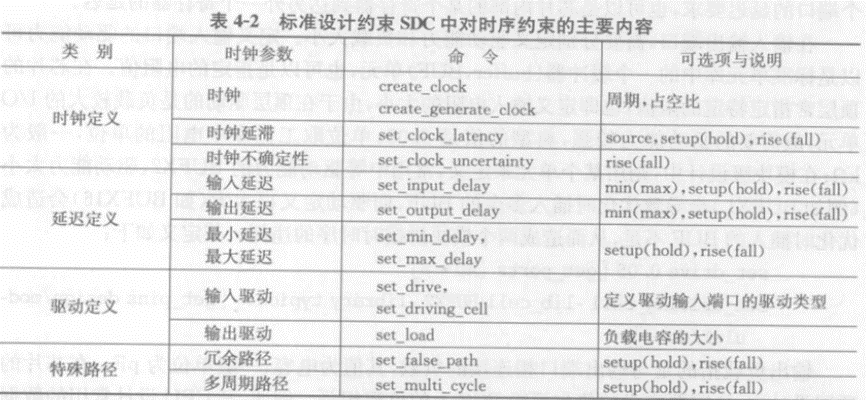

对时钟的定义、时钟延迟的定义、时钟不确定性定义是为了在布局、时钟树综合和布线时提供时序约束参考点。时钟的定义将通过时钟综合来实现，而时钟延迟与时钟抖动或不确定性将在静态时序分析时进行检查。

#### 4.2.2 时钟树结构

时钟信号的起点叫做根节点，时钟信号经过一系列分布结点最终到达寄存器时钟输入端或其他时钟终点被称为叶节点。

**时钟树综合：**时钟网络从根节点逐级插入驱动器，从而到达其叶节点，按照芯片时钟网络的约束要求产生时钟树的过程。

时钟树根据在芯片内的分布特征，可以分为多种结构：H树、X树、平衡树，以及梳状或脊椎状时钟网。

#### 4.2.3 时钟树约束文件与综合

时钟树约束文件可以由标准设计约束文件自动产生。

在时钟约束文件中，对应于每一个将要综合的时钟树，分别定义它的名称、周期、时钟根节点、最大插入延迟、最小插入延迟、最大偏差、定义专供时钟树综合选用的时钟buffer、inverter。

### 4.3 时钟树设计策略

#### 4.3.1 时钟树综合策略

（1）自我交叉

（2）相互交叉时钟

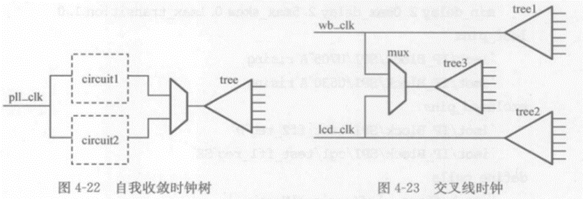

（3）有用偏差

（4）OCV与CPPR在时钟树时序分析时的应用

（5）与布局相结合的手动时钟树设计

（6）对时钟插入多驱动的buffer

#### 4.3.2 时钟树案例

#### 4.3.3 异步时钟树设计

通常各模块间时钟同属于同一个主时钟，因此能量功耗也最大，若将结构bus做成自我定时各个模块的时钟成为相互独立，时钟偏差与平衡也就容易实现。在实际SoC设计中，以非同步时钟设计来实现，从而降低功耗。

时钟树综合对同步电路实现的优点：

电路结构简单明朗，具有较好的鲁棒性，验证简单。

缺点：较大时钟在物理实施时具有一定的难度，封装电感和电源电阻会在同步时钟跳变的瞬间产生很大噪声。

异步电路与同步电路相反，电路不规则，速度快，功耗低，将全局时钟变为多个局部时钟。

#### 4.3.4 锁存器时钟树

特点：数据在有效电平区间内传输，而非在时钟的边沿传输。相较于寄存器电路，锁存器半个时钟周期内直通，故能在本周期内容忍一定的负的剩余时间或借用下一级的时间，故锁存器上的时序更容易满足。

锁存器可以实现较高频率的电路，但锁存器在半个周期内透明的特性增加了电路的灵活性，也由于噪声的影响，数据上的毛刺信号很容易在锁存器电路中传递，从而造成功能的错误，抗噪性比较差。

不提倡使用，但在物理设计中采用一定抗噪方法的前提下，可以考虑采用锁存器。

#### 4.3.5门控时钟

降低功耗的最常用方法。

用一个控制信号控制时钟的开启，在模块不工作时关闭时钟，在工作时打开时钟，从而降低触发器的总的翻转率达到降低功耗的目的。

根据关闭触发器的数量可以分为：

- 粗粒度门控时钟：一个门控单元关闭整个模块（时钟树综合，放置在靠近根节点的位置）；
- 中粒度门控时钟、
- 细粒度门控时钟：一个模块中部分不工作的寄存器。

在EDA工具中，需要对其进行特殊处理。

### 4.4 时钟树分析

#### 4.4.1 时钟树与时序分析

紧密相关，时序分析离不开对时钟的分析。

（1）偏差与建立时间

由于时钟偏差（skew）的存在，在分析建立时间会导致预留寄存器之间延迟时间减小，降低芯片的工作频率，即降低了芯片的性能。

（2）偏差与保持时间

通过降低工作频率，牺牲性能可以解决时钟偏差造成的建立时间违例问题，但却不能解决时钟偏差导致的保持时钟违例，从而导致芯片错误的动作。

**减小时钟偏差对增加芯片的性能和稳定性起到了至关重要的作用，在时钟树综合时，尽量获得较小的时钟偏差从而获得性能和稳定性的提升。**

#### 4.4.2时钟树与功耗分析

功耗由静态功耗、短路功耗与跳变功耗三部分组成。


时钟树静态功耗为各个buffer上静态功耗的和，故减小静态功耗的方法是减少buffer的加权数。

时钟树短路功耗是芯片短路功耗的重要组成部分，阈值电压由工艺条件决定，降低时钟树上的功耗关键在于降低波形的转换时间。

时钟树上的跳变功耗为整个芯片功耗的重要组成部分，由门的加权数值以及互连线总的电容决定，减低互连线的长度可以降低跳变功耗。

降低功耗：时钟树长度与驱动的加权数降为最小，实现方案：

（1）减小时钟信号转换时间

（2）降低节点电容

**减小互连线的长度也是优化时序的关键。**

#### 4.4.3时钟树与噪声分析

（1）噪声主要类型

a.耦合电容对寄存器的效应

b.耦合电容对时钟的效应

（2）降低噪声方法

a.局部电源地保护

b.增加驱动

c.高层金属多倍间隔走线

信号延迟主要有电阻和电容两个因素决定；噪声的主要因素是耦合电容

## 第五章 布线

布局与时钟树综合之后的重要物理实施任务，内容是将分布在芯片内核模块、标准单元和输入输出接口单元按照逻辑关系进行100%互连并满足各种约束关系进行优化。

优化工作指标：消除布线拥塞（congestion）、优化时序（timing）、减小耦合效应（coupling）、消除串扰（crosstalk）、降低功耗、保证信号完整性（signal integrity）、预防DFM问题与提高良品率等

### 5.1 全局布线

制定全局布线目标，根据设计特征做出具体规划。

1.全局布线目标

2.全局布线规划

将芯片核区划分为大方块，进行纵横方向走线。

### 5.2 详细布线

局部布线

1. 详细布线目标

属于同一个net的所有pin连接上；不同net的终端不能连接；要遵守设计规则要求的距离间隔等。

详细布线是物理实施的最后步骤，实现的结果被用来作为参数提取和时序分析。

详细布线要求：

1. 详细布线与设计规则

   （1）设计规则

   （2）通孔与最小面积要求

   （3）密度要求

   （4）掩模光刻过程中的工艺天线效应（PAE）

   （5）串扰在布线中的预防和修复

   （6）纳米布线规划

   （7）对角45°布线规划

2. 布线修正

   （1）自动修正

   （2）渐进修正

   （3）局部修正

### 5.3 其他特殊布线

专指“电源网络布线”与“时钟树布线”还有总线布线和实验布线等

1. 电源网络布线

   包括建立电源环线、电源条线和连接标准单元供电电源网络总连接。

2. 时钟树布线

   要求时钟信号延时很小。

3. 总线布线

   要求布线长度同步一致，减小同一组总线延时的差别。

4. 实验布线

   尽快尽早了解设计的初步结果，供时序分析使用。

### 5.4 布线算法

1. 通道布线和面积布线
2. 连续布线和多层次布线
3. 模块设计和模块布线

## 第六章 静态时序分析

首先对芯片物理版图设计进行参数提取，再进行延时计算。

### 6.1 延迟计算与布线参数提取

1. 延迟计算模型

   RC提取可以在布局也可在时钟树综合之后。

   只有在布线结束后，互连线的物理特性被确定，RC提取才是真实的

   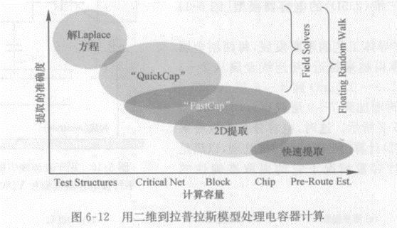

2. 电阻参数提取

   将连线以线宽的方式分割成若干小方块，再以小方块为计算单位，线同理。

3. 电容参数提取

   总电容：面积电容、侧面电容、边缘电容。

4. 电感参数提取

### 6.2 寄生参数与延迟

1. 寄生参数格式SPF文件

   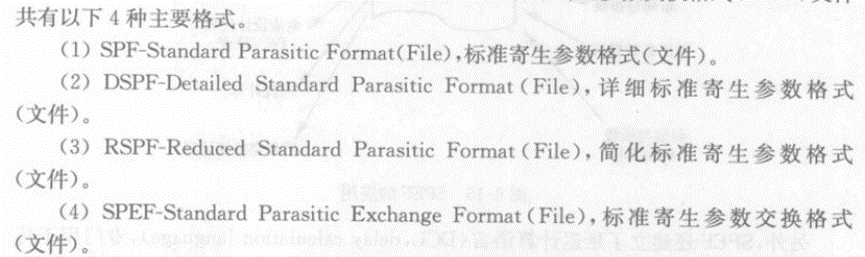

2. 标准寄生参数交换格式文件

   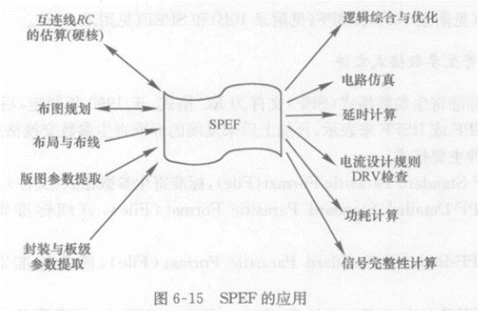

3. 标准延迟格式SDF文件

4. 中间信息文件

5. SDF文件的应用

   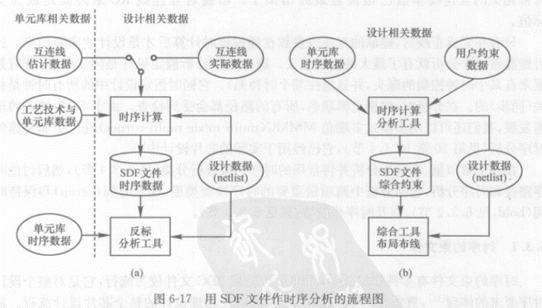

对布局布线后的设计状态延时的报告，最广泛的应用：

**反标：**即与布局布线后的设计网表检查设计的时序是否达到要求。

**正标：**延迟数据可以作为时序约束文件来使用。

### 6.3 静态时序分析

从RTL逻辑综合到布局、时钟树综合、布线和反标，直到出带，目的都是为了检查设计结果是否满足设计的约束条件，检查时序是否达到要求。不同在于时序结果与设计约束之间相差的准确性。

时序检查类型：建立时间（setup）和保持时间（hold）以及时序分析特例。

1. 时序约束文件

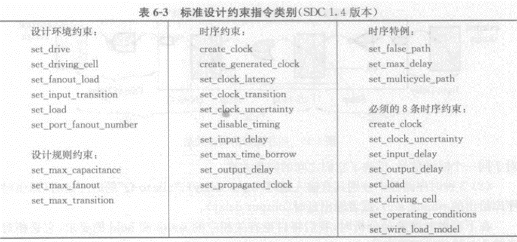

1. 时序路径与时序分析

时序分析根本目的是检查再时钟的控制和要求的约束下，与其相关的数据能否符合时序要求被记录存储下来，即建立时间时序和保持时间时序

（1）时序路径与同步

```
先找起点和终点，再路径分类。

路径分类：I2C、C2C、C2O。
```

（2）时序分析的建立和保持

```
Setup：时钟作用前沿（或后沿）到达前，同步输入信号必须保持稳定的那段时间以使信号不至于丢失。

Hold：时钟作用前沿（或后延）到达后，同步输入信号必须保持稳定的那段时间以使信号不至于丢失。

  a.关于建立时序的违例

    检查setup时序，在典型的情况是用“最差条件”时序库。出现setup违例解决：让时钟变慢（增长周期），要么缩短数据路径延迟。

  b.关于保持时序违例

    检查hold时序，在典型情况下应当用“最佳条件”时序库。解决违例方法：增长数据路径的延迟，要么加快时钟到达。
```

（3）时序路径类型

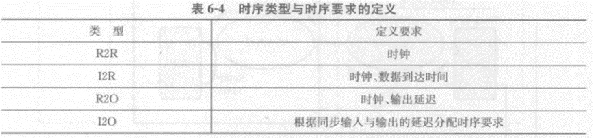（4)时序分析的环境与时钟特性

```
类型：

确定驱动、确定驱动单元、确定负载、确定扇出。

特性参数：时钟插入延时、时钟抖动、时钟转换时间。
```

（5）锁存器的时序分析

1. 时序分析特例

   多周期路径和虚假路径

2. 统计静态时序分析

### 6.4 时序优化

1. 造成时序违例的因素

   （1）由于系统设计的复杂性和抽象性，有些约束不合理或不可能实现。

   （2）一些约束在逻辑综合时可能依据了不合理的WLM，参生的网表在物理实施时不可能实现；

   （3）设计太大，互连线的相互牵制引起时序违例；

   （4）不合理布局使得物理实施后的设计时序无法满足要求。

2. 解决方案

   **（1）原地优化（时序优化）**

   **时序问题**，先解决setup违例的问题，再处理hold违例，相互牵制，有时需要重复进行优化过程。如今可同时处理setup和hold违例。

   **设计规则违例：**最大负载、最大扇出和最大转换。

   方法：

   a.挑选并替换驱动能力大小不一样的逻辑单元（最简单、最重要）

   b.克隆法，复制逻辑单元去分担负载。

   c.添加缓冲器（buffering）或用缓冲器替代两个反相器。

## 附录

### 1 SI(Signal Integrity)

信号传输过程中，信号的质量和完整性保持高水平的能力。

#### 1.1 信号完整度相关的因素和问题

1. 信号衰减：在信号传输过程中，信号可能会受到衰减，导致信号强度减弱。这可能由于传输线的损耗、反射、耦合和串扰等因素引起。
2. 信号噪声：噪声是无用的或干扰性的信号，它可能会混入到原始信号中，导致误码或降低信号的可靠性。噪声可以来自各种源，如电源噪声、电磁干扰、时钟抖动等。
3. 时钟抖动：时钟信号的抖动是指时钟信号的波形在时间上的变化或不稳定性。时钟抖动可能会导致时序错误、时钟偏移和数据同步问题。
4. 反射和时域反射：传输线上的信号在遇到阻抗不匹配时会发生反射，这可能导致信号完整性问题，如信号失真和时序偏移。
5. 致命耦合和串扰：信号线之间的互相干扰称为耦合或串扰。例如，高速时钟线可能会对邻近的数据线产生电磁耦合，导致数据错误或失真。

#### 1.2 确保信号完整度，设计和分析工程师可以采取多种措施，包括：

- 使用适当的传输线设计和布局，以减小传输线的衰减和反射。
- 使用合适的信号终端阻抗匹配，以减少反射和时域反射。
- 使用屏蔽和隔离措施，以减少耦合和串扰。
- 优化电源供应和电源噪声抑制，以降低噪声对信号的影响。
- 进行时钟和时序分析，以识别和纠正时钟抖动问题。
- 进行模拟和功耗分析，以综合考虑信号完整性和功耗要求。

通过有效地管理信号完整度，可以提高系统性能、降低误码率，并确保电路的可靠性和稳定性。

### 5 SDC文档简介

设计约束SDC（Synopsys design constraints）文件基于TCL（tool command language）格式，用于电路的逻辑综合。

对电路的时序、功耗、面积等进行约束，从而使芯片满足设计要求的规范。

包含：

- 版本
- 基本单位
- 设计约束
- 注释部分

除设计约束外均不是必须。

版本命令`set sdc_version`指明SDC文件所用的版本

基本命令`set_units`用于指定电阻、电容、电压、电流、功耗、时间的基本单位。

注释用`#`开头

工作环境命令`set operating_conditions`用于设置电路最快和最慢情况下所对应的库文件和工作环境。

设计相关命令：

工作环境：`operating condition`

线负载模型：`wire load mode`

系统接口：`system interface`

时序约束：`Timing constrains`

时序个例：`timing exception`

设计规则约束：`design rule constrains`

面积约束：`area constrains`

功耗约束：`power constrains`

逻辑赋值：`logic assigments`

线负载模型相关命令：

```
set_wire_load_min_block_size
set_wire_load_mode
set_wire_load_model
set_wire_selection_group
```

系统接口相关命令：

设置模块输入输出端口的属性

```
`set_load`设置输出端电容值，电容值的设置将影响端口延时的计算。

`set_driving_cell`定义了输入端口的特性


```

时序约束相关命令：

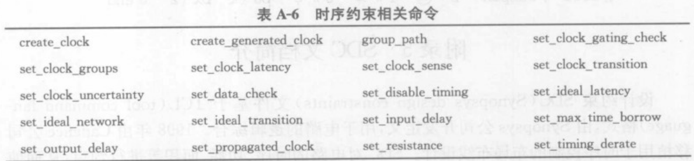

时序个例相关命令：

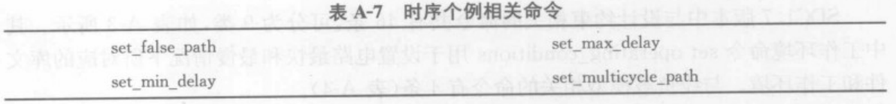

设计约束相关命令：

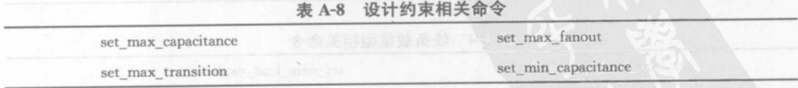

逻辑赋值相关命令：

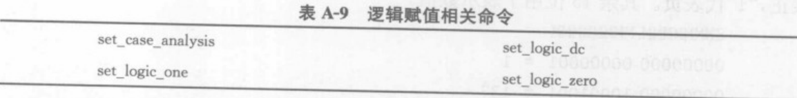

SDC命令中还包括一些用于访问电路端口（port）、时钟（clock）、单元端口（pin）以及互连线（net）等命令，这些命令作为设计约束命令的参数（argument）用于实现对某一端口，时钟及互连线等的约束施加。

### 7 LEF文档简介

LEF（library exchange format）自动布局布线所必须的库文件。

为便于管理和应用，LEF库文件可分为Technology LEF和Cell LEF两大部分

#### 7.1 Technology LEF

Technology LEF主要包含工艺信息、设计规则信息、通孔信息。内容和定义：

- 单位（Unit）：标准单位与LEF数据库单位之间的转换
- 层信息（layer）：定义所有工艺层的物理属性、设计规则及天线效应等。

```
LAYER METAL1
    TYPE ROUTING ;
        WIDTH 0.160 ;       //默认布线宽度
        SPACING 0.180;      //布线间距规则
        SPACING 0.18 LENGTHTHRESHOLD 1.0;
        SPACING 0.22 RANGE 0.3 10.0 USELENGTHTHRESHOLD;
        SPACING 0.60 RANGE 10.05 100000.0;
        PITCH 0.410;    //布线器轨道的最小间距
        DIRECTION HORIZONTAL ;
        RESISTANCE RPERSQ 8.3000e-02 ;
        CAPACITANCE CPERSQDIST 1.8831e-04 ;
        EDGECAPACITANCE 9.7858e-05;
        ANTENNACUMAREARATIOEND 500;
    END METAL1
```

- 互连线通孔（via）：布线工具进行金属互连时可以使用的通孔种类和选择通孔的规则。一个完整通孔包括：两个互连层和一个cut层，cut层理解为连接两层互连线的接口。
- 通孔整列：电源和接地线承载更大的电流，故宽度一般是信号线宽度的几倍甚至几十倍，故连接需要特殊的通孔阵列，对于较宽的互连线也可采用通孔阵列以减小通孔电阻
- 相同连线距离（same-net spacing）规则：主要用于布线工具或验证工具的DRC检查。

#### 7.2 Cell LEF

Cell LEF单元库中各单元信息，采用SITE语句对布局最小单位的定义，另一部分是采用MACRO语句对单元属性及几何形状的描述。

### 9 DEF文档简介

设计交换格式DEF（design exchange format）文件描述电路物理设计信息的文件格式，不仅包含电路的连接关系而且描述了电路布局布线后单元及互连线的具体物理信息。


PDEF物理设计交换格式（physical design exchange format），主要作用是为高层次设计与EDA工具间传递物理设计信息提供一个标准媒介。，可以将后端工具产生的物理设计数据反标到前端工具中，也可以采用正向标定的方法将前端设计的物理约束传递给后端工具。

### 10 SPF文档简介

标准寄生格式SPF（standard parasitic format）用于EDA工具间传递电路互连线寄生参数的标准接口格式，分析电路延时的重要依据之一。

根据电路寄生参数的不同格式和描述方式有三种形式：

- 原初SPF
- DSPF（detailed SPF）完整的寄生信息
- RSPF（reduced SPF）

原初SPF和RSPF对寄生信息的缩减描述

#### DSPF

DSPF按文件的结构分为：

- 在文件开始部分用来定义设计和文件的一些基本属性
- 文件的主要内容，描述电路具体的寄生参数数据。

描述电路寄生信息的主要部分：

1. 电路定义
2. 定义全局地线
3. 线网定义
4. 子电路的调用
5. 电路定义结束

#### RSPF

保证在一定寄生信息精确性的前提下提高电路的仿真速度。