## EDA 部分学习记录

### iEDA 代码阅读

[开源EDA软件iEDA初探 - 基本架构及代码框架](https://www.guofan.fun/ieda-architecture/)

### 书籍阅读

[《数字集成电路物理设计》学习笔记](https://www.guofan.fun/digital-physical-design/)

[《超大规模集成电路物理设计：从图分割到时序收敛》学习笔记](https://www.guofan.fun/vlsi-physical-design/)

[《集成电路静态时序分析与建模》学习笔记](https://www.guofan.fun/ic-sta-and-modeling/)

### 理解输出

[EDA后端总体概览](https://www.guofan.fun/eda-physical-design-summary/)

## 必知必会

- （1）布局：请简述一个你学习的布局算法，包括：输入、输出、数据结构设计、算法主要思想，时间复杂度等；
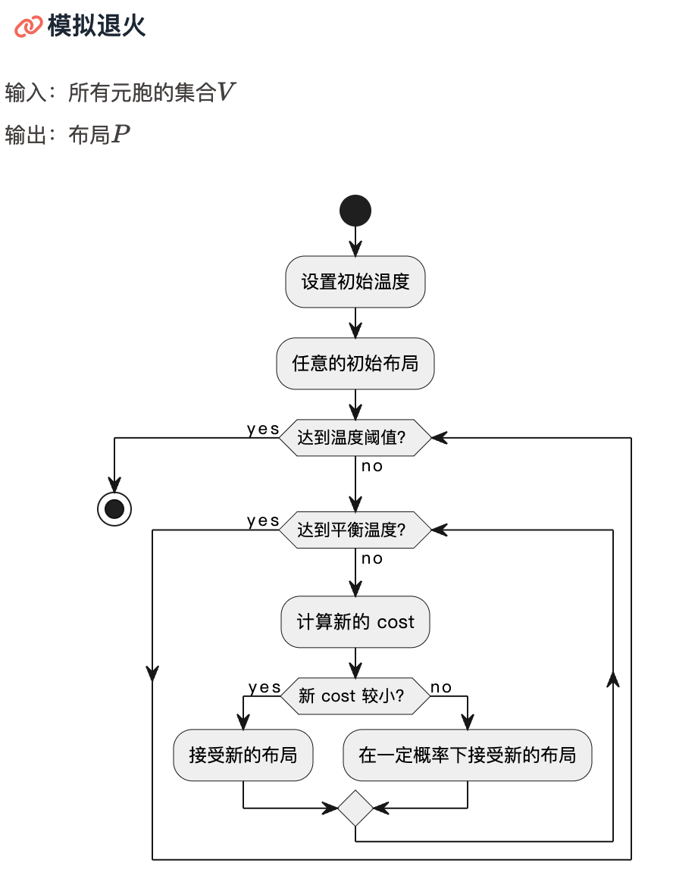
模拟退火算法。
  - 输入：所有元胞的集合
  - 输出：布局
  - 主要思想：以一定的方式布局，如果新布局cost较小则接受之，否则以一定概率接受
  - 时间复杂度：不确定

- （2）布线：请简述一个你学习的布线算法，包括：输入、输出、数据结构设计、算法主要思想，时间复杂度等；
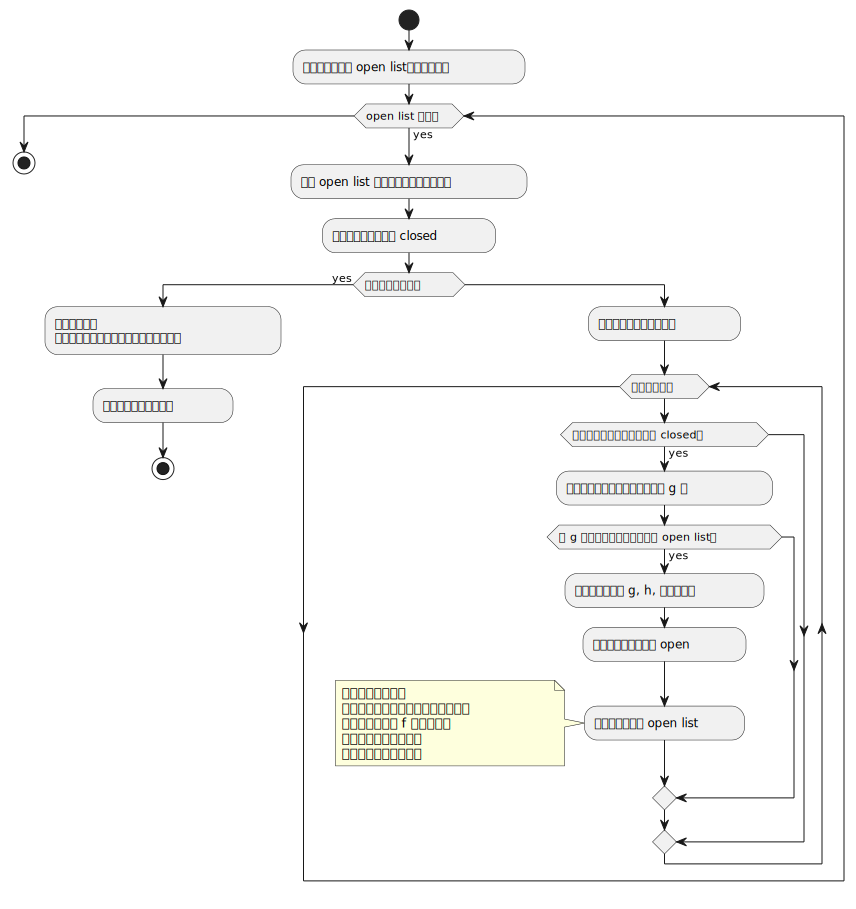
A*算法。
  -输入：grid地图、起点、终点
  -输出：最短路径
  -主要思想：利用启发函数f=g+h，每次找出最可能在最短路径中的节点（列表中f值最小的节点），计算其周围节点的f值并加入列表中
  -时间复杂度：O(n)

- （3）静态时序分析：请简述单元库，互连寄生，单元时延（NLDM表格），线网时延（Elmore计算），串扰噪声的定义，时序检查（Setup/Hold）,时序路径定义，时序约束命令；
  - 单元库（Library）：单元库是指包含了各种标准单元（比如逻辑门、存储器单元等）的集合，其中包含了这些单元的物理特性描述、电气特性描述和时序信息等。
  - 互连寄生（Interconnect Parasitics）：互连寄生是指由于电路中的导线、电源线、地线等互连元件引入的电容、电感和电阻等元素，对电路的时序行为和性能产生影响。
  - 单元时延（NLDM表格）：NLDM（Non-Linear Delay Model）是一种根据输入负载电容和输入电压进行建模的时延模型，它通常以表格的形式给出。
  - 线网时延（Elmore计算）：Elmore Delay是一种简化的计算线网传输延迟的方法，它假设信号沿着每条路径传播的速度是均匀的，并根据树状结构来估计总的传输延迟。
  - 串扰噪声（Crosstalk Noise）：串扰噪声是指由于信号在临近线网之间的耦合效应引起的干扰噪声。它可能会导致信号失真、时序错误等问题。
  - 时序检查（Setup/Hold）：时序检查是指对电路的时序要求进行验证的过程。其中Setup是指在时钟上升沿之前输入数据必须稳定的时间，Hold是指在时钟上升沿之后输入数据必须保持稳定的时间。
  - 时序路径定义：时序路径是指信号从一个时钟域到另一个时钟域的传输路径。时序路径定义包括了源寄存器、时钟网络、组合逻辑网络、目标寄存器等各个元素。
  - 时序约束命令：时序约束命令是用于规定电路设计的时序要求的命令。它包括了时钟频率、时序路径、时钟边沿、时钟域等信息，用于指导综合和布局布线工具进行设计。

- （4）EDA性能：如何解决EDA软件中的性能问题？
  - 优化硬件：使用更高性能的计算机或服务器，增加内存、CPU等硬件资源。
  - 并行计算：使用多线程或分布式计算技术，将任务分配给多个计算节点并行处理，提高计算效率。
  - 优化算法：改进算法的复杂度或适应性，减少计算量或提高算法的效率。
  - 优化输入：对输入数据进行预处理，减少冗余数据或提取关键信息，以减少计算量。
  - 减少冗余计算：通过缓存中间结果、减少重复计算等方式，避免不必要的重复计算。
  - 使用分层设计：将复杂的问题分解为多个层次，每个层次分别进行优化，提高计算效率。

- （5）EDA后端：请简述EDA后端软件开发的流程。每个阶段主要在做哪些工作?
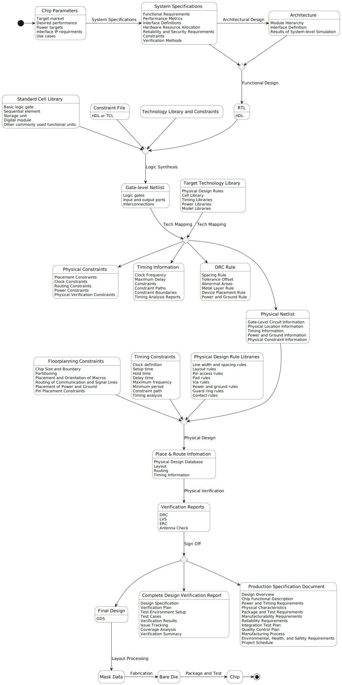

- （6）EDA工具：常见的EDA仿真工具和Debug工具分别有哪些？它们有什么优势和不足？
  - ModelSim：提供了丰富的仿真和调试功能，支持多种硬件描述语言（如VHDL和Verilog），但较为复杂，对系统资源要求较高。
  - VCS：具有高性能、高容量的仿真能力，支持多种硬件描述语言，但商业软件，需要购买授权。
  - Incisive：支持多种硬件描述语言，具有全面的仿真和调试功能，但较为复杂，学习曲线较陡。
  - Xilinx ISE：针对Xilinx FPGA设计提供了丰富的仿真和调试功能，支持多种硬件描述语言，但对Xilinx设备有较好的兼容性。
  - DVE：提供了直观的图形界面，易于使用，支持多种硬件描述语言，但功能相对较简单。
  - ChipScope：针对Xilinx FPGA设计提供了强大的调试和分析功能，可以实时监测信号波形、寄存器状态等，但只适用于Xilinx设备。
  - Cadence Debug Analyzer：支持多种硬件描述语言，具有高级调试和分析功能，可以进行时序查看、触发分析等，但商业软件，需要购买授权。


## iEDA架构图

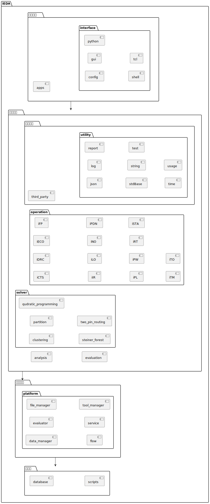

文字描述：是一个分层结构，lef文件通过idb读入，其余点工具通过idb相互协作。通过def文件，各流程可以单独执行，并保存中间结果。

## iEDA flow 练习

- sky130 gcd [192.168.224.130]: /home/guofan/i-training/iEDA_run/sky130_gcd
- sky130 uart [192.168.224.130]: /home/guofan/i-training/iEDA_run/sky130_uart
- 数据记录：[【腾讯文档】水滴计划-iEDA demo学习 郭帆](https://docs.qq.com/sheet/DUnVUVkhSUXp4ZHpS?tab=BB08J2)

### 数据记录截图

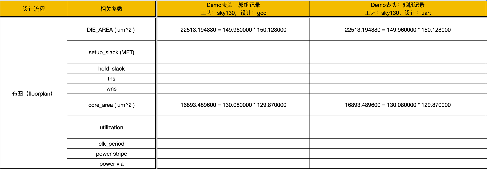
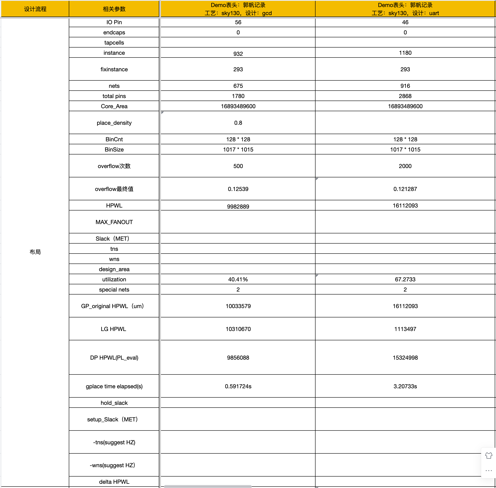
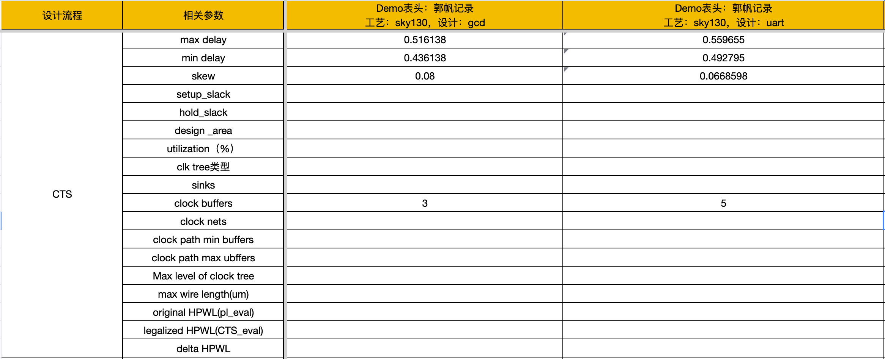
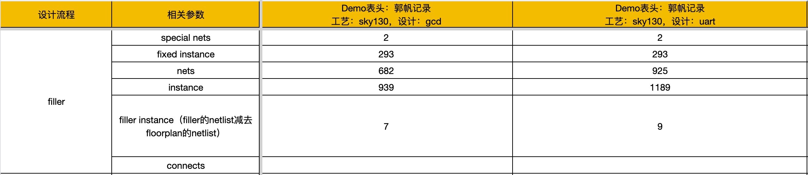
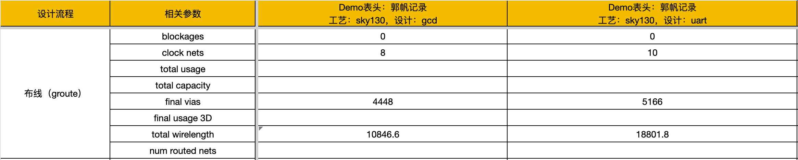
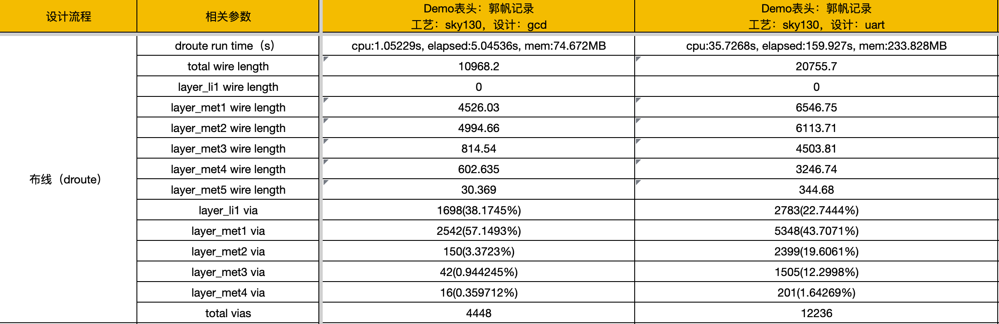
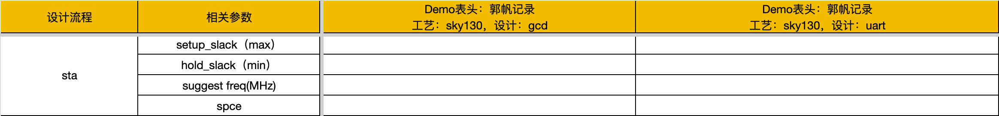
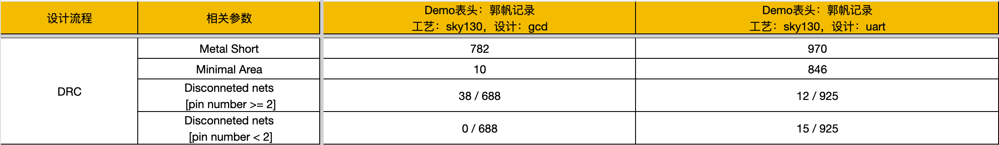

## 布局合法化实验

### Tetris 算法思路

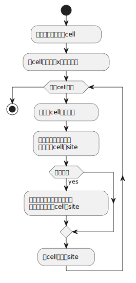

### 代码修改

数据流类的代码可以照着 AbacusLigalizer 写，这里列出与之不同的一些方法：

`runCompleteMode`中，无需再寻找一个最低的`cost`了，直接将当前`inst`安排到行中。
```C++
bool TetrisLegalizer::runCompleteMode() {
  // Sort all movable instances
  std::vector<LGInstance*> movable_inst_list;
  pickAndSortMovableInstList(movable_inst_list);

  int32_t placed_count = 0;
  for (auto* inst : movable_inst_list) {
    if (placeRow(inst) >= 0) {
      ++placed_count;
    }
  }

  LOG_INFO << "placed cells: " << placed_count;

  return true;
}
```

`placeRow`中，首先获得行号，然后尝试寻找 site，若找不到，则分别向上和向下寻找其他行中的 site。
```C++
int32_t TetrisLegalizer::placeRow(LGInstance* inst) {
  Rectangle<int32_t> inst_shape = std::move(inst->get_shape());
  int32_t row_range = _database._lg_layout->get_interval_2d_list().size();

  int32_t row_idx =
      (inst->get_coordi().get_y() + (_row_height / 2)) / _row_height;
  row_idx = std::clamp(row_idx, 0, row_range - 1);

  // Determine clusters and their optimal positions x_c(c):
  std::vector<LGInterval*> interval_list =
      _database._lg_layout->get_interval_2d_list()[row_idx];

  int32_t interval_idx = -1;

  // Find a place to arrange cell
  for (int32_t i = 0; i < (int32_t)interval_list.size(); ++i) {
    auto* interval = interval_list[i];
    if (interval->get_remain_length() >= inst_shape.get_width()) {
      interval_idx = i;
      break;
    }
  }

  // Row is full
  if (interval_idx == -1) {
    for (int i = 0; i < row_range; ++i) {
      int32_t row_up = row_idx - i;
      int32_t row_down = row_idx + i;

      // Check, direction up
      if (row_up > 0) {
        auto current_interval_list =
            _database._lg_layout->get_interval_2d_list()[row_up];
        for (int32_t j = 0; j < (int32_t)current_interval_list.size(); ++j) {
          auto* interval = current_interval_list[j];
          if (interval->get_remain_length() >= inst_shape.get_width()) {
            interval_idx = i;
            break;
          }
        }
      }

      // check, direction down
      if (row_down < row_range) {
        auto current_interval_list =
            _database._lg_layout->get_interval_2d_list()[row_down];
        for (int32_t j = 0; j < (int32_t)current_interval_list.size(); ++j) {
          auto* interval = current_interval_list[j];
          if (interval->get_remain_length() >= inst_shape.get_width()) {
            interval_idx = i;
            break;
          }
        }
      }
    }
  }

  if (interval_idx >= 0) {
    // Arrange inst into interval
    auto* target_interval = interval_list[interval_idx];
    LGCluster target_cluster =
        std::move(arrangeInstIntoIntervalCluster(inst, target_interval));

    // Replace cluster
    replaceClusterInfo(target_cluster);
    target_interval->updateRemainLength(-(inst->get_shape().get_width()));
  }

  return interval_idx;
}
```

### 实验结果

#### Abacus

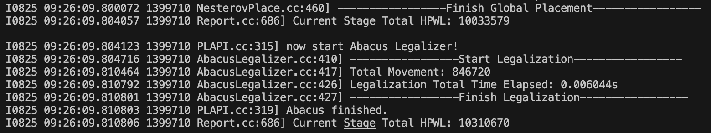

可以看到：

| 指标                    | 数值      |
| ----------------------- | --------- |
| Total Movement          | 846720    |
| Total Time Elapsed      | 0.006044s |
| HPWL After Legalization | 10310670  |

#### Tetris 优化前

使用 Tetirs 算法，但使用如下公式计算 cell 所在行号：
`row_idx = inst->get_coordi().get_y() / _row_height`

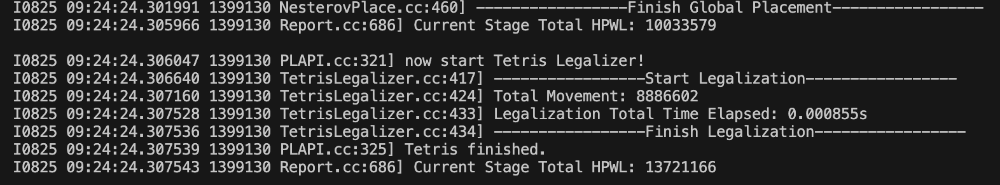

可以看到：

| 指标                    | 数值      |
| ----------------------- | --------- |
| Total Movement          | 8886602   |
| Total Time Elapsed      | 0.000855s |
| HPWL After Legalization | 13721166  |

结论：
| 指标                    | 相比 Abacus |
| ----------------------- | ----------- |
| Total Movement          | +949.53%    |
| Total Time Elapsed      | -85.85%     |
| HPWL After Legalization | +33.08%     |

#### Tetris 优化后

使用 Tetirs 算法，计算行号的公式改为：
`row_idx = (inst->get_coordi().get_y() + (_row_height / 2)) / _row_height`


可以看到：

| 指标                    | 数值     |
| ----------------------- | -------- |
| Total Movement          | 8602946  |
| Total Time Elapsed      | 0.00093s |
| HPWL After Legalization | 13539500 |

结论：
| 指标                    | 相比 Abacus | 相比优化前 |
| ----------------------- | ----------- | ---------- |
| Total Movement          | +916.03%    | -3.19%     |
| Total Time Elapsed      | -84.61%     | +8.77%     |
| HPWL After Legalization | -31.32%     | -1.32%     |


