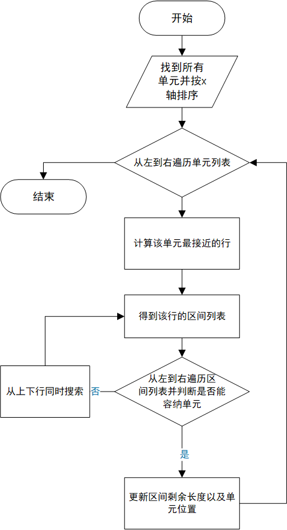
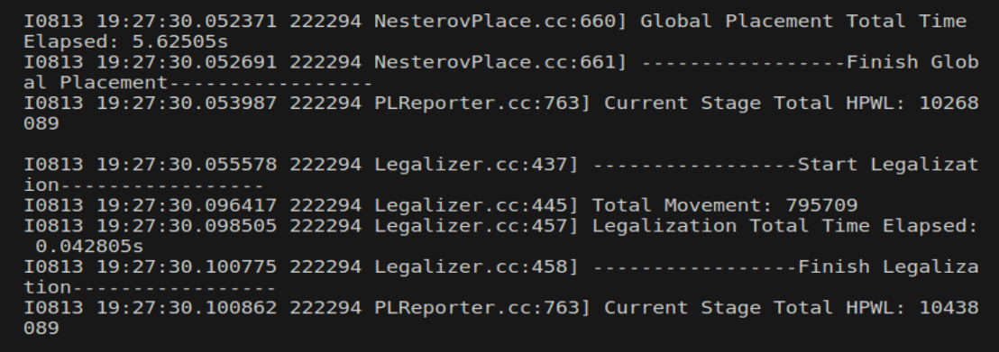
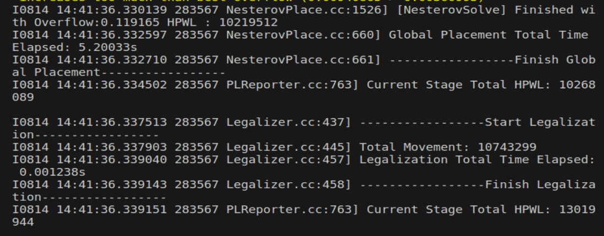

# 布局合法化实践
## Tetris算法
- 布局合法化（Legalization）在物理设计（Physical Design）中是一个关键步骤，特别是在放置阶段。它的主要任务是将已经初步放置的标准单元或宏单元移动到合法的位置上，确保它们没有重叠且满足设计规则。

- Tetris算法是一种用于布局合法化的启发式算法，因其在结构上类似于俄罗斯方块游戏而得名。它的核心思想是尽量将标准单元（或宏单元）从左到右放置到最近的可行位置，就像在玩俄罗斯方块时将块状物体放在没有空隙的地方一样。
### 算法流程

### 核心代码
由于iEDA提供了很多数据结构和接口，我们只需在abacus算法上修改一部分即可。
```
 bool Tetris::runLegalization()
  {
    // Sort all movable instances
    std::vector<ipl::LGInstance*> movable_inst_list;
    pickAndSortMovableInstList(movable_inst_list);

    int32_t inst_id = 0;
    for (auto* inst : movable_inst_list) {
      int32_t best_row = INT32_MAX;
      best_row = placeRow(inst);
      if (best_row == INT32_MAX) {
        LOG_ERROR << "Instance: " << inst->get_name() << "Cannot find a row for placement";
        return false;
      }
      inst_id++;
      if (inst_id % 100000 == 0) {
        LOG_INFO << "Place Instance : " << inst_id;
      }
    }

    return true;
  }

  int32_t Tetris::placeRow(ipl::LGInstance* inst)
  {
    int32_t best_row_idx = (inst->get_coordi().get_y() + (_row_height / 2)) / _row_height;
    int32_t row_range = _database->get_lg_layout()->get_row_num();
    ipl::Rectangle<int32_t> inst_shape = std::move(inst->get_shape());
    std::vector<ipl::LGInterval*> interval_list =_database->get_lg_layout()->get_interval_2d_list()[best_row_idx];
    
    int32_t row_idx = INT32_MAX ;
    int32_t row_interval_idx = INT32_MAX;
    for (size_t i = 0; i < interval_list.size(); ++i) {
      if (_interval_remain_length[interval_list[i]->get_index()] >= inst_shape.get_width()) {
        row_interval_idx = i;
        break;
      }
    }
    if (row_interval_idx == INT32_MAX) {
      for (int i = 0; i < row_range; ++i) {
        int32_t row_up = row_idx - i;
        int32_t row_down = row_idx + i;

        // up
        if (row_up > 0) {
          auto interval_list = _database->get_lg_layout()->get_interval_2d_list()[row_up];
          for (size_t j = 0; j < interval_list.size(); ++j) {
            if (_interval_remain_length[interval_list[j]->get_index()] >= inst_shape.get_width()) {
              row_interval_idx = j;
              best_row_idx = row_up ;
              break;
            }
          }
        }

        // down
        if (row_down < row_range) {
          auto interval_list = _database->get_lg_layout()->get_interval_2d_list()[row_down];
          for (size_t j = 0; j < interval_list.size(); ++j) {
            if (_interval_remain_length[interval_list[j]->get_index()] >= inst_shape.get_width()) {
              row_interval_idx = j;
              best_row_idx = row_down;
              break;
            }
          }
        }
        if (row_interval_idx != INT32_MAX) {
          break;
        }
      }
    }
    //update inst and interval
    if (row_interval_idx >= 0) {
      auto* target_interval = interval_list[row_interval_idx];
      inst->updateCoordi(target_interval->get_min_x(), best_row_idx * _row_height);
      this->updateRemainLength(target_interval, -(inst->get_shape().get_width()));
    }
    return best_row_idx;
  }
```
## 结果对比
- Abacus:

- Tetris:


|                         | Abacus   | Tetris   | Compared |
|-------------------------|----------|----------|----------|
| Total Movement          | 795709   | 10743299 | +1250.2% |
| Total Time Elapsed      | 0.042805 | 0.001238 | -97.11%  |
| HPWL After Legalization | 10438089 | 13019944 | +24.73%  |
