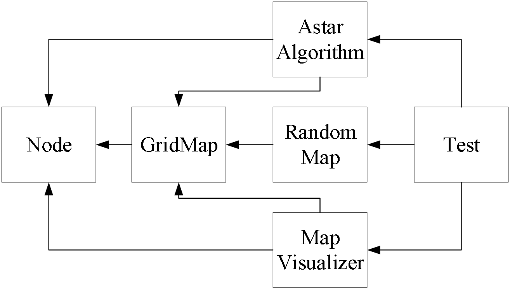
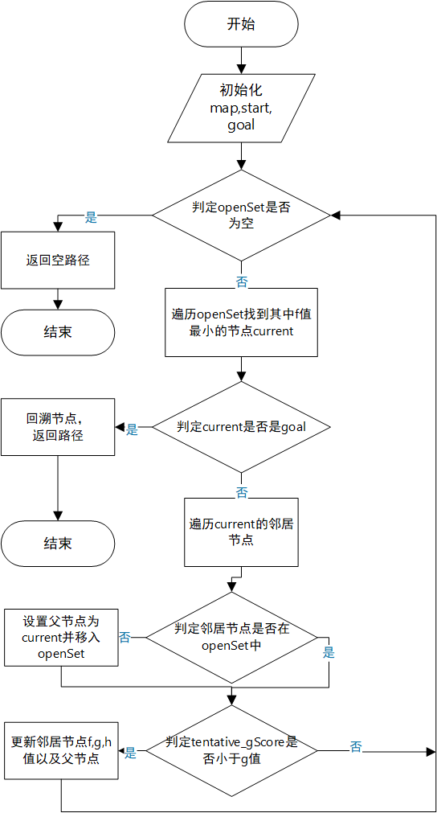

## 布局算法：模拟退火
1. 输入、输出和数据结构设计
输入：
 - 所有元胞
输出：
 - 元胞的物理位置。
 - 布局的具体形状和尺寸。
2. 算法主要思想及步骤
 主要思想：
 - 模拟物理退火过程，通过在高温下允许不利变化逐渐降低温度，以寻找全局最优解。
 - 在布局中，初始状态为随机布局，通过逐步调整元胞位置以减少总线长、满足时序和其他约束。
 步骤：
 (1)初始化：设置初始温度，生成一个初始布局，计算其代价函数（例如，总线长、时序违例等）。
 (2)迭代优化：
 - 随机选择一个单元并尝试移动到新位置。
 - 计算新布局的代价函数，并与原代价进行比较。
 - 如果变小，接受新布局；如果没有变小，根据退火概率（与当前温度相关）决定是否接受新布局。
 (3)降温：逐步降低温度，减少接受不利变化的概率。
 (4)终止条件：温度降低到预设值或代价函数收敛。
3. 时间复杂度
模拟退火的时间复杂度取决于温度下降的步数和每步中的布局调整次数。一般来说，时间复杂度可以表示为O(n * m)，其中n是温度下降的步数，m是每步中的布局调整次数。
## 布线：A*算法
### 1.输入、输出和数据结构设计
输入：
- 网格地图
- 起点和终点
输出：
- 最短路径
数据结构设计：

### 2.算法主要思想及流程
主要思想：
- A*算法是一种启发式搜索算法，结合了Dijkstra算法的最短路径搜索和启发式信息以优化搜索过程。
流程：

### 3.时间复杂度
A*算法的时间复杂度取决于搜索空间的大小和启发式函数的质量。最坏情况下，时间复杂度为O(m^n)，其中m是每个节点的分支因子，n是目标节点的深度。
## 静态时序分析
### 1.单元库（Cell Library）
- 单元库包含所有标准单元的详细信息，包括其功能、时序、功耗和物理属性。单元库文件通常使用NLDM（Non-Linear Delay Model）格式来描述单元的时延特性。
### 2.互连寄生（Interconnect Parasitics）
- 互连寄生效应包括电容、电阻和电感，这些效应会影响信号的传播延迟和完整性。互连寄生通常使用SPEF（Standard Parasitic Exchange Format）文件描述。
### 3.单元时延（NLDM表格）
- NLDM表格描述了标准单元的输入到输出的延迟特性，基于输入信号的转换时间和输出负载。表格中包含不同条件下的延迟值，以便时序分析工具使用。
### 4.线网时延（Elmore计算）
- Elmore延迟模型是一种简单而有效的互连延迟估算方法，基于互连电阻和电容的分布计算总延迟。该方法假设互连为RC树结构，通过求和各节点的RC乘积得到总延迟。
### 5.串扰噪声（Crosstalk Noise）
- 串扰噪声是由于相邻信号线之间的电容耦合引起的，会导致信号干扰和延迟变化。时序分析需要考虑串扰效应，以确保信号完整性。
### 6.时序检查（Setup/Hold）
- Setup时间：数据必须在时钟边沿之前稳定的最小时间。 
- Hold时间：数据必须在时钟边沿之后保持稳定的最小时间。
- 时序检查包括验证所有路径上的Setup和Hold时间要求，确保数据能够正确采样。
### 7.时序路径定义
- 时序路径从输入端口到寄存器，或从寄存器到寄存器，或从寄存器到输出端口。时序分析需要检查所有路径，以确保满足时序要求。
### 8.时序约束命令
- create_clock：定义时钟信号和属性。 
- set_input_delay：定义输入信号的延迟。 
- set_output_delay：定义输出信号的延迟。
- set_max_fanout：限制最大扇出。
- set_max_transition：限制最大转换时间。
## EDA性能优化
### 1.多线程和并行计算
- 利用多线程和并行计算技术，提高EDA工具的计算效率。
### 2.数据结构优化
- 使用高效的数据结构（如哈希表、平衡树）以提高数据访问和处理速度。
### 3.缓存技术
- 使用缓存技术减少重复计算，提高计算效率。
### 4.优化算法
- 改进算法，减少计算复杂度，提高计算效率。
## EDA后端软件开发流程
### 1.需求分析
- 了解用户需求，定义软件功能和性能要求，制定开发计划。
### 2.系统架构设计
- 设计软件架构，包括模块划分、接口定义和数据结构设计。
### 3.逻辑综合
- 综合（Synthesis ）：将设计的高级描述（如Verilog或VHDL的RTL级描述）转换为中间表示（IR）。
- 映射（Mapping ）：将中间表示中的基本逻辑操作映射为工艺库中的具体单元，生成门级网表。
- 优化（Optimization）：优化门级网表以满足设计的时序、面积和功耗要求。
### 4.物理设计
（1）布图（Floorplanning）
- 宏单元布局：确定大型模块（如内存、IP核等）的初始位置。
- 电源规划：设计电源和地线网络，确保芯片各部分能获得稳定的电源供应。
- 区域划分：划分芯片区域，确定各功能模块的位置和大小。
（2）布局（Placement）
- 标准单元布局：将标准单元（如逻辑门、触发器等）放置到芯片的布局区域中。
- 布局优化：通过位置调整和优化，减少信号延迟和面积，提高电路性能。
（3）时钟树综合（Clock Tree Synthesis, CTS）
- 时钟树生成：生成时钟树网络，确保时钟信号能够到达所有需要时钟的单元。
- 时钟树优化：优化时钟树的延迟和平衡，减少时钟偏差（skew）和抖动（jitter）。
（4）全局布线（Global Routing）
- 布线规划：根据布局结果进行全局布线规划，确定信号线的大致路径。
- 拥塞分析：分析布线过程中的拥塞情况，进行调整和优化。
（5）详细布线（Detailed Routing）
- 信号线布线：对所有信号线进行详细布线，确保信号连接正确且符合设计规则。
- 布线优化：优化布线结果，减少信号延迟和电容，提高信号完整性。
（6）寄生参数提取（Parasitic Extraction）
- 寄生参数提取：提取电容、电阻等寄生参数，生成寄生参数网表（SPEF）。
- 寄生参数验证：验证寄生参数的准确性，确保后续分析的正确性。
### 5.验证
（1）静态时序分析（Static Timing Analysis, STA）
- 时序验证：使用静态时序分析工具对设计进行时序分析，确保设计满足时序约束。
- 时序优化：对违反时序约束的路径进行优化，调整单元或布线以满足时序要求。
（2）电源完整性分析（Power Integrity Analysis）
- IR压降分析：分析电源网络的IR压降，确保电源供应稳定。
- 电流密度分析：分析电流密度，避免电源网络过热和电迁移问题。
（3）物理验证（Physical Verification）
- 设计规则检查（DRC）：检查布局和布线是否符合制造工艺的设计规则。
- 版图与网表对比（LVS）：验证版图与门级网表的一致性，确保布局正确实现了设计逻辑。
- 电气规则检查（ERC）：检查电气特性，确保没有短路、开路等电气问题。
### 6.制造与封装测试
## 常见EDA工具
### 仿真工具
ModelSim：
- 优势：功能强大，支持多种硬件描述语言。
- 不足：学习曲线较陡，资源消耗较大。
VCS：
- 优势：仿真速度快，支持大规模设计。
- 不足：价格较高，主要用于企业级项目。
### Debug工具
Verdi：
- 优势：功能强大，界面友好，支持时序和逻辑分析。
- 不足：价格较高，资源消耗较大。
DVE：
- 优势：与VCS集成良好，仿真和调试方便。
- 不足：功能相对单一，主要用于VCS用户。