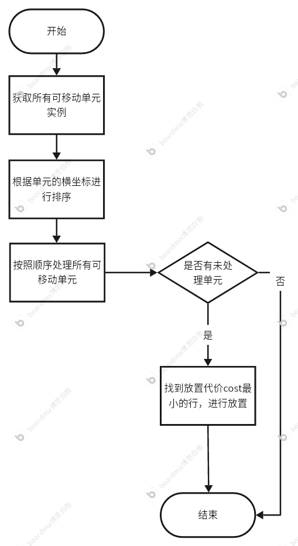
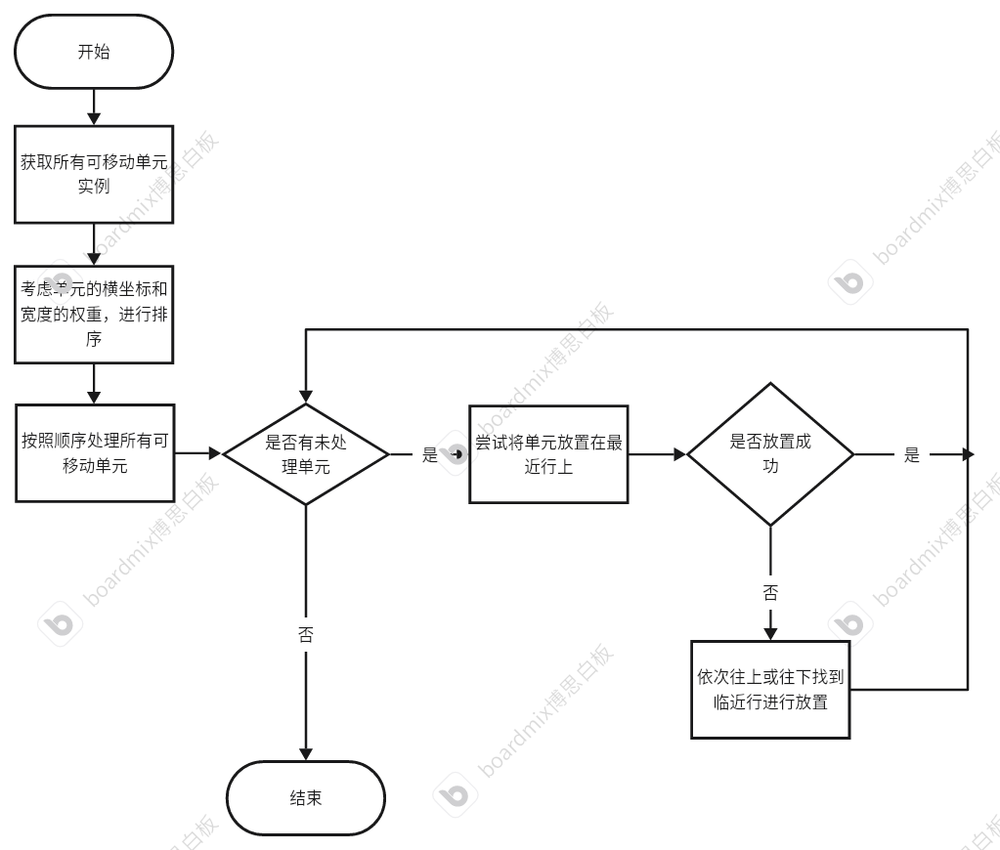
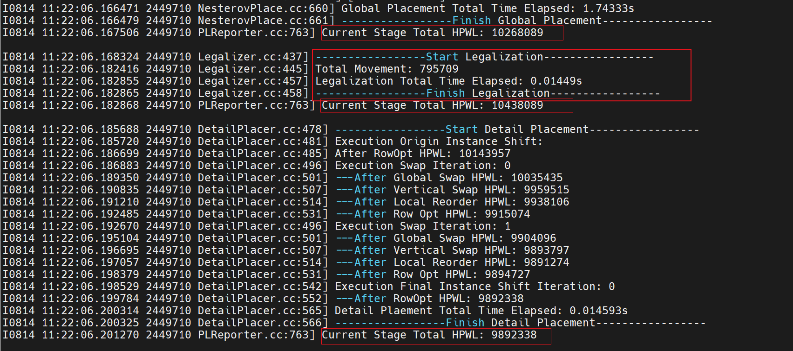
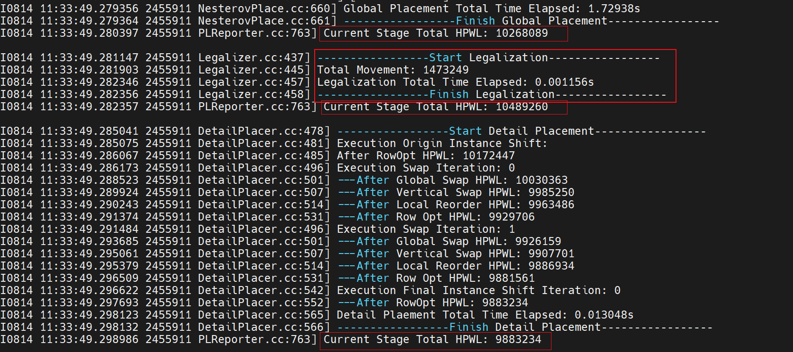

---


---

# 布局合法化算法实现

​	布局合法化在全局布局之后，将标准单元放置在行上，并消除重叠；为了保持全局布局的结果，标准单元在合法化过程中应尽可能少地移动。

​	标准单元具有相同的高度但宽度不同。标准单元电路的芯片是按行组织的，标准单元需要对齐到这些行中。

实现布局合法化的算法有**Abacus算法**和**Tetris算法**；

## 1、Abacus算法

#### 算法流程：



#### 伪代码：

##### Alogorithm 1：Abacus


​	Abacus算法首先根据单元的x坐标对单元进行排序（第1行）；然后，单元逐个进行合法化（第2-13行）；

遍历每一行r,试验性地将单元i放置在行r上，并计算成本c，并更新最小成本cbest和最佳行rbest（第4-10行）；

最终，将单元i放置在最佳行rbest上（第11-12行）

##### Alogorithm 2：PlaceRow


###### 函数介绍：

* **AddCell**：将单元加入到指定的聚类，并更新聚类的相关统计数据；
* **AddCluster**：合并两个重叠的聚类，并更新合并后聚类的统计数据；
* **Collapse**：处理聚类的位置调整和可能的进一步合并。首先计算聚类的最优位置，然后检查并处理聚类间的重叠问题，必要时将聚类合并；

###### 步骤：

1、**初始化聚类**：遍历单元列表，确定是否形成新聚类：若单元是行中的第一个或着与前一个聚类不重叠，则创建新聚类；否则，将单元添加到现有聚类；

2、**聚类合并**：如果当前聚类与其前一个聚类重叠，就会合并这两个聚类，并递归地进行合并直到没有重叠为止；

3、**转换聚类位置到单元位置**：计算出聚类的最优位置，并根据单元在聚类中的位置确定单元的位置；

## 2、Tetris算法





## 3、Tetris算法代码实现

### 1、runLegalization函数

```c++
bool Tetris::runLegalization()
  {
    LOG_INFO<<"TEST123";
    // Sort all movable instances
    std::vector<ipl::LGInstance*> movable_inst_list;
    pickAndSortMovableInstList(movable_inst_list);

    //得到单元格的高度
    int32_t row_height=_database->get_lg_layout()->get_row_height();
    //得到单元格的行数
    int32_t row_num=_database->get_lg_layout()->get_row_num();

    for (auto* inst : movable_inst_list) {
      //计算放在哪一行，即单元矩形左下点的高除以单元格的高度；
      int32_t row_index=(inst->get_coordi().get_y())/row_height;

      int32_t cost = placeRow(inst, row_index, false,false);

      if(cost!=INT32_MAX) continue;
      else{
        bool placed=false;
        int32_t i=1;
        while(true){
          bool checked_above = false, checked_below = false;

          if(row_index+i<row_num){
            int32_t ncost = placeRow(inst, row_index+i, false,false);
            if(ncost!=INT32_MAX) {
              placed=true;
              break;
            }
            checked_above = true;
          }
          if(row_index-i>=0){
            int32_t ncost = placeRow(inst, row_index-i, false,false);
            if(ncost!=INT32_MAX) {
              placed=true;
              break;
            }
            checked_below = true;
          }

           // 如果上下都检查了还是没找到位置，且这两个方向都超出范围，终止循环
          if ((row_index + i >= row_num && checked_above) && (row_index - i < 0 && checked_below)) {
              break;
            }
          i++;
        }
        if(!placed){
          return false;
        }
      }
    }

    return true;
  }
```

### 2、pickAndSortMovableInstList函数

#### (1)根据单元的x值对单元进行排序

```c++
void Abacus::pickAndSortMovableInstList(std::vector<ipl::LGInstance*>& movable_inst_list)
{
    for (auto* inst : _database->get_lgInstance_list()) {
        if (inst->get_state() == ipl::LGINSTANCE_STATE::kFixed) {
            continue;
        }
        movable_inst_list.push_back(inst);
    }

    std::sort(movable_inst_list.begin(), movable_inst_list.end(),
              [](ipl::LGInstance* l_inst, ipl::LGInstance* r_inst) 
              { return (l_inst->get_coordi().get_x() < r_inst->get_coordi().get_x()); });
}
```

#### (2)考虑单元的x值和宽度的权重，进行排序

```c++
void Tetris::pickAndSortMovableInstList(std::vector<ipl::LGInstance*>& movable_inst_list)
{
    double w=2; 
    LOG_INFO<<"W=2";
    for (auto* inst : _database->get_lgInstance_list()) {
        if (inst->get_state() == ipl::LGINSTANCE_STATE::kFixed) {
            continue;
        }
        movable_inst_list.push_back(inst);
    }


    std::sort(movable_inst_list.begin(), movable_inst_list.end(),
              [w](ipl::LGInstance* l_inst, ipl::LGInstance* r_inst) { return (l_inst->get_coordi().get_x()-l_inst->get_shape().get_width()*w < r_inst->get_coordi().get_x()-r_inst->get_shape().get_width()*w); });
}
```


### 3、placeRow函数

#### 功能：

​	将单元放置到指定行；

#### 参数：

 * **inst**:要放置的单元；
 * **row_idx**:要放置的行；
 * **is_trial**:指示是否为试验性放置；
 * **is_record_cluster**:是否记录与实例放置相关的聚类信息

#### 步骤：

1. 获取表示单元的矩形；
2. 获取当前行的间隔列表（保存所有可放置区域）
3. 通过**searchNearestIntervalIndex**函数寻找和矩形距离最近的可放置间隔；
4. 若该间隔无法容纳矩形，通过**searchRemainSpaceSegIndex**函数从找到的间隔向两侧扩展寻找另一个有足够剩余空间的间隔；
5. 通过**arrangeInstIntoIntervalCluster**函数将单元放置到目标间隔，并组织成簇；
6. 计算移动成本；
7. 如果非试验性放置，则更新聚类信息；

## 4、实验结果

##### Abacus：



##### Tetris：



##### 不同算法关键参数指标对比

|               对比项                | Abacus算法 | Tetris算法 |
| :---------------------------------: | :--------: | :--------: |
|            全局布局HPWL             |  10268089  |  10268089  |
|           布局合法化HPWL            |  10438089  |  10489260  |
|            详细布局HPWL             |  9892338   |  9883234   |
|     Legalization Total movement     |   795709   |  1473249   |
| Legalization Total Time Elapsed (s) |  0.01449   |  0.001156  |
|           Peak BinDensity           |     1      |     1      |
|             Total STWL              |  10777178  |  10751546  |
|              Max STWL               |   209533   |   231449   |


